# ESP Conversational Website — Architecture Specification

**Status:** Draft  
**Version:** 0.25  
**Date:** 2026-09-29  
**Architecture:** Multi-provider conversational application using provider-native agent harnesses behind a mandatory ESP inference proxy  
**Candidate model providers:** OpenAI GPT-6 Astra and xAI Grok; production use requires conformance with the Brain-presence invariant  
**Terminology:** Full term followed by its abbreviation on every mention; definitions and naming rule in Chapter 3  
**Runtime deployment:** Separate Codex and Grok Build Harness Instance Pools (HarInsPoo); multiple independent Harness Conversation Sessions (HarConSes) per Shared Harness Instance (ShaHarIns)  
**Design assumption:** DA-01 — adopted for this specification; pending validation or invalidation for each harness/build  
**Harness Conversation Session (HarConSes) lifecycle and failure recovery:** Chapter 12  
**ESP Conversation (EspCon) binding:** One initially selected harness/provider for the ESP Conversation (EspCon) lifetime; Chapter 14  
**Request admission:** Direct dispatch on immediately available capacity; otherwise reject immediately; Section 12.4  

---

## 1. Purpose

The ESP website provides an AI-first interface for exploring ESP.

A visitor interacts primarily through an ESP Conversation (EspCon) rather than navigating a conventional hierarchy of content pages. The AI has a permanent conceptual understanding of ESP and can retrieve authoritative ESP source material for detailed, exact, or citation-backed answers.

The user selects the harness/provider when creating an ESP Conversation (EspCon). That choice remains fixed for the ESP Conversation (EspCon) lifetime:

- Codex with the configured OpenAI model
- Grok Build with the configured xAI model

Every subsequent message, native resume, and recovery stays with the chosen harness/provider. To use the other option, the visitor starts a separate ESP Conversation (EspCon) with a new ID and its own native history.

The architecture separates four concerns:

1. the website experience,
2. provider-specific agent execution,
3. permanent ESP knowledge,
4. detailed ESP source retrieval.

---

## 2. Architecture overview

The application consists of:

- **ESP Web Client** — chat interface, initial harness/model selection, fixed ESP Conversation (EspCon) identity, citations, diagrams, and rich content.
- **ESP Application Backend** — ESP Conversation (EspCon) management, provider routing, Harness Conversation Session (HarConSes) mapping, streaming, authentication, observability.
- **OpenAI Harness Runtime** — the Codex Harness Instance Pool (HarInsPoo), each hosting multiple independent Harness Conversation Sessions (HarConSes). All model traffic goes through the ESP Inference Gateway using a custom provider/base URL.
- **xAI Harness Runtime** — the Grok Build Harness Instance Pool (HarInsPoo), each hosting multiple independent Harness Conversation Sessions (HarConSes). All model traffic goes through the ESP Inference Gateway using a custom model/base URL.
- **ESP Inference Gateway** — mandatory inference proxy that receives every outbound Model Inference (ModInf) request, injects or verifies the exact ESP Core Brain, records evidence, and forwards verified requests to OpenAI or xAI.
- **ESP Core Brain** — versioned canonical conceptual knowledge enforced by the Inference Gateway on every Model Inference (ModInf).
- **ESP Knowledge Service** — retrieval interface for whitepapers, technical documents, exact facts, historical material, diagrams, and other ESP assets.
- **Application Database** — ESP Conversation (EspCon) ownership, provider/Harness Conversation Session (HarConSes) mappings, Shared Harness Instance (ShaHarIns) placement, Active Agent Run (ActAgeRun) authority, and native-state locations. ESP Conversation (EspCon) content and native execution history are persisted by the harnesses.
- **Provider Session Registry** — maps each ESP Conversation (EspCon) to its current Harness Conversation Session (HarConSes) in the permanently assigned provider Harness Instance Pool (HarInsPoo), runtime generation, and durable state location.
- **Rate-Limit Counter Store** — shared, short-lived admission-policy counters and their expiry/reset metadata, used by the backend to enforce visitor/account request-rate limits. Execution capacity and ownership remain in the Application Database; this store contains no message payloads or waiting work.
- **Runtime Session Manager and Admission Controller** — backend components that place Harness Conversation Sessions (HarConSes) on Shared Harness Instances (ShaHarIns), keep recently active Harness Conversation Sessions (HarConSes) resident, reserve immediately available Active Agent Run (ActAgeRun) capacity, maintain current Harness Conversation Session (HarConSes) ownership, and coordinate recovery. Requests that cannot be admitted now receive an immediate busy/unavailable response.
- **Codex Native Session Store** — the data persisted by Codex's native implementation for Harness Conversation Sessions (HarConSes). Codex determines its organization, format, and save/read/resume behavior. ESP supplies the persistent volume and mounts it at the native location configured for the corresponding Shared Harness Instance (ShaHarIns).
- **Grok Build Native Session Store** — the data persisted by Grok Build's native implementation for Harness Conversation Sessions (HarConSes). Grok Build determines its organization, format, and save/read/resume behavior. ESP supplies the persistent volume and mounts it at the native location configured for the corresponding Shared Harness Instance (ShaHarIns). The selected integration's persistence and resume behavior are qualified independently under DA-01.
- **Knowledge Publishing Worker** — batch publication of reviewed Brain releases and source-corpus artifacts to the shared registry and knowledge stores.

**Harness State Store** is only an umbrella label for data retained by these two native persistence implementations. Their diagram boxes show where harness-owned state persists on ESP-provisioned storage; they do not denote separately developed or deployed ESP database services. ESP treats the contents as harness-owned data and uses supported native lifecycle operations. The Application Database holds identity, placement, and storage references; inference evidence remains separate.

## 2.1 Hard invariant — exact Core Brain presence on every inference

The complete released ESP Core Brain must be present **word-for-word, without summarization, truncation, reordering, omission, or substitution, in every final inference request submitted to a model provider**.

This requirement applies to:

- the first inference of a user request,
- every continuation after an ESP tool call,
- every retry,
- every inference following context compaction,
- every provider-side continuation that is part of the answer-generating agent loop,
- every sub-agent inference that is permitted to contribute ESP reasoning to the final answer,
- compaction/summarization model calls when their output can affect subsequent ESP reasoning.

A Harness Conversation Session (HarConSes) being configured with Brain vN is not sufficient evidence. A saved `instructions` field, Grok rules configuration, Harness Conversation Session (HarConSes) metadata, or a Brain version label proves configuration only; it does not prove the contents of a particular inference request.

For every individual Model Inference (ModInf), the ESP Inference Gateway must observe the actual outbound request body that the harness intends to send to the model endpoint.

The gateway must then ensure:

```text
UTF8(extracted_brain_from_outbound_request)
==
UTF8(canonical_brain_release)
```

and therefore:

```text
SHA256(extracted_brain_from_outbound_request)
==
SHA256(canonical_brain_release)
```

The Brain must appear as an exact contiguous instruction-content sequence. Provider-specific messages, role wrappers, harness instructions, tool results, ESP Conversation (EspCon) history, and other context may appear before or after it.

### Enforcement point

Verification occurs at the **ESP Inference Gateway**, which is the only network path from the harnesses to model-provider APIs.

```text
Codex / Grok Build
        |
        | custom model endpoint / base URL
        v
ESP Inference Gateway
        |
        | inject exact Brain if absent
        | verify byte-for-byte
        | store evidence
        v
OpenAI / xAI model API
```

This boundary is stronger than relying on the harness to preserve the Brain through compaction or context reconstruction.

### Fail-closed rule

The provider request is blocked when:

```text
Gateway did not observe request
    -> no inference

Brain missing and cannot be injected safely
    -> no inference

Brain present but modified
    -> no inference

Brain truncated
    -> no inference

Evidence persistence fails
    -> no inference
```

### Network enforcement

Codex and Grok Build are deployed with network policy that permits model traffic only to the ESP Inference Gateway.

They cannot directly reach OpenAI or xAI model endpoints.

```text
Codex
  -> CAN reach ESP Inference Gateway
  -> CANNOT reach OpenAI model API directly

Grok Build
  -> CAN reach ESP Inference Gateway
  -> CANNOT reach xAI model API directly

ESP Inference Gateway
  -> CAN reach OpenAI model API
  -> CAN reach xAI model API
```

This ensures that a harness bug or configuration regression cannot silently bypass Brain enforcement.

### Provider trust boundary

The architecture independently verifies the exact final request that leaves ESP-controlled infrastructure.

If OpenAI or xAI performs additional unobservable transformations after accepting the request, the application cannot independently inspect the provider-internal physical token buffer.

The production trust boundary is therefore:

> **The exact canonical ESP Core Brain is proven present in every final inference request submitted to the provider API.**

If a future provider exposes a stronger accepted-context attestation, that evidence can be incorporated without changing the rest of the architecture.

## 2.2 Runtime deployment assumption — shared harness processes (DA-01)

The architecture uses **long-lived shared harness processes**. Each Codex process hosts multiple independent Harness Conversation Sessions (HarConSes); each Grok Build process hosts multiple independent Harness Conversation Sessions (HarConSes). An ESP Conversation (EspCon) has one current Harness Conversation Session (HarConSes) in its initially selected provider Harness Instance Pool (HarInsPoo). Each shared process may host many such ESP Conversations (EspCon), all using that process's harness type. Multiple ESP Conversations (EspCon) share the process infrastructure, while their history, authorized operations, streams, and Brain bindings remain separately identified.

The provider-specific deployments use separate Codex and Grok Build Harness Instance Pools (HarInsPoo). **The proposed deployment packages each Shared Harness Instance (ShaHarIns) in its own Docker-style container: one Shared Harness Instance (ShaHarIns) per container, with multiple containers on a Worker Host (WorHos).** Each container runs one main Codex or Grok Build harness process, together with any required trusted supervision and transport integration. Under DA-01, that process hosts multiple independent Harness Conversation Sessions (HarConSes). Harness Conversation Session (HarConSes) residency and Active Agent Run (ActAgeRun) concurrency have separate admission limits. Section 3.10 defines the hosting relationships; Chapter 21 describes their deployment.

> **Design-validation note — DA-01:** This is the assumed deployment model for the specification, not a demonstrated property of either production integration. It must be tested with the actual selected Codex and Grok Build binaries, independently, and explicitly **validated or invalidated** against Section 12.14. Multiple native IDs alone do not establish concurrency, isolation, correct request attribution, recoverability, or acceptable cost. No test results are claimed by this revision. An affected shared-process deployment remains ineligible for production until it passes qualification. If the assumption is invalidated, its runtime topology must be redesigned and requalified without weakening the Brain or ESP Conversation (EspCon)-isolation requirements.

---

# 3. Definitions and Abbreviations

**Document-wide naming rule:** Write every defined term in full, immediately followed by its abbreviation in parentheses, on **every occurrence**, including repeated mentions in prose, headings, tables, examples, and diagram labels. For example, use **ESP Conversation (EspCon)** and **Harness Conversation Session (HarConSes)**. The abbreviation accompanies the full name; it is never used alone as a prose or diagram label.

Each abbreviation combines the **first three letters of each word**, with each fragment capitalized. Separators such as the slash in **Native Turn / Work (NatTurWor)** are ignored. For a plural reference, pluralize the full term and retain the same abbreviation: **Harness Conversation Sessions (HarConSes)**. A grammatical possessive may follow the complete name-and-abbreviation pair.

Literal implementation identifiers—database tables and fields, native API operations, state values, artifact paths, and internal Mermaid node/participant IDs—remain unchanged. Their human-readable descriptions and displayed diagram labels use the full-name-and-abbreviation form. The identity fields below map those technical identifiers to the architectural terms.

## 3.1 ESP Conversation (EspCon)

The website-level discussion owned by one authorized visitor or account. An ESP Conversation (EspCon) is bound to the harness/provider selected when it is created and retains that choice for its lifetime. It identifies which discussion the visitor is accessing, independently of browser connections, process restarts, or where the native state is loaded.

**Identity:** `conversation.id`, carried as `conversation_id`. Each ESP Conversation (EspCon) has at most one current Harness Conversation Session (HarConSes) mapping. Before the first admitted message, that mapping may not yet have a native ID. Its content lives in the selected harness's native persistence; the Application Database stores ownership, pinned settings, placement references, and current coordination state.

**Lifetime:** Across many messages and browser reconnects, provided its native persisted state remains intact. Starting a chat with a different provider creates a separate ESP Conversation (EspCon) rather than moving this one.

## 3.2 Worker Host (WorHos)

A server or cloud virtual machine supplying CPU, RAM, networking, and storage access. In the proposed deployment, a Worker Host (WorHos) hosts multiple Docker-style containers, each packaging exactly one Shared Harness Instance (ShaHarIns). A Worker Host (WorHos) may host both Codex and Grok Build containers, subject to resource limits and placement policy. The Worker Host (WorHos) runs harness software, not the remote OpenAI/xAI model weights. Its failure may affect every Shared Harness Instance (ShaHarIns) placed on it.

**Identity:** `worker_id` or the corresponding infrastructure identity.

**Lifetime:** The lifetime of the server/VM placement. Recovery on another Worker Host (WorHos) is covered only when the required native storage survives and remains accessible.

## 3.3 Harness Instance Pool (HarInsPoo)

The set of eligible Shared Harness Instances (ShaHarIns) for one harness/provider. Codex and Grok Build have separate Harness Instance Pools (HarInsPoo). A Harness Instance Pool (HarInsPoo) is a logical grouping, not another server, container, or process in the hosting hierarchy. It may span several Worker Hosts (WorHos), and a Worker Host (WorHos) may run containers belonging to both provider-specific Harness Instance Pools (HarInsPoo). Placement selects a compatible Shared Harness Instance (ShaHarIns) within the ESP Conversation (EspCon)'s fixed Harness Instance Pool (HarInsPoo), using the qualified capacity and deployment settings.

**Identity:** The provider and deployment/pool configuration, not a visitor's native ID. This definition does not introduce a new Application Database table.

**Lifetime:** A service-level deployment grouping that can outlive its individual Worker Hosts (WorHos), Shared Harness Instances (ShaHarIns), and Process Incarnations (ProInc). Additional Shared Harness Instances (ShaHarIns) can be deployed as capacity is needed.

## 3.4 Shared Harness Instance (ShaHarIns)

One logical deployed instance of either Codex or Grok Build. **In the proposed deployment, each running Shared Harness Instance (ShaHarIns) is packaged in exactly one Docker-style container on one Worker Host (WorHos), and each such container packages exactly one Shared Harness Instance (ShaHarIns).** The container runs one main harness process of the selected type, with any required trusted supervision/transport integration. Under DA-01, that process hosts multiple independent Harness Conversation Sessions (HarConSes). Provider-specific references use **Codex Shared Harness Instance (ShaHarIns)** and **Grok Build Shared Harness Instance (ShaHarIns)**.

The Shared Harness Instance (ShaHarIns) is the architectural identity of the deployed harness; its Docker-style container is the runtime packaging of that same deployment. They are not two separate application services. Sharing occurs between Harness Conversation Sessions (HarConSes) inside the main harness process, rather than allocating a new container or process to each ESP Conversation (EspCon).

**Identity:** `harness_instance.id`, referenced as `harness_instance_id`. This is a logical deployment identity, distinct from the infrastructure's container ID and the Process Incarnation (ProInc). A replacement container may retain `harness_instance_id` where the deployment preserves that identity; its new main process receives a new Process Incarnation (ProInc). The one-to-one container mapping describes a running placement, not a permanent identity relationship across replacements. This is not a backup copy of an ESP Conversation (EspCon).

**Lifetime:** Across successive Process Incarnations (ProInc) where the deployment retains the logical instance identity. The Shared Harness Instance (ShaHarIns) remains available after an individual Active Agent Run (ActAgeRun) completes and may continue serving other Harness Conversation Sessions (HarConSes) while one is idle. Resident-Harness Conversation Session (HarConSes) and concurrent-Active Agent Run (ActAgeRun) limits are separate.

## 3.5 Process Incarnation (ProInc)

One particular start of the harness process inside a Shared Harness Instance (ShaHarIns). All Harness Conversation Sessions (HarConSes) resident in that process share the Process Incarnation (ProInc), while retaining their own native IDs and authority. A restart always creates a new Process Incarnation (ProInc), even when `harness_instance_id` stays the same.

**Identity:** `harness_instance.process_incarnation_id`; assigned Harness Conversation Session (HarConSes) mappings and telemetry carry the corresponding `runtime_incarnation_id`.

**Lifetime:** Until that process exits, fails, or is fenced. Identifying the Process Incarnation (ProInc) lets the backend and gateway reject stale activity from an earlier process and enumerate the Harness Conversation Sessions (HarConSes) affected by its failure.

## 3.6 Harness Conversation Session (HarConSes)

The ongoing native conversation maintained by the ESP Conversation (EspCon)'s chosen harness: a Codex thread or a Grok Build session. It contains the harness-managed dialogue and native work history required to continue that ESP Conversation (EspCon). A resident Harness Conversation Session (HarConSes) is hosted by one currently authorized Shared Harness Instance (ShaHarIns), sharing its main process and container with other Harness Conversation Sessions (HarConSes). An unloaded Harness Conversation Session (HarConSes) remains in native persistence without requiring a resident process allocation of its own. The Harness Conversation Session (HarConSes) is separate from the process currently hosting it.

**Identity:** The harness-provided `provider_session.native_session_id`. `provider_session.id` is ESP's mapping-row identity, while `session_generation` identifies mapping generations. These are not substitutes for the native ID used to reopen saved state.

**Lifetime:** Across multiple user messages, completed Active Agent Runs (ActAgeRun), idle periods, and qualified unload/resume or process-restart operations. A warm Harness Conversation Session (HarConSes) can be resident without running any work. Recovery resumes it in the same harness using intact native storage; there is no cross-harness history transfer.

## 3.7 Active Agent Run (ActAgeRun)

The work currently authorized by ESP within a Harness Conversation Session (HarConSes), normally answering one newly admitted user message. An Active Agent Run (ActAgeRun) can encompass several Model Inferences (ModInf) and tool interactions; it is not one model call and is not the lifetime of the harness process or container. Only one Active Agent Run (ActAgeRun) may be authorized for an ESP Conversation (EspCon) at a time, including while an interrupted operation's outcome is unresolved.

**Identity:** `provider_session.active_agent_run_id`, with its ownership epoch, lease, Process Incarnation (ProInc), and pinned settings. `active_agent_run_expires_at` bounds that authorization. These are current fields on the Harness Conversation Session (HarConSes) mapping, not separate historical turn/attempt rows.

**Lifetime:** From successful admission to native completion, acknowledged interruption/cancellation, or recovery reconciliation. Authority can be renewed or replaced according to the recovery rules. Releasing an Active Agent Run (ActAgeRun)'s capacity does not end its Harness Conversation Session (HarConSes), Shared Harness Instance (ShaHarIns), or Process Incarnation (ProInc). When the visitor is only reading or typing and no native operation is active, there is no Active Agent Run (ActAgeRun).

## 3.8 Native Turn / Work (NatTurWor)

The harness's own work unit and lifecycle, such as the native operation submitted for the latest user input. Its status and saved execution history are owned by Codex/Grok Build. The Active Agent Run (ActAgeRun) is the application authorization around that work; a Native Turn / Work (NatTurWor) reference is the native identifier used to inspect or correlate it.

**Identity:** The harness-provided reference recorded as `provider_session.current_native_work_ref` when available. It is distinct from the application's Active Agent Run (ActAgeRun) ID.

**Lifetime:** Determined by the harness's native completion, interruption, cancellation, and supported recovery behavior. The backend reads and coordinates that state rather than duplicating its history in application turn tables.

## 3.9 Model Inference (ModInf)

One model-provider invocation within agent work. An Active Agent Run (ActAgeRun) may generate several Model Inferences (ModInf), for example before and after tool calls or compaction. Retries and any other answer-influencing model calls remain subject to the same per-request Brain invariant.

**Identity:** `inference_id`, correlated with the Harness Conversation Session (HarConSes), Active Agent Run (ActAgeRun), Process Incarnation (ProInc), and provider request. Exact forwarded request bodies and Brain-verification evidence are held in the proxy's evidence storage.

**Lifetime:** One provider request/response operation. The gateway verifies the complete canonical Brain before forwarding every Model Inference (ModInf) request; retaining a Harness Conversation Session (HarConSes) does not replace this check.

## 3.10 Relationships and identity boundaries

**Hosting hierarchy:** A Worker Host (WorHos) runs Docker-style containers. Each of those containers packages one Shared Harness Instance (ShaHarIns), whose one main harness process hosts multiple independent Harness Conversation Sessions (HarConSes) under DA-01.

| Relationship | Proposed mapping | Meaning |
|---|---|---|
| Worker Host (WorHos) to Docker-style containers | One to many | A server/VM can run several containers, subject to its resource and placement limits. Each running container is placed on one Worker Host (WorHos). |
| Docker-style container to Shared Harness Instance (ShaHarIns) | One to one | Each harness container packages exactly one deployed Codex or Grok Build instance, and each running Shared Harness Instance (ShaHarIns) has its own container. |
| Shared Harness Instance (ShaHarIns) to main harness process | One to one while running | Each Shared Harness Instance (ShaHarIns) runs one main Codex or Grok Build process; trusted supervision/transport helpers may accompany it. Each process start is identified by a Process Incarnation (ProInc). |
| Shared Harness Instance (ShaHarIns) to Harness Conversation Sessions (HarConSes) | One to many | Multiple visitors' native conversations share the main process. Each resident Harness Conversation Session (HarConSes) has one currently authorized host; the resident count may be zero and is bounded by the qualified limit. |
| Harness Conversation Session (HarConSes) to Active Agent Run (ActAgeRun) | One to zero or one | A native conversation may be idle or have one currently authorized operation. Finishing that operation leaves the native conversation and shared process available. |
| Harness Instance Pool (HarInsPoo) to Shared Harness Instances (ShaHarIns) | One to many | The provider-specific logical grouping can span multiple Worker Hosts (WorHos). It is not an additional enclosing container or process. |

```text
Worker Host (WorHos) A - one server / cloud VM
    |
    +-- Docker-style container A
    |     +-- Codex Shared Harness Instance (ShaHarIns) A
    |           one main Codex process - Process Incarnation (ProInc) 92
    |             +-- Harness Conversation Session (HarConSes) 101
    |             |     ESP Conversation (EspCon) 101
    |             |     Active Agent Run (ActAgeRun) 501
    |             +-- Harness Conversation Session (HarConSes) 102
    |                   ESP Conversation (EspCon) 102
    |                   idle; no Active Agent Run (ActAgeRun)
    |
    +-- Docker-style container B
          +-- Grok Build Shared Harness Instance (ShaHarIns) B
                one main Grok Build process - Process Incarnation (ProInc) 37
                  +-- Harness Conversation Session (HarConSes) 201
                  |     ESP Conversation (EspCon) 201
                  |     Active Agent Run (ActAgeRun) 601
                  +-- Harness Conversation Session (HarConSes) 202
                        ESP Conversation (EspCon) 202
                        idle; no Active Agent Run (ActAgeRun)
```

The Shared Harness Instance (ShaHarIns) name within each container identifies the harness deployment running there, not a second service that wraps Codex or Grok Build. The example allocates one container per Shared Harness Instance (ShaHarIns), not one per visitor. The two provider-specific Harness Instance Pools (HarInsPoo) group their corresponding Shared Harness Instances (ShaHarIns) across this and any additional Worker Hosts (WorHos).

An ESP Conversation (EspCon) identifies the discussion; its Harness Conversation Session (HarConSes) retains native context; its Active Agent Run (ActAgeRun) identifies work authorized now. A Native Turn / Work (NatTurWor) reference links an Active Agent Run (ActAgeRun) to the harness-owned operation, which can generate multiple Model Inferences (ModInf). Shared Harness Instance (ShaHarIns), Process Incarnation (ProInc), container, and Worker Host (WorHos) describe different deployment and execution identities, not additional application services or historical tables.

The one-to-one container mapping applies to a live deployment. A restart or replacement can retain the logical Shared Harness Instance (ShaHarIns) identity while changing the container ID and/or Process Incarnation (ProInc). Native storage and native IDs are used to resume Harness Conversation Sessions (HarConSes); completing an Active Agent Run (ActAgeRun) does not create a new container.

DA-01 remains an adopted design assumption pending validation or invalidation for each harness/build. The definitions describe the target topology and do not claim that shared hosting, unloading, or recovery has already passed the qualification gate.

---

# 4. C1 — System Context

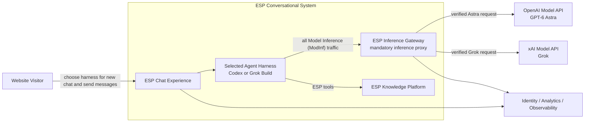

## 4.1 Website Visitor

The visitor:

- asks questions about ESP,
- explores concepts conversationally,
- selects Codex/OpenAI or Grok Build/xAI when starting a new ESP Conversation (EspCon),
- follows source citations,
- views supporting diagrams and assets,
- returns to the same Harness Conversation Session (HarConSes) after refresh, inactivity, or process recovery.

## 4.2 ESP Conversational Website

The website:

- provides the conversational user interface,
- maintains ESP Conversation (EspCon) ownership and Harness Conversation Session (HarConSes) mappings, and reads ESP Conversation (EspCon) content through native-history adapters,
- routes every turn to the ESP Conversation (EspCon)'s fixed agent harness,
- maintains mappings to provider Harness Conversation Sessions (HarConSes),
- streams provider output to the browser,
- exposes citations and rich ESP content,
- records the ESP Brain version used for each Harness Conversation Session (HarConSes).

## 4.3 OpenAI Runtime

The OpenAI runtime:

- runs a Codex Harness Instance Pool (HarInsPoo) of long-lived Shared Harness Instances (ShaHarIns), with multiple independent Harness Conversation Sessions (HarConSes) per process under DA-01,
- manages the Codex agent loop, tool use, ESP Conversation (EspCon) context, and compaction,
- uses a custom OpenAI model-provider/base-URL configuration that points model traffic to the ESP Inference Gateway,
- invokes GPT-6 Astra only through the gateway,
- uses the ESP Knowledge Service for ESP-specific tools and retrieval.

Codex itself does not enforce the permanent-Brain invariant. Enforcement occurs at the ESP Inference Gateway.

## 4.4 xAI Runtime

The xAI runtime:

- runs a Grok Build Harness Instance Pool (HarInsPoo) of long-lived Shared Harness Instances (ShaHarIns), with multiple independent Harness Conversation Sessions (HarConSes) per process under DA-01,
- manages the Grok agent loop, tool use, ESP Conversation (EspCon) context, and compaction,
- uses Grok Build's custom model/base-URL configuration to point model traffic to the ESP Inference Gateway,
- invokes the selected Grok model only through the gateway,
- uses the ESP Knowledge Service for ESP-specific tools and retrieval.

Grok Build itself does not enforce the permanent-Brain invariant. Enforcement occurs at the ESP Inference Gateway.

## 4.5 ESP Knowledge Platform

The ESP Knowledge Platform:

- stores the canonical ESP Core Brain,
- stores source documents and source metadata,
- maintains search and retrieval indexes,
- exposes ESP knowledge tools,
- stores diagrams, infographics, and other source assets,
- manages ESP knowledge releases.

---

# 5. C2 — Container Architecture

C2 is presented as a **runtime view plus three focused supporting views**. Together they define the same applications, batch process, data stores, and dependencies. The runtime view makes the user path, each harness's native persistence, and the separate model/tool paths easy to follow. Authority checks, publication, and telemetry are shown in Section 5.5 rather than drawn across every runtime box. These supporting relationships remain part of the current design.

Each labeled application is a C4 application container, and each cylinder represents persisted data. For Codex Native Session Store and Grok Build Native Session Store, the cylinder depicts the harness's own persisted state on an ESP-provisioned volume, not a separately deployed database service. Technology choices marked as alternatives remain implementation decisions. The native persistence implementation and internal storage layout are determined by the corresponding harness.

The Codex Runtime and Grok Build Runtime boxes each represent a scalable **Harness Instance Pool (HarInsPoo)**. Each **Shared Harness Instance (ShaHarIns)** hosts one main harness process and multiple **Harness Conversation Sessions (HarConSes)** under DA-01. At deployment, one Docker-style container packages one **Shared Harness Instance (ShaHarIns)**; a **Worker Host (WorHos)** hosts several such containers. Section 3.10 and Chapter 21 specify that physical nesting; a runtime box here does not mean one container for the entire pool.

## Runtime view

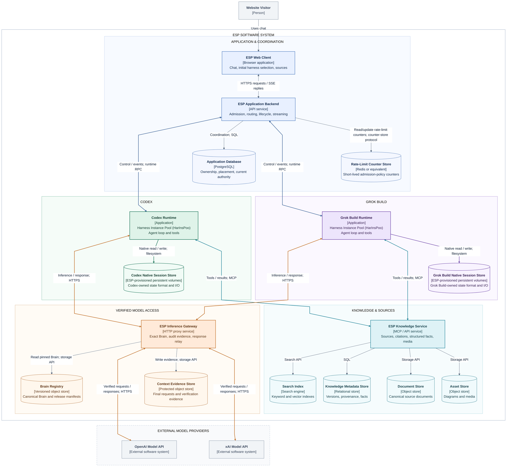

**Reading the diagram:** Blue groups application coordination; green groups Codex with its native storage; purple groups Grok Build with its native storage; teal groups retrieval and its source stores; amber groups verified model access and Brain/evidence storage. External model providers sit outside the ESP system boundary. Grouping frames identify responsibility areas, not extra services, containers, or Worker Hosts (WorHos).

**Connections:** A double-headed line combines an initiating request with its returning response/event stream on the same interaction. It does not authorize independently initiated provider-to-runtime connections. A single-headed line identifies the caller of a data-access operation; read/write results are implicit. Amber lines show model transport; teal lines show MCP tool transport. The source contains explicitly commented invisible layout links (`~~~`); they are layout constraints, not architectural dependencies.

**Native storage:** Each harness is adjacent to the data retained by its native persistence implementation. **Codex Native Session Store** shows Codex-persisted state; **Grok Build Native Session Store** shows Grok Build-persisted state. ESP supplies persistent volumes to the relevant Shared Harness Instances (ShaHarIns), while each harness controls the internal organization, format, and native access operations. Each logical box represents the provider-specific persisted data across those deployments, rather than prescribing a common database or one writable volume for the entire Harness Instance Pool (HarInsPoo). Data on the mounted volume survives the disposable process/container.

## 5.1 Container responsibilities and storage

The Application Backend owns website requests, ESP Conversation (EspCon) continuity, runtime selection, and the normalized event stream. Its routers, adapters, Harness Conversation Session (HarConSes) registry, and conversation service are components within that one container; Section 7.4 shows their internal structure.

Codex and Grok Build are separate Harness Instance Pools (HarInsPoo). Each Shared Harness Instance (ShaHarIns) runs one shared harness process with multiple resident Harness Conversation Sessions (HarConSes); different Harness Conversation Sessions (HarConSes) may execute turns concurrently within a qualified limit. Each runtime communicates with the Knowledge Service for tools and with the Inference Gateway for Model Inference (ModInf). Trusted adapters associate every operation with its specific Harness Conversation Session (HarConSes) and Active Agent Run (ActAgeRun). Codex native state is stored in Codex Native Session Store, and Grok Build native state is stored in Grok Build Native Session Store; a process ID or Harness Conversation Session (HarConSes) ID alone is not durable recovery state. DA-01 and its production gate apply to both Harness Instance Pools (HarInsPoo) independently.

The Application Database holds ESP Conversation (EspCon) metadata, Harness Conversation Session (HarConSes) placement, Active Agent Run (ActAgeRun) ownership and native-state locations. Native histories remain in the native session store belonging to the selected harness. The Admission Controller reserves available capacity or rejects the request immediately; the Runtime Session Manager handles placement and Harness Conversation Session (HarConSes) lifecycle. Both are backend components. New input exists only in the live request until submission to the Harness Conversation Session (HarConSes). Gateway and Knowledge Service read restricted current-Harness Conversation Session (HarConSes) authorization from the database to reject stale owners; they retain separate paths and do not call each other. Chapter 12 defines these lifecycle and crash-recovery contracts.

The Inference Gateway owns the complete provider connection, including request verification, upstream dispatch, and downstream response relay. Its Brain resolver, injector, verifier, evidence recorder, and forwarder are components within that one container; Section 9.14 shows their internal structure.

The Knowledge Service owns retrieval and source access. Search, metadata, document, and asset stores are its backing data stores. Section 10.2 shows its internal components.

The Brain Registry holds both the canonical Brain artifact and its immutable manifest. The gateway reads the release pinned to the originating ESP Conversation (EspCon)/Harness Conversation Session (HarConSes). The Context Evidence Store holds the exact request verified before upstream dispatch.

The Knowledge Publishing Worker represents the publication stage of the offline lifecycle in Chapter 15. It publishes reviewed artifacts to the Brain Registry and the knowledge stores. The Application Database, Rate-Limit Counter Store, and observability service support the online application. Section 5.5 explicitly retains the authority, release-publication, and telemetry relationships that are not drawn in the runtime view.

The **Rate-Limit Counter Store** is a logical data store used by the backend's Authentication and Rate Limits component. It holds only short-lived admission-policy counters and expiry/reset metadata, shared across backend service instances. It stores no user input, conversation history, response buffers, pending requests, or future-dispatch jobs. Exceeding a rate limit causes immediate rejection; checking and reserving execution capacity remains a separate Application Database operation. Section 7.5 defines its scope.

## 5.2 Model Inference (ModInf) requests and responses

The request and return paths for the selected provider are:

```text
OpenAI request:
Codex Runtime -> ESP Inference Gateway -> OpenAI Model API

OpenAI response:
OpenAI Model API -> ESP Inference Gateway -> Codex Runtime

xAI request:
Grok Build Runtime -> ESP Inference Gateway -> xAI Model API

xAI response:
xAI Model API -> ESP Inference Gateway -> Grok Build Runtime
```

The gateway relays response chunks, tool-call events, terminal status, and errors on the originating request connection. The runtime integration then routes them to that request's Harness Conversation Session (HarConSes) and turn, not to every Harness Conversation Session (HarConSes) in the shared process. The runtime then emits agent-level events to the Application Backend, which streams the website response to the Web Client.

The gateway holds the upstream provider connection. Network policy confines provider API access to that gateway; the response stream travels back over the corresponding established connections.

## 5.3 Knowledge/tool path

Both runtimes have the same logical MCP relationship with the Knowledge Service:

```text
Codex Runtime -> ESP Knowledge Service -> Codex Runtime
Grok Build Runtime -> ESP Knowledge Service -> Grok Build Runtime
```

A tool result returns to the requesting runtime. That runtime includes relevant retrieved material in its subsequent Model Inference (ModInf) request, which follows Section 5.2. The gateway obtains permanent knowledge from the Brain Registry; retrieval belongs to the runtime-to-Knowledge-Service path.

The separation is reflected directly in the diagram: each runtime connects to both services, while the Knowledge Service and Inference Gateway have independent responsibilities and backing stores.

## 5.4 Diagram levels

C2 represents applications, batch processing, data stores, and their inter-container relationships. Component decomposition appears in the C3 diagrams for the Application Backend (Section 7.4), Inference Gateway (Section 9.14), and Knowledge Service (Section 10.2). The per-inference sequence in Section 9.13 and end-to-end sequence in Chapter 13 describe interaction order.

Notation references: [C4 container diagrams](https://c4model.com/diagrams/container), [C4 component diagrams](https://c4model.com/diagrams/component), and [C4 notation](https://c4model.com/diagrams/notation).

## 5.5 Supporting C2 views

The following views use the **same container identities** as the runtime view. Repeated boxes are references to those same containers, not additional deployments. Together, these views preserve the complete dependency coverage of C2 without threading operational lines across the main runtime path. All calls shown remain in the current architecture.

### Authority and release access

The backend reads the release manifest to pin the Brain. The gateway and Knowledge Service independently read current execution authority from the Application Database through restricted access. There is no direct Knowledge Service–Inference Gateway dependency.

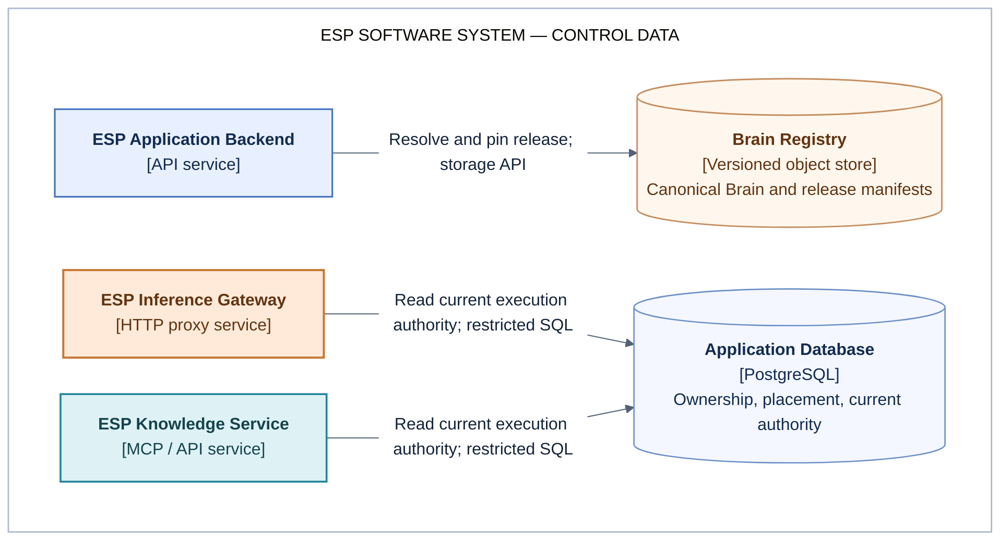

### Knowledge publication

The batch publisher reads reviewed repository artifacts and writes the Brain release and knowledge-store contents. This is the existing publication stage, separate from a visitor's live interaction.

```mermaid
%%{init: {"theme":"base","themeVariables":{"fontFamily":"Inter, Arial, sans-serif","fontSize":"16px","lineColor":"#526379","primaryTextColor":"#14243A","edgeLabelBackground":"#FFFFFF","clusterBkg":"#FFFFFF","clusterBorder":"#CFD9E5"},"flowchart":{"htmlLabels":true,"useMaxWidth":false,"curve":"linear","wrappingWidth":280,"nodeSpacing":35,"rankSpacing":64,"padding":18,"subGraphTitleMargin":{"top":15,"bottom":25}},"themeCSS":".label, .nodeLabel, .edgeLabel, .cluster-label, .flowchartTitleText { font-family: Arial, sans-serif !important; } .cluster-label { font-size: 14px; font-weight: 700; }"}}%%
flowchart TB
    accTitle: C2 — Knowledge Publication
SOURCES["<b>ESP Knowledge Repository</b><br/>[External software system]<br/>Reviewed Brain, sources, and assets"]:::external
    subgraph ESP["ESP SOFTWARE SYSTEM — PUBLICATION"]
        PUBLISHER["<b>Knowledge Publishing Worker</b><br/>[Batch application]<br/>Publish reviewed release artifacts"]:::knowledge
        BRAINREG[("<b>Brain Registry</b><br/>[Versioned object store]<br/>Canonical Brain and release manifests")]:::inferenceStore
        subgraph DATA["KNOWLEDGE DATA STORES"]
            SEARCH[("<b>Search Index</b><br/>[Search engine]<br/>Keyword and vector indexes")]:::knowledgeStore
            META[("<b>Knowledge Metadata Store</b><br/>[Relational store]<br/>Versions, provenance, facts")]:::knowledgeStore
            DOCS[("<b>Document Store</b><br/>[Object store]<br/>Canonical source documents")]:::knowledgeStore
            ASSETS[("<b>Asset Store</b><br/>[Object store]<br/>Diagrams and media")]:::knowledgeStore
        end
    end
    PUBLISHER -->|"Read reviewed inputs; repository / file API"| SOURCES
    PUBLISHER -->|"Publish Brain and manifest; storage API"| BRAINREG
    PUBLISHER -->|"Publish retrieval indexes; search API"| SEARCH
    PUBLISHER -->|"Publish metadata and facts; SQL"| META
    PUBLISHER -->|"Publish snapshots; storage API"| DOCS
    PUBLISHER -->|"Publish media; storage API"| ASSETS
    style ESP fill:#FFFFFF,stroke:#ADBACE,stroke-width:1.4px
    style DATA fill:#F6FCFD,stroke:#A8D4DE,stroke-width:1px

    classDef application fill:#E8F0FF,stroke:#4575BC,stroke-width:1.6px,color:#132C51;
    classDef applicationStore fill:#F4F7FF,stroke:#6D90C6,stroke-width:1.3px,color:#132C51;
    classDef codex fill:#DFF3E9,stroke:#247B5F,stroke-width:2px,color:#123E30;
    classDef codexStore fill:#F1FBF6,stroke:#247B5F,stroke-width:1.5px,color:#123E30;
    classDef grok fill:#EDE5FC,stroke:#7953B0,stroke-width:2px,color:#382057;
    classDef grokStore fill:#F8F3FF,stroke:#7953B0,stroke-width:1.5px,color:#382057;
    classDef knowledge fill:#DEF2F6,stroke:#23859A,stroke-width:1.8px,color:#16434D;
    classDef knowledgeStore fill:#F0FAFC,stroke:#5196A4,stroke-width:1.3px,color:#16434D;
    classDef inference fill:#FFEAD9,stroke:#C57835,stroke-width:2px,color:#623513;
    classDef inferenceStore fill:#FFF7ED,stroke:#C58E60,stroke-width:1.4px,color:#623513;
    classDef external fill:#F1F4F7,stroke:#8896A7,stroke-width:1.2px,color:#344258;
```

### Observability

Application, harness, proxy, retrieval, and publication telemetry goes to the existing Observability Platform through its telemetry API. These arrows are shown here rather than duplicated across the runtime view. Context Evidence Store remains a separate synchronous correctness dependency in the runtime view.

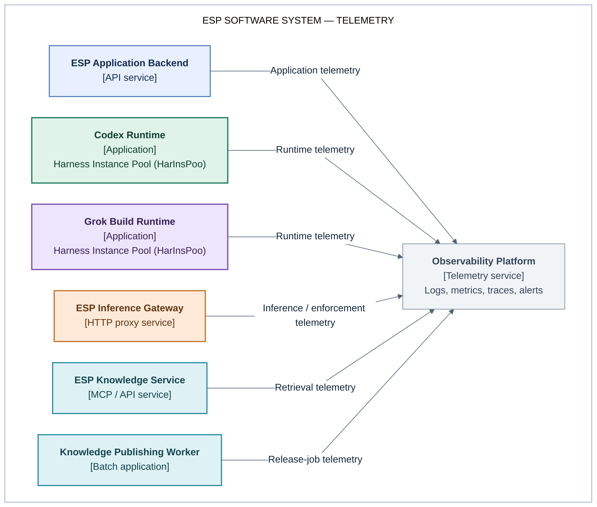

---

# 6. ESP Web Client

The ESP Web Client is the public website interface.

## 6.1 Chat interface

The chat interface supports:

- user messages,
- streamed assistant responses,
- ESP Conversation (EspCon) history read from native persistence,
- source citations,
- expandable supporting material,
- diagrams and infographics,
- structured ESP content.

## 6.2 Initial harness selection

The new-ESP Conversation (EspCon) screen offers the eligible harness/provider options:

```text
New ESP Conversation (EspCon)
    Codex / OpenAI
    Grok Build / xAI
```

The backend records the choice when the ESP Conversation (EspCon) is created. The chat view then displays that ESP Conversation (EspCon)'s harness and configured model as an identity label. Existing ESP Conversations (EspCon) retain their recorded selection on refresh, reconnect, and resume.

Choosing the other harness starts a separate ESP Conversation (EspCon) with a new ESP Conversation (EspCon) ID and a new Harness Conversation Session (HarConSes). Its history begins with its own user input. Chapter 14 defines the binding and enforcement rules.

The browser retains an unsent draft when a request is rejected for lack of capacity or because the ESP Conversation (EspCon) is busy. It shows the reason and a manual retry action. It does not automatically submit that draft when capacity later becomes available. A lost connection after submission triggers a status check before any resubmission.

## 6.3 Rich response renderer

The renderer consumes a provider-neutral event protocol and renders:

- text,
- citations,
- links to ESP sources,
- diagrams,
- infographics,
- structured data,
- tool activity where useful.

---

# 7. ESP Application Backend

## 7.1 Chat API

ESP Conversation (EspCon) creation records the visitor's initial harness/provider selection:

```http
POST /conversations
```

```json
{
  "provider": "openai"
}
```

The backend validates that the selected provider has a qualified deployment, creates the ESP Conversation (EspCon) identity, and pins its provider and released Brain. The model is resolved from the selected deployment when the Harness Conversation Session (HarConSes) is created. Physical Harness Conversation Session (HarConSes) allocation remains lazy until the first message is admitted.

Subsequent chat requests identify the existing ESP Conversation (EspCon) rather than choose a provider:

```json
{
  "conversation_id": "conv_123",
  "client_request_id": "browser_req_456",
  "message": "Why does ESP use X?"
}
```

The backend authorizes the visitor and reads the ESP Conversation (EspCon)'s immutable provider and pinned Brain from application metadata. A conflicting provider/harness override is rejected before admission. The Admission Controller then tries to reserve the ESP Conversation (EspCon) guard and immediately available Shared Harness Instance (ShaHarIns) and provider Active Agent Run (ActAgeRun) capacity. It does not hold the message waiting for a slot or a provider to recover.

If admission fails, the API returns a busy/unavailable response during this request. The message is not submitted to the harness, retained for later dispatch, or retried automatically. The browser keeps the draft for a manual retry. Section 12.4 defines the rejection outcomes.

If admission succeeds, the backend sets a fresh `active_agent_run_id`, request ID, owner, and expiry on the current `provider_session`. A new or unloaded Harness Conversation Session (HarConSes) can be created/resumed on the reserved healthy Shared Harness Instance (ShaHarIns) as a bounded part of this live request. The adapter then submits input to that explicit Harness Conversation Session (HarConSes) and records `current_native_work_ref` when available. The API reports native acceptance only after the qualified adapter confirms it; the capacity reservation alone does not mean the message has been saved by the harness.

The input is held only for the live request, then persisted by the native harness if accepted. If submission may have occurred but confirmation is lost, the backend retains current coordination state and inspects native status/history. It reports an unresolved submission rather than treating it as a clean rejection or automatically submitting it again.

The harness supplies saved ESP Conversation (EspCon) content and Native Turn / Work (NatTurWor) status. The backend reads them through the owning harness's adapter for display and recovery. Streamed events are routed under current Harness Conversation Session (HarConSes) authority; terminal native status releases Active Agent Run (ActAgeRun) capacity and returns the Harness Conversation Session (HarConSes) to `warm_idle`.

Chapter 12 defines direct admission, ownership, and recovery. The Application Database records current operational state rather than a second native execution history.

## 7.2 Provider Router

The Provider Router resolves the ESP Conversation (EspCon)'s immutable provider to its fixed provider Harness Instance Pool (HarInsPoo):

```text
conversation.provider = openai -> Codex Harness Instance Pool (HarInsPoo) and Codex adapter
conversation.provider = xai    -> Grok Build Harness Instance Pool (HarInsPoo) and Grok Build adapter
```

It supplies the ESP Conversation (EspCon) ID, Harness Conversation Session (HarConSes) mapping and generation, explicit Harness Conversation Session (HarConSes) ID, Active Agent Run (ActAgeRun) ID, Shared Harness Instance (ShaHarIns) and Process Incarnation (ProInc), ownership epoch, configured model, and pinned Brain identity.

Placement may select another compatible Shared Harness Instance (ShaHarIns) within the same provider Harness Instance Pool (HarInsPoo) after idle unloading or process failure. The ESP Conversation (EspCon)'s provider remains unchanged. An unavailable provider or recovering Harness Conversation Session (HarConSes) causes immediate rejection of new input. Recovery of already accepted Native Turn / Work (NatTurWor) follows Chapter 12 independently.

Dispatch begins after non-waiting admission claims the ESP Conversation (EspCon)'s Active Agent Run (ActAgeRun) guard, reserves an active slot on a healthy qualified Shared Harness Instance (ShaHarIns) in that provider Harness Instance Pool (HarInsPoo), and the Runtime Session Manager confirms that the Harness Conversation Session (HarConSes) is ready. Admission is race-safe across backend service instances. A failed reservation releases partial claims and returns rejection without native submission. Only one Active Agent Run (ActAgeRun) is active for an ESP Conversation (EspCon). Distinct ESP Conversations (EspCon) may execute concurrently within the Shared Harness Instance (ShaHarIns)'s qualified limit.

Current authority is recorded on `provider_session`. Process-global credentials, a last-selected-Harness Conversation Session (HarConSes) setting, and a common model base URL are insufficient to identify an individual ESP Conversation (EspCon).

## 7.3 Event Normalizer

Admission rejection is returned directly by the Chat API before native execution starts. For admitted requests and Harness Conversation Session (HarConSes)-status inspection, the normalizer converts provider-specific agent events to the website protocol:

```typescript
type ChatEvent =
  | { type: "text_delta"; text: string }
  | { type: "citation"; citation: Citation }
  | { type: "tool_started"; tool: string }
  | { type: "tool_finished"; tool: string }
  | { type: "asset"; asset: AssetRef }
  | { type: "usage"; usage: Usage }
  | { type: "session_status"; status: "starting" | "restoring" | "running" | "recovering" | "warm_idle" }
  | { type: "output_reset"; activeAgentRunId: string }
  | { type: "error"; code: string; message: string; retryable: boolean }
  | { type: "done"; nativeWorkRef: string };
```

Events carry ESP Conversation (EspCon) ID, provider-Harness Conversation Session (HarConSes) ID, Active Agent Run (ActAgeRun) ID, Native Turn / Work (NatTurWor) reference where available, and a connection-local sequence for stream ordering. The backend checks the current ownership before publishing events. Completed content is read from native persistence; recent stream buffering is a delivery optimization with bounded retention.

On reconnect, the backend inspects current Harness Conversation Session (HarConSes) status and reads saved native history. It uses native replay or a recent stream buffer where supported; otherwise the UI reloads a native history snapshot. Exact replay of every transient token event is not a database requirement.

## 7.4 C3 — ESP Application Backend

This view expands the Application Backend container from C2. Its components share the backend process/deployment boundary. Internal arrows represent component calls; the external nodes retain their C2 container identities. The implementation language and exact runtime-control protocols remain to be selected.

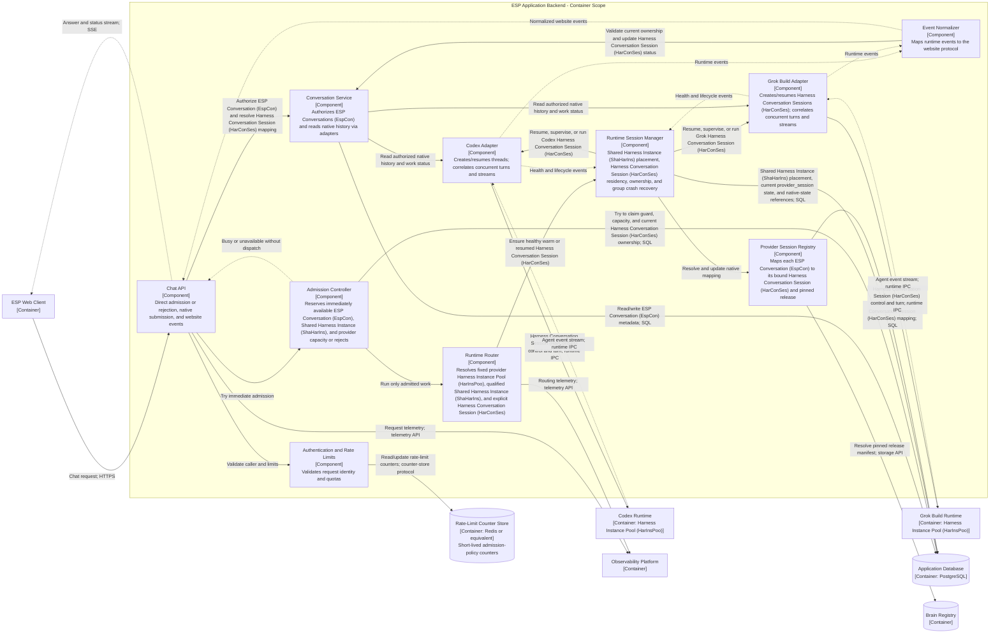

**Diagram key:** The boundary encloses backend components. Solid arrows show calls; dashed arrows show returned events or streams. Other nodes are supporting containers. The adapters communicate with harness runtimes; the runtimes' model traffic follows the gateway path shown in C2.

## 7.5 Rate-Limit Counter Store

The Rate-Limit Counter Store supplies shared, short-lived counters to the backend's Authentication and Rate Limits component. It is a data store, not another application service or a request queue. Redis or an equivalent counter store is the proposed technology; the concrete implementation and rate policies remain deployment choices.

Each entry contains only an opaque visitor/account or policy-scope key, the applicable policy/window identifier, a counter or remaining allowance, and expiry/reset metadata. Counter checks and updates must be atomic across backend service instances, and entries expire when the selected rate policy no longer needs them.

The store contains no message bodies, pending requests, delayed-dispatch jobs, conversation transcripts, native harness state, answer-stream buffers, or execution ownership records. A rejected request is never stored here for later execution. Any bounded stream buffer described in Section 7.3 remains an implementation-local delivery optimization, not a responsibility of this store.

Admission uses two separate checks:

| Check | Authoritative state | Outcome when the check fails |
|---|---|---|
| Visitor/account request-rate policy | Rate-Limit Counter Store | Reject immediately using the rate-limit outcome in Section 12.4. |
| Immediately available execution capacity and current authority | Application Database, including the current `provider_session` and `harness_instance` records | Reject immediately using the busy/unavailable outcome in Section 12.4. |

Passing a rate-limit check does not reserve execution capacity or authorize native work. Capacity reservations, the ESP Conversation (EspCon) guard, and Active Agent Run (ActAgeRun) ownership remain transactional responsibilities of the Application Database. The browser retains the draft after rejection; it is not automatically submitted when counters reset or capacity becomes available.

---

# 8. ESP Core Brain

## 8.1 Purpose

The ESP Core Brain gives each model the conceptual knowledge required to reason correctly about ESP before any retrieval occurs.

It contains:

- ESP purpose,
- core mental model,
- architecture,
- actors and roles,
- major components,
- relationships between components,
- mechanisms,
- invariants,
- economics and incentives,
- design rationale,
- terminology,
- important caveats,
- common misconceptions,
- retrieval policy.

The Core Brain is optimized for conceptual understanding. Detailed source material remains in the ESP Knowledge Platform.

## 8.2 Canonical storage

The canonical Brain is stored in the ESP knowledge repository.

```text
esp-knowledge/
├── brain/
│   ├── esp_brain_core_v17.md
│   └── manifest_v17.json
├── behavior/
│   └── website_behavior_v6.md
├── ontology/
│   ├── concepts.json
│   ├── relationships.json
│   └── terminology.json
├── corpus/
│   ├── whitepapers/
│   ├── technical/
│   ├── economics/
│   ├── website/
│   └── historical/
├── assets/
│   ├── diagrams/
│   └── infographics/
└── evals/
    ├── conceptual.json
    ├── factual.json
    ├── retrieval.json
    └── adversarial.json
```

## 8.3 Brain manifest

Example:

```json
{
  "brain_version": 17,
  "brain_sha256": "58e23...",
  "behavior_version": 6,
  "source_revision": "git:abc123",
  "created_at": "2026-09-15T18:00:00Z",
  "status": "production"
}
```

## 8.4 Size

The initial expected size is approximately 5k–15k tokens.

The production size is determined through ESP evaluation results and model performance.

---

# 9. Brain Enforcement Through the ESP Inference Gateway

The permanent ESP Core Brain is enforced at a mandatory inference proxy located between the agent harnesses and the model-provider APIs.

This design uses a capability provided by both harnesses:

- Codex can send model traffic to a custom model provider/base URL.
- Grok Build can send model traffic to a custom model/base URL.

The ESP Inference Gateway is configured as that endpoint.

```text
Codex
  -> custom model provider/base_url
  -> ESP Inference Gateway
  -> OpenAI Responses API
  -> Astra

Grok Build
  -> custom model/base_url
  -> ESP Inference Gateway
  -> xAI model API
  -> Grok
```

The harnesses continue to provide their normal agent functionality. The gateway owns permanent-Brain enforcement.

The gateway terminates each harness-facing inference connection and opens the corresponding provider connection. It relays the provider response, including streamed chunks, tool-call events, and errors, back to the originating harness. The Application Backend receives agent events from the harness rather than receiving raw provider responses directly.

## 9.1 Canonical Brain release

A Brain release is immutable.

```text
dist/
└── brain_v17/
    ├── canonical_brain.md
    └── manifest.json
```

Example:

```json
{
  "brain_version": 17,
  "canonical_brain_sha256": "58e23...",
  "canonical_brain_bytes": 48291,
  "behavior_version": 6,
  "source_revision": "git:abc123",
  "status": "production"
}
```

`canonical_brain.md` is the exact text that must be present in every outbound inference request.

## 9.2 Codex routing through the gateway

Codex is configured with a custom model provider/base URL whose endpoint is the ESP Inference Gateway.

```text
Codex harness
    |
    | /v1/responses
    v
https://esp-inference-gateway.internal/openai/v1
    |
    v
https://api.openai.com/v1
```

The exact configuration syntax is deployment-specific, but the invariant is:

```text
Codex model endpoint != OpenAI directly
Codex model endpoint == ESP Inference Gateway
```

Codex continues to own agent loops, tool calls, MCP interactions, ESP Conversation (EspCon) state, context compaction, retries, and enabled subagents. The gateway does not replace the Codex harness.

## 9.3 Grok Build routing through the gateway

Grok Build is configured with a custom model `base_url` that targets the ESP Inference Gateway.

```text
Grok Build
    |
    | /v1/responses or configured inference API
    v
https://esp-inference-gateway.internal/xai/v1
    |
    v
https://api.x.ai/v1
```

The exact selected Grok API backend is fixed in the production runtime configuration.

Grok Build continues to own agent loops, tool calls, MCP interactions, ESP Conversation (EspCon) state, compaction, retries, and enabled subagents. The gateway does not replace Grok Build.

## 9.4 Gateway request processing

For every Model Inference (ModInf) request:

```text
1. Receive the actual request and authenticate its request-scoped Harness Conversation Session (HarConSes) binding.
2. Match the Active Agent Run (ActAgeRun) ID, ownership epoch, Process Incarnation (ProInc), and pinned settings to provider_session.
3. Check the ESP Conversation (EspCon) guard and require the ESP Conversation (EspCon), provider_session, provider Harness Instance Pool (HarInsPoo), and upstream route to agree on the fixed provider.
4. Resolve the pinned canonical Brain and locate the Brain block in the request.
5. Inject exact canonical text if absent. Block a present but invalid block.
6. Extract the Brain content and compare exact UTF-8 bytes, length, and SHA-256.
7. Persist the final outbound request and verification evidence.
8. Recheck current dispatch authority and forward only the verified request.
9. Record dispatch and observed outcome in the proxy's evidence/observability storage.
```

Recommended Brain framing:

```text
----- BEGIN ESP CORE BRAIN v17 -----
<exact canonical_brain.md bytes>
----- END ESP CORE BRAIN v17 -----
```

The Brain is placed in the provider's system/developer/instructions field appropriate to the selected API.

The transport binding identifies the ESP Conversation (EspCon), Harness Conversation Session (HarConSes) mapping and generation, Harness Conversation Session (HarConSes), `active_agent_run_id`, Shared Harness Instance (ShaHarIns) and Process Incarnation (ProInc), ownership epoch, provider/model, and pinned Brain. It is an authenticated request envelope whose authority comes from the **current `provider_session` row** and the ESP Conversation (EspCon) and Shared Harness Instance (ShaHarIns) records. Historical execution records are not part of this authorization path.

For a shared process, an IP address, container credential, process-global header, or common base URL identifies only the runtime. Trusted transport integration must attach the correct Harness Conversation Session (HarConSes) binding to every model call, including tool continuations, compaction, retries, and enabled subagents. It never identifies a Harness Conversation Session (HarConSes) from prompt text, timing, or whichever request started most recently. The same principle applies independently to MCP authorization and response demultiplexing.

The initial profile performs answer-affecting model work within the currently authorized Harness Conversation Session (HarConSes) operation. Unbound background work fails closed. The transport hook that propagates Harness Conversation Session (HarConSes) identity is subject to DA-01: mixed-Brain, interleaved-Harness Conversation Session (HarConSes) tests must validate it for each selected build. This requirement does not assert that a stock CLI flag already supplies the hook.

## 9.5 Injection versus verification

### Brain absent

The gateway deterministically injects the canonical Brain.

```text
Harness request
    |
    | Brain absent
    v
Gateway injects exact Brain
    |
    v
verify
    |
    v
forward
```

This makes the architecture resilient to harness compaction or reconstruction dropping application context.

### Brain present but incorrect

The gateway blocks the request.

Examples include a truncated Brain, modified Brain, unexpected duplicate Brain, wrong Brain version, or markers containing content with a different hash.

A malformed existing Brain is treated as an unexpected harness/runtime state rather than silently repaired.

## 9.6 Context evidence

Every forwarded inference produces a context-evidence record in the proxy's evidence storage:

```yaml
inference_id: inf_019ab
conversation_id: conv_123
provider_session_id: ps_001
active_agent_run_id: exec_456
native_work_ref: native_work_24
ownership_epoch: 8
harness_instance_id: codex_instance_a
runtime_incarnation_id: runtime_92
native_session_id: codex_thread_abc
session_generation: 2

harness: codex
provider: openai
model: "<configured-openai-model-id>"

brain_version: 17
canonical_brain_sha256: 58e23...
canonical_brain_bytes: 48291
request_body_sha256: 91d71...
brain_content_path: "<adapter-defined logical instruction-content path>"
brain_start_offset: 9412
brain_end_offset: 57703
extracted_brain_sha256: 58e23...
extracted_brain_bytes: 48291
brain_presence_verified: true
injection_action: injected
provider_request_id: "<available after provider response>"
timestamp: "<capture timestamp>"
```

The Context Evidence Store retains the exact final provider request body, or an encrypted content-addressed snapshot, under its privacy and retention policy. Offsets identify the decoded instruction content at `brain_content_path`; JSON escaping is not mistaken for a change to the logical Brain text. The recorded full request allows independent extraction and byte comparison.

Dispatch status, the provider request identifier when available, and observed outcome are appended to the proxy's evidence/observability records. They are not stored as an application execution-history table. A durable request proves what was submitted, not that generation or the containing Native Turn / Work (NatTurWor) completed. Native persistence remains the source for ESP Conversation (EspCon) content and completed Native Turn / Work (NatTurWor).

## 9.7 Network enforcement

The harnesses are prevented from reaching model providers directly.

```text
Codex runtime
  ALLOW  -> ESP Inference Gateway
  DENY   -> api.openai.com
  DENY   -> ChatGPT/Model Inference (ModInf) endpoints
  DENY   -> unapproved external model endpoints

Grok Build runtime
  ALLOW  -> ESP Inference Gateway
  DENY   -> api.x.ai
  DENY   -> unapproved external model endpoints

ESP Inference Gateway
  ALLOW  -> approved OpenAI inference endpoint
  ALLOW  -> approved xAI inference endpoint
```

Provider API credentials are held by the gateway wherever practical rather than by the harness containers.

This turns the gateway into the unavoidable model-inference choke point.

## 9.8 Tool loops, compaction, retries, and subagents

The invariant applies to every outbound Model Inference (ModInf) request.

```text
user request
  -> inference A
       -> gateway verify/inject
  -> tool call
  -> inference B
       -> gateway verify/inject
  -> compaction inference C
       -> gateway verify/inject
  -> inference D
       -> gateway verify/inject
  -> final answer
```

The gateway is independent of why the harness made the inference. The same enforcement therefore applies to first-turn calls, tool continuations, retries, automatic/manual compaction, Harness Conversation Session (HarConSes) resume, internal continuations, and enabled subagents.

## 9.9 Provider request adapters

The gateway contains provider/API-specific adapters.

```text
ESP Inference Gateway
    |
    +-- OpenAI Responses adapter
    |
    +-- xAI Responses adapter
    |
    +-- other explicitly approved provider API adapters
```

Each adapter knows where the system/developer/instructions content lives, how to insert the Brain without changing unrelated harness context, how to preserve streaming and tool-call semantics, how to authenticate to the upstream provider, and how to capture the exact forwarded request.

The number of supported inference protocols is kept intentionally small.

## 9.10 Fail-closed behavior

An inference is not forwarded when the Brain release cannot be resolved, the request format is unsupported, the gateway cannot locate/create the instruction field, an existing Brain block is corrupted, the extracted Brain hash differs, evidence cannot be persisted, the upstream provider route is not approved, or the request violates provider/model constraints.

## 9.11 Provider qualification

Each Codex and Grok Build release used in production is tested behind the gateway.

The qualification suite covers ordinary turns, multiple tool calls, retries, very long ESP Conversations (EspCon), automatic/manual compaction, Harness Conversation Session (HarConSes) resume, harness restart, context near model limits, missing Brain, corrupted Brain, direct-provider connection attempts, and subagents if enabled.

For every captured Model Inference (ModInf) request:

```text
brain_presence_verified == true
```

and:

```text
all provider-bound model traffic
passed through ESP Inference Gateway
```

A shared-process harness release is production-qualified only when these conditions and the DA-01 multi-Harness Conversation Session (HarConSes) qualification in Section 12.14 pass for its exact build, configuration, and transport/storage integration.

## 9.12 Trust boundary

The gateway can independently prove:

> **The exact canonical ESP Core Brain was present in the final inference request submitted from ESP-controlled infrastructure to the model provider.**

The gateway cannot independently inspect provider-internal transformations after the request is accepted. The provider API contract is the trust boundary for that final internal step.

If OpenAI or xAI later exposes accepted-context attestation, the gateway can store that evidence in addition to its own request evidence.

## 9.13 Inference sequence

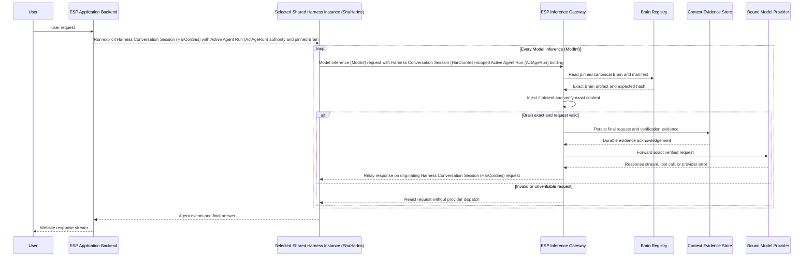

Upstream dispatch occurs only after successful Brain verification and durable evidence acknowledgement. Evidence-store failure rejects the request before provider dispatch. Provider response chunks, errors, and stream termination return through the gateway to the originating harness.

The runtime invariant is:

> **No model-provider request can leave ESP-controlled infrastructure unless the ESP Inference Gateway has ensured and verified the complete canonical ESP Core Brain in that exact request.**

## 9.14 C3 — ESP Inference Gateway

This view expands the single Inference Gateway container from C2. All enforcement and forwarding components below run inside that container. The component implementation language is an open implementation choice.

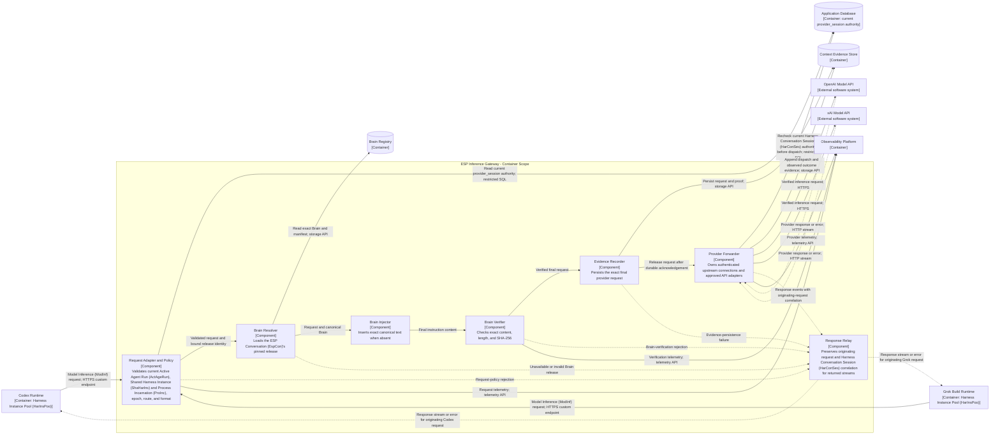

**Diagram key:** The boundary encloses gateway components. Solid arrows show calls or verified-request progression; dashed arrows show returned streams or errors. Data-store reads and writes include their acknowledgements. Provider output is relayed only to the runtime that originated that inference; the two runtime return edges are alternatives, not a broadcast.

The Provider Forwarder owns both sides of the upstream exchange. The Response Relay preserves provider tool-call content for execution by the originating harness. The Knowledge Service remains on the separate runtime tool path shown in C2.

---

# 10. ESP Knowledge Service

The ESP Knowledge Service exposes detailed source material to both agent runtimes: Codex and Grok Build.

Both runtimes access the service through the same logical MCP tool interface. The ESP Inference Gateway does not call the Knowledge Service; it has a separate responsibility and obtains only the permanent Brain from the Brain Control Plane.

The preferred common interface is MCP. The service validates the runtime's Harness Conversation Session (HarConSes)-scoped request against current provider_session authority and the ESP Conversation (EspCon) guard in the Application Database, rejecting stale or misattributed work. This authorization path is independent of the inference proxy.

## 10.1 Tool contract

Example tools:

```text
esp.search(query, filters?)
esp.get_source(source_id, version?)
esp.get_claim(claim_id)
esp.get_concept(concept_id)
esp.get_asset(asset_id)
esp.get_current_value(key)
```

## 10.2 C3 — ESP Knowledge Service

This view expands the Knowledge Service container. Its components serve both runtime clients through the same logical MCP interface. Search, metadata, document, and asset stores retain their C2 identities. Internal implementation languages remain to be selected.

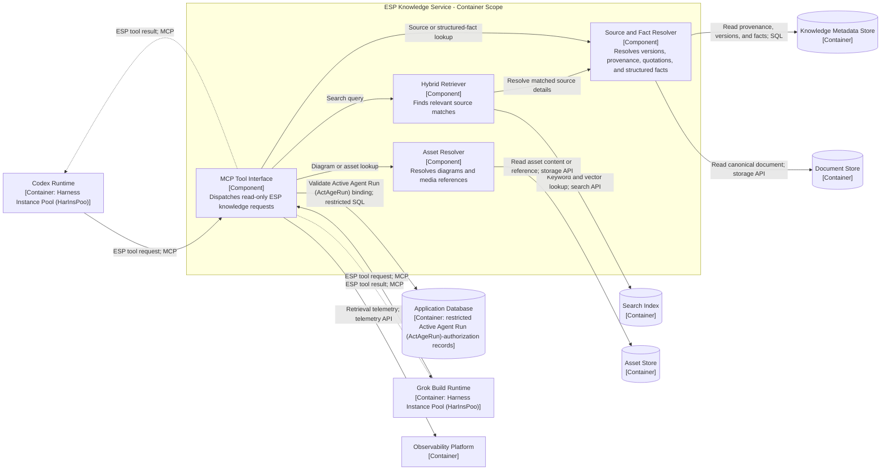

**Diagram key:** The boundary encloses service components. Solid arrows show calls or reads; dashed arrows show returned tool results. Other nodes are supporting containers. Each tool result returns to the requesting runtime, which decides how to use it in the next gateway-mediated inference.

## 10.3 Retrieval use cases

Retrieval supports:

- source citations,
- exact quotations,
- exact numerical values,
- current parameters,
- version-specific information,
- detailed technical material,
- historical material,
- diagrams and infographics,
- information outside the Core Brain.

---

# 11. ESP Conversation (EspCon) Model

## 11.1 ESP Conversation (EspCon) identity and native history

The application stores the ESP Conversation (EspCon)'s owner, immutable provider, pinned Brain, and Active Agent Run (ActAgeRun) guard. ESP Conversation (EspCon) content and Native Turn / Work (NatTurWor) history remain in the native persistence of that one harness.

```yaml
conversation_id: conv_123
owner_subject_id: visitor_456
provider: openai
brain_release_id: v17
active_provider_session_id: null
status: active
```

`provider` is selected once when the ESP Conversation (EspCon) is created. It identifies the Codex/OpenAI Harness Instance Pool (HarInsPoo) or the Grok Build/xAI Harness Instance Pool (HarInsPoo) for every later operation. The website reads authorized history only from that ESP Conversation (EspCon)'s Harness Conversation Session (HarConSes) through its owning adapter. A new ESP Conversation (EspCon) on the other provider has a separate ID, Harness Conversation Session (HarConSes), and history.

## 11.2 Provider session registry

An ESP Conversation (EspCon) has at most one current Harness Conversation Session (HarConSes) mapping, created lazily on first use. After initialization, that mapping identifies its one Harness Conversation Session (HarConSes), placement, recovery state, and Active Agent Run (ActAgeRun) authority.

> **Application Database record:** The registry is stored in the main Application Database in the `provider_session` table defined in Section 17.2. The YAML below illustrates one row from that table: each field corresponds to a database column, populated with an example value. It is not a separate configuration file or data structure. The example omits `deployment_ref`, `created_at`, and `last_used_at` for brevity; Section 17.2 remains the authoritative schema.

```yaml
id: ps_001
conversation_id: conv_123
provider: openai
session_generation: 2
is_current: true
native_session_id: codex_thread_abc
model: "<configured-openai-model-id>"
brain_release_id: v17
brain_hash: "sha256:example"
runtime_state: warm_idle
harness_instance_id: codex_instance_a
runtime_incarnation_id: runtime_92
native_storage_unit_id: native_storage_a
state_location: "harness-store://native_storage_a/current"
ownership_epoch: 8
owner_lease_expires_at: null
active_agent_run_id: null
current_request_id: null
current_native_work_ref: null
active_agent_run_expires_at: null
recovery_count: 0
last_failure_code: null
```

The mapping's provider must equal `conversation.provider`, including any retained mapping generations. The current-mapping uniqueness rule is scoped to `conversation_id`, not to an ESP Conversation (EspCon)/provider pair. Distinct ESP Conversations (EspCon) may share a Shared Harness Instance (ShaHarIns) and Process Incarnation (ProInc) while retaining separate Harness Conversation Session (HarConSes) IDs. An unloaded Harness Conversation Session (HarConSes) keeps its durable mapping without a live Shared Harness Instance (ShaHarIns) assignment.

During execution, the current fields identify the work allowed now. They remain available while its outcome is unresolved. On terminal native confirmation or acknowledged interruption, those fields are cleared under an ownership-checked update. `ownership_epoch` persists and increases on reassignment. Previous execution details remain in native persistence or observability according to their retention policies.

`conversation.active_provider_session_id` remains the single-Active Agent Run (ActAgeRun) guard and must reference the ESP Conversation (EspCon)'s own current mapping. A process restart changes runtime placement/Process Incarnation (ProInc) and ownership, while native resume uses the saved Harness Conversation Session (HarConSes) ID in the same harness. Chapter 12 defines recovery; Chapter 14 defines the fixed harness binding.

---

# 12. Harness Conversation Session (HarConSes) Lifecycle and Crash Recovery

The backend places each ESP Conversation (EspCon)'s bound Harness Conversation Session (HarConSes) on a **shared, long-lived harness process** in the corresponding provider Harness Instance Pool (HarInsPoo). One process serves multiple unrelated ESP Conversations (EspCon) through explicit Harness Conversation Session (HarConSes) IDs. Recently active Harness Conversation Sessions (HarConSes) remain resident between messages; the process continues serving other Harness Conversation Sessions (HarConSes) while one visitor is idle.

Active Agent Run (ActAgeRun) completion releases that Harness Conversation Session (HarConSes)'s Active Agent Run (ActAgeRun) reservation. It neither normally terminates the shared process nor discards the completed ESP Conversation (EspCon)'s resident state. Idle Harness Conversation Session (HarConSes) unloading and process lifecycle are separate operations.

The Application Backend owns placement, admission, identity, ownership, and recovery. Each runtime supervisor starts and monitors Shared Harness Instances (ShaHarIns); trusted transport integration preserves Harness Conversation Session (HarConSes) identity through RPC, model calls, MCP tools, and streamed results. The harness retains its agent loop and context management. Every Model Inference (ModInf) request, including recovery and compaction, follows Chapter 9.

**Recovery scope:** Restart failed harness processes and reopen their Harness Conversation Sessions (HarConSes) from intact, accessible native storage. Worker Host (WorHos) replacement is covered when that storage survives. Recovery from lost, deleted, or corrupt native storage is outside this specification.

**DA-01 is the working design assumption. Its implementation is pending validation or invalidation, independently for Codex and Grok Build, under Section 12.14.** The rules below are required ESP behavior, not claims that a stock binary already provides all the needed primitives.

## 12.1 Harness Conversation Session (HarConSes) identity and sharing rules

Chapter 3 distinguishes the website identity, Harness Conversation Session (HarConSes), shared deployment, individual process start, and currently authorized work. Section 3.10 explicitly defines the hosting hierarchy: multiple Docker-style containers per Worker Host (WorHos), one Shared Harness Instance (ShaHarIns) per container, and multiple Harness Conversation Sessions (HarConSes) per main harness process under DA-01. The rules below govern their use during residency and recovery.

Each ESP Conversation (EspCon) has one current Harness Conversation Session (HarConSes) in its fixed harness/provider. Only one Active Agent Run (ActAgeRun) is authorized for that ESP Conversation (EspCon) at a time. Distinct ESP Conversations (EspCon) may run concurrently within a Shared Harness Instance (ShaHarIns)'s qualified limits. RPC, cancellation, tools, streams, and Brain selection retain explicit Harness Conversation Session (HarConSes) and run identity.

A Shared Harness Instance (ShaHarIns) retains its logical deployment identity across supported process restarts; each restart receives a new Process Incarnation (ProInc). Restoring a saved Harness Conversation Session (HarConSes) uses its native ID and intact storage, independently of the identity of the failed process.

A runtime container is an OS deployment boundary. Harness Conversation Sessions (HarConSes) sharing it are logical boundaries, not separate OS sandboxes. The provider Harness Instance Pool (HarInsPoo) uses the constrained ESP tool profile in Section 20.5. A browser refresh reconnects to the existing ESP Conversation (EspCon) and Harness Conversation Session (HarConSes). “New chat” creates a separate ESP Conversation (EspCon) and allocates its own Harness Conversation Session (HarConSes) on first admitted use.

## 12.2 Warm Harness Conversation Session (HarConSes) and Shared Harness Instance (ShaHarIns) lifecycle

The backend selects a compatible Shared Harness Instance (ShaHarIns) with room for another resident Harness Conversation Session (HarConSes), then creates or resumes the explicit Harness Conversation Session (HarConSes) there using its assigned native storage. Later turns retain affinity to that Shared Harness Instance (ShaHarIns) while it is healthy. Assignment is recorded in the database rather than held only in browser or connection state.

```text
Shared process starts once
    -> load/create Harness Conversation Sessions (HarConSes) A, B, C
    -> run A's turn and B's turn within the Active Agent Run (ActAgeRun) limit
    -> A completes; release A's Active Agent Run (ActAgeRun) slot
    -> A stays resident while B and C continue
    -> A receives another message; reuse A's Harness Conversation Session (HarConSes)
    -> A becomes idle past its residency timeout
    -> confirm native persistence and unload A only
    -> process continues hosting B and C
    -> A returns later; resume its saved ID on a qualified Shared Harness Instance (ShaHarIns) with access to its native storage
```

Harness Conversation Session (HarConSes) eviction requires a qualified native unload/resume path or another demonstrably safe bounded-residency mechanism. An individual idle timeout does **not** instruct the supervisor to kill a process that also hosts other visitors. If the harness cannot independently release Harness Conversation Sessions (HarConSes), Shared Harness Instance (ShaHarIns) draining/recycling must be qualified as an explicit revised residency policy; it is not silently assumed to have the same behavior.

Initial proposed operating defaults, subject to qualification:

| Setting | Initial value | Meaning |
|---|---:|---|
| Harness Conversation Session (HarConSes) warm idle timeout | 15 minutes | Applies per Harness Conversation Session (HarConSes) after its last terminal turn or resume, not per process. Browser keepalives do not extend it. |
| Supervisor heartbeat interval | 5 seconds | Process health and current Harness Conversation Session (HarConSes)-ownership renewal; independent of token output. |
| Harness Conversation Session (HarConSes) ownership lease | 30 seconds | Expiry uses the authoritative database clock. Process liveness alone does not authorize a Harness Conversation Session (HarConSes)'s work. |
| Maximum automatic recovery restarts | 2 for the current interrupted operation | Tracked on provider_session while unresolved, subject to native-state reconciliation and safe continuation. |
| Automatic recovery window | 120 seconds | Bounds automatic recovery after detection; not a guaranteed restoration time. |
| Active Agent Run (ActAgeRun) deadline | 300 seconds | Initial cap for model/tool work, configurable by policy. |
| Resident-Harness Conversation Session (HarConSes) and Active Agent Run (ActAgeRun) limits per Shared Harness Instance (ShaHarIns) | Set by qualification | Independently measured for each harness/build; no user-count-per-process claim is made here. |

Executing/recovering Harness Conversation Sessions (HarConSes) are not evicted by the idle timer. The Runtime Session Manager can evict eligible idle Harness Conversation Sessions (HarConSes) under memory pressure. An empty Shared Harness Instance (ShaHarIns) is retained or scaled down according to Harness Instance Pool (HarInsPoo) demand; a nonempty Shared Harness Instance (ShaHarIns) must drain before planned termination. A known process exit triggers immediate group recovery. A quiet token stream or browser disconnect does not establish process death.

## 12.3 Native persistence and Harness Conversation Session (HarConSes) resume

Codex and Grok Build each manage persistence through their own native implementation. The selected harness determines how Harness Conversation Session (HarConSes) data is organized, stored, read, and resumed. These internals remain under the harness's control, including any sharing of persisted structures between Harness Conversation Sessions (HarConSes) within one Shared Harness Instance (ShaHarIns).

| Store | Contents | Owner and recovery role |
|---|---|---|
| Application Database | ESP Conversation (EspCon) identity, Harness Conversation Session (HarConSes) placement, Active Agent Run (ActAgeRun)/ownership, Harness Conversation Session (HarConSes) and storage references, and current Native Turn / Work (NatTurWor) references | Backend coordinates routing and process recovery. Gateway and Knowledge Service read restricted current authority. |
| Codex Native Session Store | Data persisted by Codex for Harness Conversation Sessions (HarConSes), in its native format and organization | Codex manages persistence and native resume. ESP provisions and mounts the persistent volume used by the Codex runtime. |
| Grok Build Native Session Store | Data persisted by Grok Build for Harness Conversation Sessions (HarConSes), in its native format and organization | Grok Build manages persistence and native resume. ESP provisions and mounts the persistent volume used by the Grok Build runtime. |
| Brain Registry | Immutable canonical releases and hashes | Proxy selects the release pinned to the authorized Harness Conversation Session (HarConSes). |
| Context Evidence Store | Exact verified requests, origin identity, and dispatch/outcome evidence | Proxy provides inference audit evidence, independently of native completion status. |

ESP provisions persistent storage, mounts it at the location supported by the selected harness, and keeps it available across container/process restarts. The Codex Native Session Store and Grok Build Native Session Store boxes depict this harness-owned persisted data, not additional database services developed or deployed by ESP. The architecture defines no common native schema, database engine, or internal persistence API.

Each Harness Conversation Session (HarConSes) mapping records the native ID and a reference to the configured storage location. The backend treats those storage references as opaque deployment information; saved content and execution history are accessed through the harness's supported operations.

After a process failure, the supervisor ensures the previous process can no longer use the volume, starts a compatible replacement with the same intact storage mounted at the required native location, and invokes the harness's native resume operation using the saved IDs. Process and volume-access coordination belongs to ESP; reopening and interpreting saved state belongs to the harness. The backend and inference proxy retain each Harness Conversation Session (HarConSes)'s pinned Brain settings independently of the native data format.

Before planned unloading or process shutdown, the adapter uses the selected harness's supported lifecycle operations to establish that saved state can be resumed. Persistence after abrupt termination, shared-process resume, and native status/history access must pass DA-01 independently for Codex and Grok Build. Recovery remains limited to process failure with intact, accessible native storage. Secrets are provisioned separately.

## 12.4 Request admission and Active Agent Run (ActAgeRun) lifecycle

**Admission policy: execute on immediately available capacity, otherwise reject immediately.** Each message is handled as a live request. The application does not accept work to wait for future capacity.

The backend authenticates the visitor, resolves the fixed provider and pinned settings, and checks the current Harness Conversation Session (HarConSes). A duplicate of `current_request_id` returns that Active Agent Run (ActAgeRun)'s status without submitting another native operation. A different request while the ESP Conversation (EspCon) is already running, cancelling, or unresolved is rejected as busy.

The Admission Controller makes a race-safe, non-waiting reservation of the ESP Conversation (EspCon) guard, qualified Shared Harness Instance (ShaHarIns) capacity, and the current provider admission budget. For a new or unloaded Harness Conversation Session (HarConSes), the reservation also covers resident-Harness Conversation Session (HarConSes) capacity and access to its native storage. If these cannot be obtained now, any partial claim is released and the request is rejected. The request does not wait for a turn to finish, a Shared Harness Instance (ShaHarIns) to start, or an outage to end.

The proposed API outcomes are:

| Condition before native submission | Result | Input disposition |
|---|---|---|
| Same request is already the Active Agent Run (ActAgeRun) | Return/reconnect to current status | No second native submission. |
| Another Active Agent Run (ActAgeRun) owns the ESP Conversation (EspCon) guard | `409`, `conversation_busy` | Not submitted; the browser retains its draft. |
| Qualified execution/residency capacity is exhausted | `503`, `capacity_unavailable` | Not submitted; manual retry may be offered. |
| Bound provider, Harness Conversation Session (HarConSes), or required control service is unavailable/recovering | `503`, `service_unavailable` | Not submitted; existing Harness Conversation Session (HarConSes) identity and history remain unchanged. |
| Visitor rate limit is exceeded | `429`, `rate_limited` | Not submitted; retry is subject to the rate-limit policy. |
| Capacity and current authority are established | Continue this live request | Create/resume if necessary, then submit directly to the bound Harness Conversation Session (HarConSes). |

For admitted work, the backend sets fresh Active Agent Run (ActAgeRun) and request identities, epoch, lease, and expiry on `provider_session`. Harness Conversation Session (HarConSes) creation or resume on an already reserved healthy Shared Harness Instance (ShaHarIns) is bounded setup work, not waiting for capacity. If setup fails or times out before input submission, the backend releases the Active Agent Run (ActAgeRun) reservation and reports that the input was not started. The Harness Conversation Session (HarConSes) mapping may remain for later reuse.

The adapter submits to the explicit Harness Conversation Session (HarConSes) ID, propagates Active Agent Run (ActAgeRun) identity, and records `current_native_work_ref` when available. Only a qualified native acceptance signal permits the backend to tell the browser that the message was accepted by the harness. Input is temporarily held in the live request handler and is saved by the harness through native persistence; there is no application-side durable input backlog.

If confirmation is lost after submission may have occurred, the backend retains the Active Agent Run (ActAgeRun) guard and reconciles native status/history. It reports `submission_unconfirmed` or recovery status rather than falsely reporting that nothing started. Neither the backend nor the browser automatically resubmits an ambiguous request. If non-acceptance is confirmed and the live input has been lost, the visitor must resubmit it explicitly.

The native harness controls the turn, model loop, tools, and terminal result. The backend checks the Harness Conversation Session (HarConSes), Active Agent Run (ActAgeRun) ID, and epoch before routing output. On confirmed terminal status it clears Active Agent Run (ActAgeRun) fields and the ESP Conversation (EspCon) guard using a conditional update, releases active capacity, and leaves the Harness Conversation Session (HarConSes) warm.

Current request identity suppresses duplicate active submissions. Older outcomes are checked through qualified native correlation where available. The current design does not promise exactly-once execution or durable retention of input that the native harness has not accepted. The browser retains a draft on a clean rejection; a lost response requires status inspection before retry. The HTTP admission decision and the harness's native acceptance are distinct states of this live operation.

## 12.5 Ownership, authorization, and fencing

The supervisor manages the Shared Harness Instance (ShaHarIns), its current Process Incarnation (ProInc), and access to its mounted persistent volume. The harness manages all native persistence operations within that volume. Each `provider_session` holds its Active Agent Run (ActAgeRun) ID, ownership epoch, lease expiry, and operational state. `conversation.active_provider_session_id` guards the ESP Conversation (EspCon)'s current Active Agent Run (ActAgeRun). The referenced Harness Conversation Session (HarConSes) must belong to that ESP Conversation (EspCon) and its immutable provider.

A request-scoped binding is matched to these current records before an operation is accepted. Ownership epochs are monotonic, Active Agent Run (ActAgeRun) IDs are never reused, and callbacks use conditional updates so stale completion cannot clear a newer Active Agent Run (ActAgeRun). A replacement process receives a new Process Incarnation (ProInc) and each affected Harness Conversation Session (HarConSes) receives fresh authority.

Enforcement applies independently to:

1. **Streams and Harness Conversation Session (HarConSes) updates:** the backend accepts output only for the current Harness Conversation Session (HarConSes)/Active Agent Run (ActAgeRun)/ownership epoch.
2. **Inference dispatch:** the proxy validates current authority and applies that Harness Conversation Session (HarConSes)'s pinned Brain.
3. **Knowledge tools:** the Knowledge Service validates the same Active Agent Run (ActAgeRun) scope through restricted metadata, without calling the proxy.
4. **Native-storage access:** the supervisor stops the obsolete process or revokes its volume access before a replacement can use the same storage. The harness remains responsible for its own reads, writes, and internal consistency; this control operates at the process/volume boundary.

A shared network identity does not identify a Harness Conversation Session (HarConSes). The transport attribution in Section 9.4 must survive interleaved activity and rejects ambiguous calls.

Lease expiry does not prove a partitioned process is dead. The supervisor confirms that the old process has stopped or can no longer access the volume before starting the replacement against it. Failed Harness Conversation Session (HarConSes)-only cancellation may require group recovery of its shared process. A provider request admitted before revocation may already be running; cancellation is best-effort, and its late output cannot update a replacement Active Agent Run (ActAgeRun). Authorization-store failure blocks new protected dispatches.

## 12.6 Sudden-death detection and group recovery

| Failure | Scope |
|---|---|
| One native operation errors or is cancelled | Reconcile its provider_session while peer Harness Conversation Sessions (HarConSes) continue. |
| Shared process exits or is killed | Every mapping on that Process Incarnation (ProInc) is affected; native storage remains intact. |
| Worker Host (WorHos) stops while native storage survives and is accessible to a replacement | Restart the affected Shared Harness Instances (ShaHarIns) against that same storage. |
| Control connection fails while the process may live | Reconnect and inspect, or fence it before replacement. |

The supervisor/backend performs the following recovery:

1. Mark the Shared Harness Instance (ShaHarIns) unavailable, revoke its Process Incarnation (ProInc), and inventory affected `provider_session` rows. Stop or fence the old process before assigning another native-storage writer.
2. Mark active Harness Conversation Sessions (HarConSes) `recovering`, retaining current Native Turn / Work (NatTurWor)/request references until reconciled. Idle Harness Conversation Sessions (HarConSes) may remain unloaded until their next request.
3. Start a compatible replacement process with access to the same native storage unit. Record the new Process Incarnation (ProInc) and placement, and reopen each required Harness Conversation Session (HarConSes) using its existing Harness Conversation Session (HarConSes) ID.
4. Update ownership epochs and inspect each affected Harness Conversation Session (HarConSes) independently under Section 12.7. Keep model/tool dispatch blocked until current native status and authority are established.
5. Read completed Native Turn / Work (NatTurWor) rather than regenerating it. Reconcile the current request/native-work references against native acceptance; no rejected or never-submitted input is scheduled for later execution.
6. Authorize a fresh Active Agent Run (ActAgeRun) only for a qualified safe continuation. Clear the Active Agent Run (ActAgeRun) when Native Turn / Work (NatTurWor) is already complete or has been explicitly interrupted/cancelled.

A shared-process crash can affect several visitors. Limits per Shared Harness Instance (ShaHarIns), recovery headroom, and backoff bound that impact. The website retains each ESP Conversation (EspCon) ID, access policy, provider mapping, and pinned Brain. Resume restores saved native state; it does not promise continuation at the exact token at which execution stopped.

## 12.7 Harness Conversation Session (HarConSes) reconciliation after interruption

| Observed state | Action |
|---|---|
| Harness Conversation Session (HarConSes) was idle and its saved state is intact | Reopen it now or on the next request. No new answer is generated. |
| Input was never submitted, or native non-acceptance is conclusive | Release the current reservation and report that the request was not started. No automatic replay is performed; the visitor can explicitly resubmit the draft. |
| Direct-submission outcome is ambiguous | Inspect the current request correlation and native history/status. Retain the Active Agent Run (ActAgeRun) guard while unresolved and do not submit the input a second time. |
| Native Turn / Work (NatTurWor) is already complete | Read its persisted answer/status and clear Active Agent Run (ActAgeRun) state under the current ownership check. |
| Interrupted Native Turn / Work (NatTurWor) supports a tested safe continuation | Resume it in the existing Harness Conversation Session (HarConSes) under fresh Active Agent Run (ActAgeRun) authority, using the harness's saved input, tool results, and execution state. |
| Only partial native output survives or completion status is ambiguous | Reconcile native status before further work. Offer an explicit retry or a qualified regeneration using the persisted native input; replace the provisional display rather than concatenate output. |
| Native resume fails despite accessible intact storage | Keep the Harness Conversation Session (HarConSes) unavailable and report the native error. Retain its ID, storage reference, and current recovery status for a bounded retry. |
| A tool may have performed an external write | Reconcile with that service before replay. Automatic recovery for write-capable tools requires a separately qualified idempotency policy. |

The initial tool profile is read-only. Repeated reads may observe changed sources, so native source/version references are reused when possible. Unknown provider outcomes can cause another billed inference if a supported recovery path retries; Brain evidence alone does not establish native completion.

The current `provider_session` record coordinates process placement and authority. Native persistence supplies the saved work history and input needed by the qualified resume/retry path.

## 12.8 Streaming, browser reconnects, and user experience

A reconnecting browser authenticates the ESP Conversation (EspCon), obtains the current Harness Conversation Session (HarConSes) status, and reloads saved native history through the adapters. Capacity rejection leaves the draft in the browser and offers a manual retry; it does not create future execution work. After a lost submission response, the browser checks Harness Conversation Session (HarConSes) native status before offering resubmission. Native event replay or a bounded recent-stream buffer can supplement the snapshot when supported. Stream sequence numbers belong to delivery, not a permanent database event log.

Browser disconnection alone leaves authorized Native Turn / Work (NatTurWor) running within its deadline. Runtime failure shows a recovery status. If a qualified retry regenerates an incomplete answer, the UI resets the affected provisional answer area rather than appending to an abandoned fragment.

Cancellation invalidates the Active Agent Run (ActAgeRun) authority, invokes Harness Conversation Session (HarConSes)-specific native cancellation, and holds the ESP Conversation (EspCon) guard until stop/reconciliation is confirmed. Recovery observes that state and does not restart cancelled work. When automatic restoration is exhausted, `provider_session` retains an actionable failure status and native references until retry or acknowledgement.

## 12.9 Fixed harness binding during residency and recovery

Each ESP Conversation (EspCon) remains assigned to the harness/provider selected at creation. Repeated messages reuse its Harness Conversation Session (HarConSes). An unloaded Harness Conversation Session (HarConSes) resumes by its saved native ID within that same provider Harness Instance Pool (HarInsPoo). Process failure may move it to a compatible replacement Shared Harness Instance (ShaHarIns) with access to the same intact native storage.

The fixed identity is the harness/provider and Harness Conversation Session (HarConSes), not a permanently running process. Process Incarnation (ProInc) and ownership may change under recovery without changing the visitor's ESP Conversation (EspCon) or importing history elsewhere.

When the provider or its Harness Conversation Session (HarConSes) is unavailable, the backend rejects new input immediately and exposes the Harness Conversation Session (HarConSes) recovery/unavailable status. An operation already accepted by the native harness follows the bounded recovery policy. The existing ESP Conversation (EspCon)'s provider remains unchanged. The visitor can independently create a new ESP Conversation (EspCon) on the other harness; that ESP Conversation (EspCon) starts its own history. Chapter 14 specifies creation-time selection and request enforcement.

## 12.10 Capacity and parallel-Harness Conversation Session (HarConSes) scaling

Three quantities are controlled independently: saved ESP Conversations (EspCon), resident Harness Conversation Sessions (HarConSes), and executing turns. A shared process can keep several Harness Conversation Sessions (HarConSes) idle while serving admitted turns in others. Saved, unloaded Harness Conversation Sessions (HarConSes) do not require a dedicated process.

The Runtime Session Manager and Admission Controller maintain separate Codex and Grok Build Harness Instance Pools (HarInsPoo), with limits for:

- resident Harness Conversation Sessions (HarConSes) per process (`resident_session_limit`);
- concurrent active turns per process (`active_turn_limit`);
- Shared Harness Instance (ShaHarIns) CPU/memory and native-storage capacity;
- Worker Host (WorHos) placement and Harness Instance Pool (HarInsPoo) sizes;
- provider request/token throughput and recovery concurrency.

Harness Conversation Session (HarConSes) placement is restricted to the ESP Conversation (EspCon)'s fixed provider Harness Instance Pool (HarInsPoo) and prefers its healthy resident Shared Harness Instance (ShaHarIns). New Harness Conversation Sessions (HarConSes) go to qualified compatible capacity; saved Harness Conversation Sessions (HarConSes) resume on a compatible Shared Harness Instance (ShaHarIns) with access to their native storage. Moving an existing storage unit requires draining its current process and transferring exclusive ownership before reopening it. Harness Instance Pool (HarInsPoo) scaling adds Shared Harness Instances (ShaHarIns), then Worker Hosts (WorHos) when placement capacity is exhausted. Scale-in stops new placement, drains turns, confirms native persistence, and unloads resident Harness Conversation Sessions (HarConSes) before terminating the process.

One thousand open browsers is not one thousand active turns. One thousand resident Harness Conversation Sessions (HarConSes) can be spread over multiple shared processes. If all one thousand ESP Conversations (EspCon) must generate simultaneously, the sum of qualified Active Agent Run (ActAgeRun) capacity and provider throughput must support it; excess new requests otherwise receive immediate capacity rejection. Rejected requests do not execute later unless the visitor resubmits them. This document claims no demonstrated 1,000-user capacity.

A planning model is:

```text
resident memory ~= harness_instance_count * measured_process_baseline
                   + sum(incremental_resident_session_memory)
                   + active_turn_working_memory
                   + runtime/storage overhead
```

Measure baseline memory, incremental per-Harness Conversation Session (HarConSes) memory, peak turn usage, memory reclaimed after unload, warm latency, restore latency, admission-decision latency, rejection rate, provider usage, and group-recovery cost. Sharing is expected to reduce duplicated process overhead; savings are an assumption to test, not a guaranteed result. Capacity/SLO and economic acceptance budgets must be recorded before the load test.

## 12.11 Harness Conversation Session (HarConSes) and Shared Harness Instance (ShaHarIns) states

Harness Conversation Session (HarConSes) states are `starting`, `warm_idle`, `running`, `cancelling`, `draining`, `unloaded`, `suspect`, `recovering`, and `unavailable`. Shared Harness Instance (ShaHarIns) states are `starting`, `ready`, `draining`, `suspect`, `failed`, and `stopped`. Capacity rejection is a request outcome, not a saved Harness Conversation Session (HarConSes) state. Native Turn / Work (NatTurWor) status belongs to the harness.

A Harness Conversation Session (HarConSes) can unload while peers continue in its shared process. A draining Shared Harness Instance (ShaHarIns) stops new placement, finishes or cancels admitted work safely, confirms native persistence, and only then stops.

The sequence below treats persistence as an implicit responsibility of the selected native harness. ESP does not issue a separate operation to persist an answer or native turn result; Codex or Grok Build updates its own persisted Harness Conversation Session (HarConSes) state according to its native implementation.

```mermaid
sequenceDiagram
    participant A as Visitor A
    participant B as Visitor B
    participant M as Backend Harness Conversation Session (HarConSes) Manager
    participant D as Application Database
    participant H as Shared Harness Instance (ShaHarIns)
    participant S as Selected harness native store<br/>Harness-owned persistence<br/>ESP-provisioned volume
    participant G as ESP Inference Gateway

    Note over A,H: This example follows two immediately admitted requests
    A->>M: Message in ESP Conversation (EspCon) A
    M->>D: Reserve available capacity and claim A guard and current authority
    M->>H: Submit to explicit Harness Conversation Session (HarConSes) A with Active Agent Run (ActAgeRun) binding A
    B->>M: Message in ESP Conversation (EspCon) B
    M->>D: Reserve available capacity and claim B guard and current authority
    M->>H: Submit to explicit Harness Conversation Session (HarConSes) B with Active Agent Run (ActAgeRun) binding B
    Note over H: Distinct Harness Conversation Sessions (HarConSes) may run concurrently within qualified limits
    H->>G: Model Inference (ModInf) request for A with binding A
    G-->>H: Response on A's request
    H->>G: Model Inference (ModInf) request for B with binding B
    G-->>H: Response on B's request
    Note over H,S: Native persistence is handled internally by the selected harness; A's completed state is durable
    H-->>M: A native completion
    M->>D: Clear A's Active Agent Run (ActAgeRun) and release its ESP Conversation (EspCon) guard
    M-->>A: Native answer and terminal status
    Note over H: Harness Conversation Session (HarConSes) A remains warm while B continues

    Note over H: Shared process dies
    M->>D: Revoke Process Incarnation (ProInc) and inventory affected provider_session rows
    M-->>B: Harness Conversation Session (HarConSes) is recovering
    M->>S: Fence old writer and make intact native storage available
    M->>H: Start qualified replacement
    H->>S: Open same native storage and load saved Harness Conversation Sessions (HarConSes) by ID
    loop Each affected Harness Conversation Session (HarConSes) independently
        M->>H: Inspect Native Turn / Work (NatTurWor) and saved history
        H-->>M: Native status and recoverable references
        M->>D: Update same-provider placement, ownership, and current recovery status
    end
    Note over M,H: A's completed native state is recovered through the harness's native persistence rather than regenerated
    opt B supports a safe qualified continuation
        M->>D: Set B's fresh Active Agent Run (ActAgeRun) authority
        M->>H: Continue B Native Turn / Work (NatTurWor) under normal capacity limits
        H->>G: Model Inference (ModInf) request with B's fresh binding and pinned Brain
    end
```

## 12.12 Recovery observability and acceptance tests

Operational traces correlate ESP Conversation (EspCon), Harness Conversation Session (HarConSes) mapping generation, Harness Conversation Session (HarConSes)/Native Turn / Work (NatTurWor) reference, Active Agent Run (ActAgeRun) ID, Shared Harness Instance (ShaHarIns), Process Incarnation (ProInc), Worker Host (WorHos), ownership epoch, native storage unit, and inference IDs. Historical traces belong to observability/evidence storage. A group-failure event inventories affected Harness Conversation Sessions (HarConSes) for recovery auditing.

Failure-injection tests cover direct submission before and after native persistence, lost native acceptance acknowledgements, single-Harness Conversation Session (HarConSes) cancellation, abrupt shared-process termination with idle and active peers, Worker Host (WorHos) termination with surviving accessible native storage, control-connection loss, compaction/tool-result interruptions, native completion before metadata update, browser reconnects, stale work, and authorization/evidence-store outages. Admission tests exhaust Shared Harness Instance (ShaHarIns) and provider capacity and race concurrent submissions: excess input must be rejected promptly, never reach the native harness, and never execute after capacity is freed unless explicitly resubmitted. Failed setup must release reservations; ambiguous submission must retain the guard until reconciled.

Verify that the replacement process opens the same intact native storage, resumes the saved Harness Conversation Session (HarConSes) IDs, and reads previously persisted history/results. Confirm absence of blind duplicate submissions, correct current ownership and Brain, unaffected-Harness Conversation Session (HarConSes) isolation, clear display of partial output, and bounded fair resumption. Planned native unload/reload must preserve saved content while peer Harness Conversation Sessions (HarConSes) continue.

These are required qualification tests, not claimed results. Section 12.14 defines DA-01's release gate.

## 12.13 Harness integration contract and reference pointers

Both adapters address Harness Conversation Sessions (HarConSes) using their explicit native IDs: Codex thread IDs and Grok Build session IDs. Each integrates process startup, Harness Conversation Session (HarConSes) creation/resume/unload, turn submission/cancellation, event demultiplexing, native persistence and restart/resume, and request-scoped model/MCP attribution. Actual supported operations, exact configuration syntax, production support, and semantics are to be recorded for the selected release.

The documentation pointers below are integration starting points carried from the earlier draft, not evidence that DA-01 has passed or that all interfaces have equivalent persistence/isolation semantics. API/model identifiers elsewhere in the specification are configuration examples until verified for the selected deployment.

[R1] OpenAI, [Codex App Server](https://developers.openai.com/codex/app-server/).  
[R2] xAI, [Grok Build: Headless & Scripting](https://docs.x.ai/build/cli/headless-scripting).  
[R3] PostgreSQL, [Transactions](https://www.postgresql.org/docs/current/tutorial-transactions.html).  
[R4] PostgreSQL, [SELECT: locking clauses and SKIP LOCKED](https://www.postgresql.org/docs/current/sql-select.html).

## 12.14 DA-01 — validation and invalidation of shared-process hosting

**Decision status:** Adopted design assumption; validation pending for each provider. The architecture is designed around bounded multi-Harness Conversation Session (HarConSes) Shared Harness Instances (ShaHarIns). Production promotion is gated by a recorded result from real-binary tests, not by this document or a synthetic request-shape test.

| Qualification area | Required evidence to validate | Evidence that invalidates the proposed integration |
|---|---|---|
| Multiple Harness Conversation Sessions (HarConSes) | One process demonstrably hosts distinct Harness Conversation Sessions (HarConSes) with separate histories across repeated turns. | Harness Conversation Session (HarConSes) selection overwrites a global current Harness Conversation Session (HarConSes) or histories are mixed. |
| Parallel Active Agent Run (ActAgeRun) execution | Overlapping Active Agent Runs (ActAgeRun) in at least two different Harness Conversation Sessions (HarConSes) are correctly executed within the configured concurrency limit. | Work cannot be correlated, cancellation affects an unrelated Harness Conversation Session (HarConSes), or concurrency limits cannot be enforced. |
| Immediate admission and rejection | Saturate resident/active/provider budgets and race requests for the same ESP Conversation (EspCon). Excess requests receive prompt rejection, retain no server-side input backlog, and do not execute later without explicit resubmission. | Hidden deferred execution, capacity oversubscription, leaked reservations, or duplicate native submissions occur. |
| Request-scoped inference and MCP identity | Interleave Harness Conversation Sessions (HarConSes) pinned to different Brain versions and Active Agent Run (ActAgeRun) ownership epochs. Verify every model/tool call and response belongs to the correct Harness Conversation Session (HarConSes), including compaction/retries/enabled subagents. | Identity exists only at process level, changes through shared mutable headers, is guessed from content/timing, or any call bypasses authorization/Brain enforcement. |
| ESP Conversation (EspCon)/privacy isolation | Distinct private canaries, histories, permissions, and streams stay separated under normal and adversarial requests; inaccessible tools stay disabled by enforceable controls. | Cross-Harness Conversation Session (HarConSes) leakage, access to another Harness Conversation Session (HarConSes)'s state, unrestricted shell/host access, or credential confusion occurs. |
| Bounded residency | Load, idle, unload, and restore Harness Conversation Sessions (HarConSes) while other Harness Conversation Sessions (HarConSes) run. Demonstrate memory can be bounded and reclaimed without silently killing peers. | Residency grows unbounded, or reclaim/recycle cannot preserve the specified policy within accepted budgets. |
| Native persistence | Demonstrate saved Harness Conversation Sessions (HarConSes) reopening by native ID after process restart against intact storage, exclusive writer fencing, native history/status access, input-acceptance correlation, and safe unload/reload. | Persisted Harness Conversation Sessions (HarConSes) cannot be reopened reliably, native acceptance cannot be determined, or obsolete writers remain active. |
| Native history and fixed harness binding | Read the owning Harness Conversation Session (HarConSes)'s saved inputs/results after reconnect and same-harness resume. Reject a conflicting provider override; verify a new chat on another provider has a distinct ID and history. | Native history cannot be read reliably, acceptance cannot be reconciled, an existing ESP Conversation (EspCon) changes provider, or history crosses ESP Conversation (EspCon) boundaries. |
| Group crash recovery | Kill a busy shared process and stop a Worker Host (WorHos) while native storage survives; resume and reconcile every affected Harness Conversation Session (HarConSes) without blind replay and with correct current ownership, provider, and Brain. | Stale writers/dispatches survive, completed turns are replayed blindly, or affected Harness Conversation Sessions (HarConSes) cannot be accounted for. |
| Capacity and operating cost | Measure resource usage, throughput, latency, recovery and memory reclamation against budgets agreed before the test. | The shared-process topology cannot meet the agreed resource/SLO/isolation objectives after a bounded tuning cycle. |
| Release compatibility | Repeat relevant tests for the exact harness build, transport hook, configuration, storage, and tool policy being promoted. | Required behavior is absent or regresses in the candidate release. |

Minimum functional testing uses at least two concurrently active Harness Conversation Sessions (HarConSes) on one process per provider, with distinguishable histories and different pinned Brain releases. Scale testing then uses the proposed resident/active limits and the actual target workload; passing a two-Harness Conversation Session (HarConSes) test establishes neither a 1,000-user benchmark nor a proof against every possible leak.

Each provider records a qualification manifest:

```yaml
design_assumption: DA-01
provider: openai  # a separate record is required for xai
harness_build: TBD
runtime_image_digest: TBD
transport_integration_digest: TBD
storage_profile: TBD
tool_policy_digest: TBD
configuration_digest: TBD
status: pending  # pending | validated | invalidated
validated_resident_session_limit: null
validated_active_turn_limit: null
acceptance_budgets_ref: null
evidence_bundle_ref: null
failed_criteria: []
review_owner: null
reviewed_at: null
```

Missing evidence leaves the status `pending` and the release blocked. A demonstrated safety/correctness violation, unsupported essential primitive, or failed agreed capacity criterion marks that candidate integration `invalidated`. One provider passing does not validate the other. Any temporary dedicated-Harness Conversation Session (HarConSes) fallback requires an explicit revised deployment/capacity decision and its own qualification; it is not presented as a shared-process success.

A new tested transport integration or harness change can be proposed and qualified as a new candidate. Invalidation changes the runtime placement strategy, not the requirements for exact Brain enforcement, ESP Conversation (EspCon) ownership, or durable recovery.

---

# 13. Standard Request Flow

This flow starts with an existing ESP Conversation (EspCon) whose provider and Brain were pinned at creation under Chapter 14. The backend attempts immediate admission. Lack of capacity, an unavailable bound service, or another active operation produces an immediate rejection; successful admission submits input directly to the ESP Conversation (EspCon)'s Harness Conversation Session (HarConSes).

The Application Database stores current coordination metadata. Saved messages, answers, and native execution history belong to the harness. The native-store participant is Codex Native Session Store for a Codex-bound conversation, or Grok Build Native Session Store for a Grok Build-bound conversation. It denotes only that selected store, not a shared cross-harness database or an ESP save-session API. Each provider inference traverses the verifying proxy.

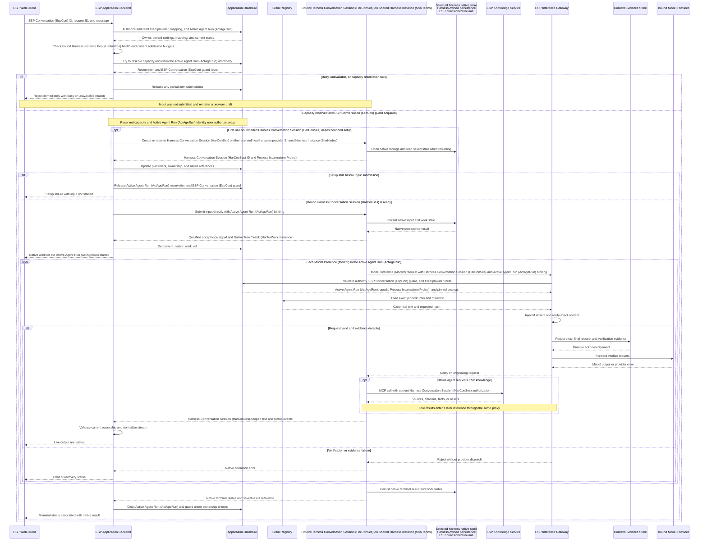

Capacity/guard acquisition is a race-safe reservation, not an observation followed by an unchecked dispatch. Section 12.4 also defines rate-limit rejection and duplicate-current-request handling. The native creation/resume branch uses capacity reserved for this live request; it does not wait for a busy or unavailable Shared Harness Instance (ShaHarIns) to become free.

The diagram's submission branch shows confirmed native acceptance. If submission may have occurred but its confirmation is lost, the adapter retains Active Agent Run (ActAgeRun) authority and follows Section 12.7 instead of automatically resending. A lost acknowledgement is not a clean admission rejection. Native persistence steps are logical events in the selected harness, not an ESP storage API.

The current design retains no durable application input before native acceptance. If the backend dies before submission, no later runtime process replays that message. The visitor can resubmit after status inspection confirms that it did not start. Once the harness has persisted the request, ordinary same-Harness Conversation Session (HarConSes) recovery applies. On reconnect, the website reads native history and Active Agent Run (ActAgeRun) state.

---

# 14. Harness Selection and ESP Conversation (EspCon) Binding

## 14.1 ESP Conversation (EspCon)-lifetime invariant

> Each ESP Conversation (EspCon) is permanently bound to the harness/provider selected when it is created. All messages, tool-driven continuations, compaction, retries, and process recovery use that same harness/provider.

The two bindings are `openai -> Codex` and `xai -> Grok Build`. A visitor may own separate ESP Conversations (EspCon) on either option. A single ESP Conversation (EspCon) has one native history in one harness.

The runtime process may change after idle unloading, draining, or failure. Such changes resume the saved Harness Conversation Session (HarConSes) on a compatible Shared Harness Instance (ShaHarIns) in the same provider Harness Instance Pool (HarInsPoo) with access to the same intact native storage. They do not change the ESP Conversation (EspCon)'s provider or transfer its history to another harness.

## 14.2 Creation and subsequent requests

The new-ESP Conversation (EspCon) screen collects the initial harness/provider choice. The backend validates eligibility and records the immutable provider and pinned Brain before returning the ESP Conversation (EspCon) ID. Harness Conversation Session (HarConSes) allocation happens when the first message is admitted.

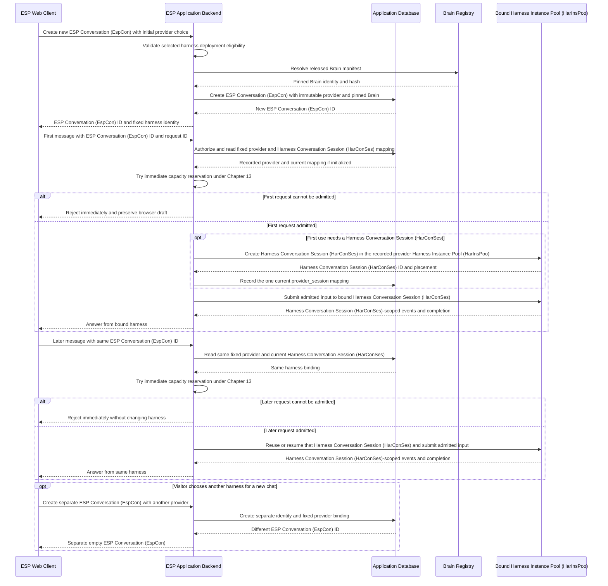

The diagram describes binding and Harness Conversation Session (HarConSes) identity. Each newly created ESP Conversation (EspCon) follows the same eligibility and Brain-release checks. Immediate admission/rejection, ownership, direct submission, native persistence, inference-proxy enforcement, and streaming follow Chapter 13.

## 14.3 Enforcement

The backend routes messages from `conversation.provider`, not a provider selector in a later message. A conflicting request override is rejected before work is admitted. The current Harness Conversation Session (HarConSes) mapping and its provider Harness Instance Pool (HarInsPoo) must match the ESP Conversation (EspCon)'s recorded provider.

The Inference Gateway validates the fixed provider and approved upstream route alongside Active Agent Run (ActAgeRun) authority and the pinned Brain. An unavailable provider causes immediate rejection of new input for the existing ESP Conversation (EspCon). Already accepted work follows the same-harness recovery policy; provider unavailability does not change the ESP Conversation (EspCon) binding.

Native history remains in the owning harness. There is no ESP Conversation (EspCon)-history export/import pipeline, cross-provider summary, synchronization cursor, or migration operation in the application baseline. Selecting another harness creates a new ESP Conversation (EspCon) without transferring content from the original one.

## 14.4 Acceptance criteria

Qualification verifies that:

- Repeated messages, browser reconnects, idle unload/resume, and process recovery retain the original harness/provider and saved Harness Conversation Session (HarConSes).
- A conflicting provider override is rejected and cannot dispatch to another Harness Instance Pool (HarInsPoo) or upstream route.
- Provider unavailability does not trigger a fallback to the other harness.
- Starting a new chat with another provider creates a different ESP Conversation (EspCon) ID, Harness Conversation Session (HarConSes), and history.
- Shared processes continue isolating each Harness Conversation Session (HarConSes) and attributing every model/tool request to that ESP Conversation (EspCon)'s current authority and pinned Brain.

These are requirements to validate with each selected harness build, not claimed test results.

---

# 15. Brain Release Lifecycle

Source preparation, canonicalization, evaluation, and review produce an approved release. The Knowledge Publishing Worker shown in C2 performs the publication stage. It publishes the canonical Brain and manifest to the shared Brain Registry, and reviewed source material to the Knowledge Service's backing stores.

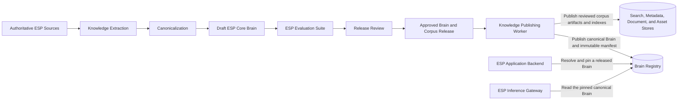

This is an offline lifecycle view; preparation and review steps are activities rather than additional C2 containers.

Each release records the Brain version and hash, behavior version, source revision, evaluation results, published artifact identifiers, and the runtime/gateway configurations against which qualification was performed. The same canonical release is read by the gateway for either provider.

---

# 16. ESP Evaluation Suite

The evaluation suite measures how well each model understands ESP with a given Brain release.

## 16.1 Evaluation categories

### Conceptual

```text
Why does ESP use X?
How do A and B interact?
```

### Counterfactual

```text
What happens if X is removed?
```

### Misconception correction

```text
Is ESP effectively the same as Y?
```

### Edge cases

```text
What happens when A fails while B is pending?
```

### Version-specific

```text
How did this mechanism differ in version 2?
```

### Exact factual

```text
What is the current value of parameter X?
```

### Retrieval behavior

Example test definition:

```yaml
question: "..."
retrieval_expected: true
required_concepts:
  - concept_a
  - concept_b
required_sources:
  - source_123
```

## 16.2 Provider matrix

Each production Brain release is evaluated against both providers:

```text
Astra + Brain vN
Grok  + Brain vN
```

Tracked metrics include:

- answer quality,
- conceptual correctness,
- source correctness,
- retrieval decision quality,
- citation correctness,
- latency,
- token usage.

---

# 17. Data Model

The Application Database contains operational metadata for ESP Conversation (EspCon) ownership, Harness Conversation Session (HarConSes) placement, Active Agent Run (ActAgeRun) authority, and restoration. These logical definitions are not SQL migrations. Harness Conversation Session (HarConSes) content and work history remain in Codex Native Session Store or Grok Build Native Session Store, according to the fixed provider; inference audit evidence belongs to the proxy's evidence storage. Input exists temporarily in the live request until native submission; rejected input is not stored for future execution.

## 17.1 ESP Conversation (EspCon)

```text
conversation
    id                                  UUID primary key
    owner_subject_id                    TEXT
    provider                            openai | xai, immutable after creation
    brain_release_id                    TEXT
    status                              active | closed
    active_provider_session_id          UUID nullable -> provider_session
    created_at                          TIMESTAMP
    updated_at                          TIMESTAMP
```

`provider` is fixed at ESP Conversation (EspCon) creation. The chat API exposes no operation for changing it. `active_provider_session_id` is the ESP Conversation (EspCon)-wide Active Agent Run (ActAgeRun) guard and must reference this ESP Conversation (EspCon)'s own current mapping. It is claimed transactionally with that mapping's Active Agent Run (ActAgeRun) state and released by a conditional update after native completion or reconciled cancellation/interruption. The guard remains while outcome or ownership is unresolved.

## 17.2 Harness Conversation Session (HarConSes) mapping and Active Agent Run (ActAgeRun) state

```text
provider_session
    id                                  UUID primary key
    conversation_id                     UUID -> conversation
    provider                            openai | xai
    session_generation                  INTEGER
    is_current                          BOOLEAN
    native_session_id                   TEXT nullable during creation
    model                               TEXT
    brain_release_id                    TEXT
    brain_hash                          TEXT
    deployment_ref                      TEXT

    runtime_state                       starting | warm_idle | running |
                                        cancelling | draining | unloaded |
                                        suspect | recovering | unavailable
    harness_instance_id                 UUID nullable -> harness_instance
    runtime_incarnation_id              UUID nullable
    native_storage_unit_id              TEXT
    state_location                      TEXT

    ownership_epoch                     BIGINT
    owner_lease_expires_at              TIMESTAMP nullable
    active_agent_run_id                 UUID nullable
    current_request_id                  TEXT nullable
    current_native_work_ref             TEXT nullable
    active_agent_run_expires_at         TIMESTAMP nullable
    recovery_count                      INTEGER
    last_failure_code                   TEXT nullable

    created_at                          TIMESTAMP
    last_used_at                        TIMESTAMP
```

There is at most one current mapping per ESP Conversation (EspCon), enforced by uniqueness on `conversation_id` where `is_current` is true. Its provider and every retained mapping generation must equal the immutable `conversation.provider`. Multiple ESP Conversations (EspCon) may share a Shared Harness Instance (ShaHarIns) while retaining distinct Harness Conversation Session (HarConSes) IDs and authority. Native generations, Harness Conversation Session (HarConSes) IDs, and storage references remain addressable as long as same-harness resume or native-history access depends on them.

`native_storage_unit_id` and `state_location` are opaque references to the provisioned storage and the location configured for native harness persistence. They let the supervisor reconnect a compatible process to its existing data; they do not define a separate database, its schema, or an ESP API for modifying native state.

The `active_agent_run_id` and `active_agent_run_expires_at` fields identify and bound the Active Agent Run (ActAgeRun) authorized **now**, together with request correlation and ownership fields. They are retained during unresolved recovery, then cleared after confirmed native termination or acknowledged interruption. A later operation gets a new Active Agent Run (ActAgeRun) ID. Historical details remain in native persistence and observability, not additional application execution rows.

`ownership_epoch` is monotonic for a mapping and increases when authority is revoked/reassigned. A Harness Conversation Session (HarConSes) replacement has a distinct mapping generation. The backend, gateway, and Knowledge Service verify the Active Agent Run (ActAgeRun) ID, epoch, lease, native mapping, Process Incarnation (ProInc), and ESP Conversation (EspCon) guard.

The provider is immutable for the ESP Conversation (EspCon) lifetime. Model and Brain settings remain pinned for execution and recovery; process replacement retains the compatible deployment. Provider changes require a new ESP Conversation (EspCon). The application stores no cross-provider synchronization metadata.

## 17.3 Shared Harness Instance (ShaHarIns)

```text
harness_instance
    id                                  UUID primary key
    provider                            openai | xai
    worker_id                           TEXT
    process_incarnation_id              UUID
    deployment_ref                      TEXT
    native_storage_unit_id              TEXT
    lifecycle_status                    starting | ready | draining |
                                        suspect | failed | stopped
    resident_session_limit              INTEGER
    active_turn_limit                   INTEGER
    last_heartbeat_at                   TIMESTAMP
    drain_started_at                    TIMESTAMP nullable
```

`resident_session_limit` bounds resident Harness Conversation Sessions (HarConSes), while `active_turn_limit` bounds concurrently admitted Active Agent Runs (ActAgeRun) on the Shared Harness Instance (ShaHarIns). Each process start has a fresh Process Incarnation (ProInc). Marking it unavailable revokes every current mapping assigned to that Process Incarnation (ProInc). Placement and admission enforce qualified Shared Harness Instance (ShaHarIns) limits; storage fencing separately prevents obsolete native writers.


## 17.4 Active Agent Run (ActAgeRun) coordination and direct admission

Visitor/account request-rate counters are held separately in the Rate-Limit Counter Store (Section 7.5). They do not hold or reserve execution capacity and are not the authority for execution ownership.

The database performs a narrow set of transactional operations:

- Resolve the immutable provider and attempt immediate reservation of capacity and the ESP Conversation (EspCon) guard, with the bound Harness Conversation Session (HarConSes)'s Active Agent Run (ActAgeRun) identity.
- Release partial reservations if admission fails, without creating a future work record.
- Renew or revoke Harness Conversation Session (HarConSes) authority and record process placement/recovery state.
- Update confirmed native references and same-provider runtime placement.
- Clear Active Agent Run (ActAgeRun) with compare-and-set checks on Active Agent Run (ActAgeRun) ID and ownership epoch.

A request envelope carries Active Agent Run (ActAgeRun) identity to the proxy and tools. It is validated against `provider_session`, not a separately stored authorization history. Gateway database access is read-only and restricted to current authority/settings. Dispatch/outcome evidence stays in proxy storage.

The live request handler holds input only while reserving capacity, performing bounded Harness Conversation Session (HarConSes) setup, and submitting it directly. The application stores no pending-message payload or future-dispatch job in this schema or another durable waiting store. Clean rejection leaves the draft with the browser. Setup failure releases the reservation when non-submission is certain.

If submission may have occurred, Active Agent Run (ActAgeRun) fields remain until native status/history establishes the outcome. Duplicate active request IDs return current status rather than creating another native operation. If a selected harness cannot reliably expose acceptance correlation and status, its integration must be revised and qualified; application metadata alone cannot establish native completion. Section 12.4 defines the admission and ambiguous-submission behavior.

## 17.5 Release and deployment references

```text
brain_release
    version, sha256, behavior_version, source_revision,
    artifact_ref, status, created_at

provider_deployment
    id, provider, model, harness_revision, configuration_digest,
    gateway_route, recovery_qualification_ref,
    shared_process_qualification_id, deployed_at

runtime_qualification
    id, design_assumption_id, provider, harness_revision,
    image_digest, configuration_digest, transport_digest,
    storage_profile, tool_policy_digest, status,
    resident_session_limit, active_turn_limit,
    acceptance_budgets_ref, evidence_bundle_ref,
    failed_criteria, reviewed_by, reviewed_at
```

These shared operational records identify eligible releases/builds and their validation status. Brain text remains in the Brain Registry. Recovery pins the compatible deployment and Brain rather than silently upgrading either. A shared-process deployment requires a validated DA-01 record for its exact integration.

---

# 18. Observability

Observability records request, Harness Conversation Session (HarConSes), Active Agent Run (ActAgeRun), and inference correlations. Historical traces and inference outcomes belong to this stack and the Context Evidence Store, not the Application Database.

## 18.1 Chat request trace

Each chat request records:

```yaml
request_id:
conversation_id:
provider:
model:
brain_version:
canonical_brain_sha256:
provider_session_id:

latency_ms:
admission_decision_ms:
admission_outcome:  # admitted | duplicate_active | rejected
rejection_reason:
http_status:
time_to_first_token_ms:
input_tokens:
output_tokens:
cached_tokens:

retrieval_used:
retrieval_calls:
retrieved_source_ids:
tool_errors:
completion_status:
```

## 18.2 Inference context trace

Every Model Inference (ModInf) records:

```yaml
inference_id:
request_id:
conversation_id:

provider:
model:
provider_session_id:
harness_instance_id:
runtime_incarnation_id:
session_generation:
active_agent_run_id:
native_work_ref:
ownership_epoch:
provider_request_id:

brain_version:
canonical_brain_sha256:
canonical_brain_bytes:

request_body_sha256:
request_body_bytes:
brain_start_offset:
brain_end_offset:
extracted_brain_sha256:
extracted_brain_bytes:
brain_presence_verified:

harness_revision:
verifier_revision:
context_evidence_ref:
```

`context_evidence_ref` points to the protected exact final provider request body used for independent audit.

Operational dashboards cover:

- Brain verification success rate,
- unobservable inference attempts,
- Brain mismatch/block events,
- provider latency,
- provider cost,
- time to first token,
- retrieval frequency,
- tool errors,
- citation correctness,
- Brain-version performance,
- fixed-harness binding violations,
- evaluation regressions.

The expected production value is:

```text
Brain verification success rate = 100%
Unobservable dispatched inference count = 0
```

## 18.3 Shared Harness Instance (ShaHarIns), warm Harness Conversation Session (HarConSes), and recovery trace

```yaml
conversation_id:
native_session_id:
active_agent_run_id:
native_work_ref:
session_generation:
harness_instance_id:
runtime_incarnation_id:
worker_id:
ownership_epoch:
native_storage_unit_id:
session_state:
harness_instance_state:
recovery_group_id:
affected_session_count:
recovery_mode:
recovery_reason:
recovery_duration_ms:
admission_decision_ms:
qualification_id:
```

Correlate these fields with Section 18.2 inference evidence. Track resident and active Harness Conversation Sessions (HarConSes) per Shared Harness Instance (ShaHarIns), qualified capacity/headroom, process baseline and incremental Harness Conversation Session (HarConSes) memory, memory reclaimed after unload, admission latency, capacity/busy rejection rates, reservation leaks, native resume latency, stale/misbound-call rejections, process-crash blast radius, and per-Harness Conversation Session (HarConSes)/group recovery success. An idle Shared Harness Instance (ShaHarIns) is not the same as an idle Harness Conversation Session (HarConSes). Recovery is assessed separately for each affected mapping against restored native status and Active Agent Run (ActAgeRun) authority.

# 19. Reliability

## 19.1 Per-inference Brain invariant

Brain identity at Harness Conversation Session (HarConSes) level is retained for routing and compatibility:

```text
brain_version
canonical_brain_sha256
behavior_version
```

Runtime correctness is established at the inference level.

Every dispatched inference must have:

```text
brain_presence_verified = true
```

There is no degraded mode in which an inference is allowed to proceed without Brain verification.

## 19.2 Context compaction safety

Harness compaction is permitted to rebuild or summarize ESP Conversation (EspCon) state.

The next outbound Model Inference (ModInf) request still passes through the ESP Inference Gateway. If compaction has removed the Brain, the gateway injects the exact canonical Brain before forwarding. If an existing Brain block is present but altered, the request is blocked.

## 19.3 Inference Gateway availability

The ESP Inference Gateway is on the synchronous model-request path.

If it is unavailable, Model Inference (ModInf) is unavailable.

This dependency is intentional because permanent-Brain enforcement is part of correctness, not optional telemetry.

## 19.4 Provider availability

New ESP Conversations (EspCon) can select only eligible providers. An existing ESP Conversation (EspCon) displays its immutable harness/provider identity. During an outage, new input receives immediate unavailable rejection while the ESP Conversation (EspCon) remains on the same provider. Recovery/status inspection of already accepted Native Turn / Work (NatTurWor) remains available where possible. The visitor may start a separate new ESP Conversation (EspCon) with another provider, with its own history.

A provider can be enabled only while its qualified runtime topology can satisfy the Brain-presence invariant. The backend and gateway reject conflicting routes rather than failing over an existing ESP Conversation (EspCon) to another harness.

## 19.5 Knowledge Service availability

Conceptual answers can be produced from the Core Brain.

Questions requiring detailed evidence, exact values, or source citations depend on the ESP Knowledge Service and expose its availability state to the agent runtime.

## 19.6 Shared runtime and Worker Host (WorHos) failure

Chapter 12 defines process restart and Harness Conversation Session (HarConSes) resume using intact persisted state. A failed shared process affects all mappings on its Process Incarnation (ProInc). The backend revokes current authority, fences the old storage writer, starts a compatible replacement with access to the same native storage, and reopens the existing Harness Conversation Session (HarConSes) IDs.

Each Harness Conversation Session (HarConSes) is reconciled against native status before further execution. Completed native results are read rather than automatically regenerated; idle Harness Conversation Sessions (HarConSes) resume on demand. Worker Host (WorHos) replacement uses the same procedure when the native storage survives and can be attached to the replacement.

Unknown submission or provider outcomes are reconciled before any retry. Newly rejected input is not retained or dispatched after recovery. An interrupted answer may need an explicit retry and another billed inference. Provider/Brain selection and current Harness Conversation Session (HarConSes) attribution remain enforced. These process-failure paths are part of DA-01 qualification.

# 20. Security

## 20.1 Brain release access

The Brain release pipeline is access-controlled and auditable.

Production runtimes load only released Brain artifacts.

## 20.2 Source metadata

Source documents carry metadata such as:

```text
authority
version
effective_date
supersedes
status
source_owner
```

This metadata determines source precedence during retrieval.

## 20.3 Tool authorization

The ESP Knowledge Service exposes read-only knowledge tools to the public conversational runtime.

Additional operational tools, if introduced later, use separate permissions.

## 20.4 Retrieved content

Retrieved documents are treated as knowledge data.

System behavior and agent instructions remain in the provider instruction layer.

---

## 20.5 Shared-process isolation and recovery access

Each visitor accesses only authorized ESP Conversations (EspCon) through the backend. Each Harness Conversation Session (HarConSes) has explicit identity, history, output routing, state references, and operation permissions, even where native files or process infrastructure are shared. Native histories, application metadata, and evidence are encrypted and access-controlled. Export, retention, and deletion of native history use the selected harness's supported mechanisms, qualified to preserve unrelated Harness Conversation Sessions (HarConSes) sharing the process.

The shared harness process is a common trust and failure boundary. Its Harness Conversation Session (HarConSes) IDs and separate working directories are not OS security boundaries. Container controls constrain the whole Shared Harness Instance (ShaHarIns) but cannot stop a compromised process from reading its own memory. The initial shared Harness Instance Pool (HarInsPoo) therefore serves the constrained ESP informational workload with approved read-only MCP tools, ESP-owned service credentials, and enforceably disabled arbitrary shell, repository-edit, host-filesystem, and unapproved-network tools. Model instructions alone are not the enforcement mechanism. Visitor-specific secrets or stronger OS-level tenant isolation would require a separate deployment decision.

Trusted adapters validate Harness Conversation Session (HarConSes) identity on RPC/events and bind each model/tool call to its own current Active Agent Run (ActAgeRun). Identity cannot be changed through shared process environment variables or inferred from user text. A correct Brain hash does not compensate for an answer, tool result, or request being attributed to the wrong visitor.

Restoration re-establishes per-Harness Conversation Session (HarConSes) permissions and current bindings. Database authority checks reject stale stream/model/tool work; process/volume-access controls prevent a superseded process from continuing to use the native storage. DA-01 tests evaluate this stated threat model and privacy boundary for the exact release. Any isolation or attribution failure blocks shared-process production use.

# 21. Deployment Model

The assumed deployment uses separate horizontally scalable Codex and Grok Build Harness Instance Pools (HarInsPoo). **One Docker-style container packages one Shared Harness Instance (ShaHarIns), containing one main harness process that hosts multiple Harness Conversation Sessions (HarConSes) under DA-01. A Worker Host (WorHos) hosts multiple such containers.** The Shared Harness Instance (ShaHarIns) is the logical identity of the harness deployment; the container is its packaging, not an additional ESP application service. Worker Hosts (WorHos) provide CPU/RAM, networking, and native-storage access; the provider APIs perform Model Inference (ModInf).

The one-to-one and one-to-many relationships are defined in Section 3.10. Codex and Grok Build containers may share a Worker Host (WorHos); their Harness Instance Pools (HarInsPoo) remain logically separate and may span multiple Worker Hosts (WorHos). The counts in the example below illustrate placement only, not measured capacity.

```text
ESP Web Client
    |
ESP Application Backend service instances
    |  immediate admission/rejection, Harness Conversation Session (HarConSes) placement,
    |  current ownership, RPC/event routing
    |
    +-- Worker Host (WorHos) A - one server / cloud VM
    |     +-- Docker-style container codex-a
    |     |     +-- Codex Shared Harness Instance (ShaHarIns) C1
    |     |           one main Codex process
    |     |             +-- Harness Conversation Session (HarConSes) -> ESP Conversation (EspCon) 101
    |     |             +-- Harness Conversation Session (HarConSes) -> ESP Conversation (EspCon) 102
    |     +-- Docker-style container grok-a
    |           +-- Grok Build Shared Harness Instance (ShaHarIns) G1
    |                 one main Grok Build process
    |                   +-- Harness Conversation Session (HarConSes) -> ESP Conversation (EspCon) 201
    |                   +-- Harness Conversation Session (HarConSes) -> ESP Conversation (EspCon) 202
    |
    +-- Worker Host (WorHos) B - another server / cloud VM
          +-- Docker-style container codex-b
          |     +-- Codex Shared Harness Instance (ShaHarIns) C2
          |           one main Codex process -> additional Harness Conversation Sessions (HarConSes)
          +-- Docker-style container grok-b
                +-- Grok Build Shared Harness Instance (ShaHarIns) G2
                      one main Grok Build process -> additional Harness Conversation Sessions (HarConSes)

Logical deployment groups, independent of physical nesting:
    Codex Harness Instance Pool (HarInsPoo)
        = Codex Shared Harness Instances (ShaHarIns) C1 and C2
    Grok Build Harness Instance Pool (HarInsPoo)
        = Grok Build Shared Harness Instances (ShaHarIns) G1 and G2

Every Harness Conversation Session (HarConSes)'s model calls
    -> request-scoped Active Agent Run (ActAgeRun) binding
    -> ESP Inference Gateway service instances
    -> exact pinned Brain injection / verification / evidence
    -> selected OpenAI or xAI model API

Every Harness Conversation Session (HarConSes)'s authorized ESP tool calls
    -> ESP Knowledge Service / MCP
    -> source and asset stores

Durable state
    +-- PostgreSQL: ESP Conversation (EspCon) metadata, provider_session current authority, placement, native-state references
    +-- Codex Native Session Store: Codex-owned native persistence on ESP-provisioned volumes
    +-- Grok Build Native Session Store: Grok Build-owned native persistence on separate ESP-provisioned volumes
    +-- Brain Registry and Context Evidence Store
```

## 21.1 Placement and admission

The backend records `ESP Conversation (EspCon) (fixed provider) -> Harness Conversation Session (HarConSes) -> Shared Harness Instance (ShaHarIns)/Process Incarnation (ProInc) -> Worker Host (WorHos)`. Healthy resident mappings retain affinity. The Admission Controller reserves one Active Agent Run (ActAgeRun) per ESP Conversation (EspCon) and bounded overlapping Active Agent Runs (ActAgeRun) across Harness Conversation Sessions (HarConSes) on each Shared Harness Instance (ShaHarIns). New input is rejected immediately when those reservations cannot be made. A browser connection does not allocate a dedicated process or container.

Each Shared Harness Instance (ShaHarIns) has a qualified maximum resident-Harness Conversation Session (HarConSes) count and Active Agent Run (ActAgeRun) count. Worker Host (WorHos) resource limits, provider throughput, storage affinity, and recovery headroom further constrain admission. Scaling adds Shared Harness Instances (ShaHarIns) and then Worker Hosts (WorHos) as needed. It is driven by resident/active utilization, resource headroom, and rejection rates. New capacity serves subsequent explicit submissions; it does not trigger execution of previously rejected input. Scaling does not create one new process for every additional visitor.

## 21.2 Idle eviction, draining, and upgrades

A Harness Conversation Session (HarConSes) idle timeout triggers safe Harness Conversation Session (HarConSes) unloading, not process termination. Harness Instance Pool (HarInsPoo) scale-in or a build upgrade drains a Shared Harness Instance (ShaHarIns): stop new placement, finish/cancel admitted turns safely, confirm native persistence, unload its Harness Conversation Sessions (HarConSes), then terminate the shared process. Saved Harness Conversation Sessions (HarConSes) resume by ID on a compatible process with access to their native storage. Native state-format compatibility and exclusive storage ownership must be qualified before moving Harness Conversation Sessions (HarConSes) between Shared Harness Instances (ShaHarIns) or builds.

The initial 15-minute residency setting and measured per-Shared Harness Instance (ShaHarIns) caps apply under Chapter 12. Neither is a retention limit on saved ESP Conversations (EspCon). A shared-process crash triggers recovery for all assigned Harness Conversation Sessions (HarConSes), not just the visitor whose turn was most recent.

## 21.3 Transport and trust boundaries

Model-provider credentials remain in the inference gateway; the runtime's common base URL and container identity identify only its Harness Instance Pool (HarInsPoo) and Shared Harness Instance (ShaHarIns). Request-scoped Active Agent Run (ActAgeRun) bindings identify individual Harness Conversation Sessions (HarConSes) and Brain releases. Model responses return through the gateway on the originating request connection and are demultiplexed to the correct Harness Conversation Session (HarConSes)/Native Turn / Work (NatTurWor).

Runtime containers cannot directly reach model-provider endpoints. Both provider Harness Instance Pools (HarInsPoo) independently access the Knowledge Service via MCP; Knowledge Service and inference gateway do not call each other. Shared data services have their own service-instance and capacity policies.

## 21.4 Deployment qualification

DA-01 is assumed by this topology, with status `pending` until Section 12.14 passes independently for each chosen harness/build and transport/storage/tool configuration. The Shared Harness Instance (ShaHarIns) placement service enables only validated profiles and enforces their measured resident/active limits. Invalidating one profile requires revising or replacing that provider's runtime deployment; it does not silently weaken the Brain or isolation contract.

# 22. Repository Structure

```text
esp-ai/
├── apps/
│   ├── web/
│   └── api/
│
├── packages/
│   ├── EspCon/
│   ├── provider-router/
│   ├── runtime-HarConSess/
│   ├── runtime-placement/
│   ├── execution-bindings/
│   ├── request-admission/
│   ├── recovery/
│   ├── event-protocol/
│   └── esp-knowledge-client/
│
├── providers/
│   ├── openai/
│   └── xai/
│
├── knowledge/
│   ├── brain/
│   ├── corpus/
│   ├── ontology/
│   ├── evals/
│   └── release/
│
├── services/
│   ├── esp-inference-gateway/
│   └── esp-mcp/
│
└── infra/
```

---

# 23. Initial Proof of Concept

The initial proof of concept contains:

```text
Browser
  |
ESP Backend
  |
  +-- Codex -- custom model base URL --+
  |                                      |
  +-- Grok Build -- custom base URL -----+
                                         |
                                         v
                                ESP Inference Gateway
                                         |
                                         +-- exact Brain injection
                                         +-- exact Brain verification
                                         +-- request evidence
                                         |
                                  +------+------+
                                  |             |
                                  v             v
                             OpenAI/Astra    xAI/Grok

Codex / Grok Build
  |
ESP Knowledge Service / MCP
  |
Small authoritative ESP corpus
```

The prototype runs at least two independent Harness Conversation Sessions (HarConSes) in one actual shared process for each provider, then tests overlapping turns. It uses distinct history canaries and mixed pinned Brain releases so wrong-Harness Conversation Session (HarConSes) routing cannot appear to pass simply because every Harness Conversation Session (HarConSes) has the same configuration.

The first proof-of-concept gate is the permanent-Brain invariant **and correct per-Harness Conversation Session (HarConSes) inference attribution**.

The prototype must demonstrate:

- Codex successfully operates when its model base URL points to the ESP Inference Gateway,
- Grok Build successfully operates when its model base URL points to the ESP Inference Gateway,
- exact canonical Brain presence on every forwarded OpenAI request,
- exact canonical Brain presence on every forwarded xAI request,
- deterministic Brain injection when the harness omits it,
- blocking when an existing Brain is corrupted,
- correct behavior through tool loops and compaction,
- correct behavior on retry and Harness Conversation Session (HarConSes) resume,
- immediate rejection when ESP Conversation (EspCon), Shared Harness Instance (ShaHarIns), or provider admission limits are reached,
- no execution of rejected input after capacity becomes available without explicit resubmission,
- released reservations after confirmed pre-submission failure and safe reconciliation of ambiguous submissions,
- direct provider access is blocked by network policy,
- every provider request has context evidence,
- zero provider-bound inference requests bypass the gateway,
- interleaved calls and responses remain correctly bound to Harness Conversation Sessions (HarConSes) and Active Agent Runs (ActAgeRun),
- Harness Conversation Session (HarConSes) creation, cancellation, and idle unloading do not corrupt or silently terminate peers.

The second gate qualifies shared-process warm residency, native persistence, and multi-Harness Conversation Session (HarConSes) process recovery under Section 12.12. It includes process termination and Worker Host (WorHos) replacement with intact surviving native storage while several ESP Conversations (EspCon) are active and idle, ambiguous in-flight work, Harness Conversation Session (HarConSes) and Process Incarnation (ProInc) fencing, native-history reload on browser reconnect, and persistence of the original harness/provider binding. A normal single-Harness Conversation Session (HarConSes) resume is insufficient.

The DA-01 decision gate in Section 12.14 then records `validated` or `invalidated` for each candidate integration, or remains `pending` if evidence is incomplete. Capacity and cost are measured against acceptance budgets agreed before testing. A synthetic proxy test alone is not a live-harness qualification.

After these gates pass, the proof of concept evaluates response quality, creation-time harness selection, fixed ESP Conversation (EspCon) binding, ESP retrieval, citations, streaming, latency, token usage, and a measured concurrent-user workload.

# 24. Architecture Ownership

## ESP platform

The ESP platform owns:

- ESP Core Brain,
- Brain release/versioning,
- ESP Inference Gateway,
- permanent-Brain injection and verification,
- Context Evidence Store,
- provider credentials used by the gateway,
- model-egress network policy,
- ESP source corpus,
- ESP Knowledge Service,
- evaluation suite,
- native-history access, ESP Conversation (EspCon) ownership, and Harness Conversation Session (HarConSes) mapping,
- provider routing,
- Harness Conversation Session (HarConSes) mapping,
- Shared Harness Instance (ShaHarIns) placement, immediate request admission/rejection, bounded Harness Conversation Session (HarConSes) residency, and per-Harness Conversation Session (HarConSes) Active Agent Run (ActAgeRun) ownership,
- persistent native-state storage and native restart/resume qualification,
- Harness Conversation Session (HarConSes)-local and multi-Harness Conversation Session (HarConSes) crash reconciliation, bounded replay, and browser reconnection,
- DA-01 validation/invalidation records and qualified deployment limits,
- website experience,
- observability.

## Codex

Codex provides the OpenAI-side agent loop, ESP Conversation (EspCon)/context handling, tool execution, MCP integration, compaction, retries, and provider request construction.

Codex sends all model traffic to the ESP Inference Gateway through its configured custom provider/base URL.

## Grok Build

Grok Build provides the xAI-side agent loop, ESP Conversation (EspCon)/context handling, tool execution, MCP integration, compaction, retries, and provider request construction.

Grok Build sends all model traffic to the ESP Inference Gateway through its configured custom model/base URL.

## OpenAI

OpenAI provides GPT-6 Astra inference and the OpenAI inference API.

## xAI

xAI provides Grok inference and the xAI inference API.

# 25. Open Design Items

Shared-process hosting is the adopted assumption, not an undecided default. The following details qualify or invalidate its implementation:

1. **DA-01 shared-process qualification**
   - record actual multi-Harness Conversation Session (HarConSes)/parallel-Active Agent Run (ActAgeRun) behavior for each pinned harness,
   - validate per-request/Harness Conversation Session (HarConSes) transport identity, MCP scope, and output demultiplexing,
   - validate privacy, bounded Harness Conversation Session (HarConSes) unloading, native persistence/resume, and group process recovery,
   - measure resident-Harness Conversation Session (HarConSes) and Active Agent Run (ActAgeRun) limits against agreed budgets,
   - record `pending`, `validated`, or `invalidated` with real-binary evidence as specified in Section 12.14.

2. **Inference Gateway wire protocol**
   - exact Codex custom-provider configuration,
   - exact Grok Build custom-model/base-URL configuration,
   - supported OpenAI/xAI inference API shapes,
   - streaming and tool-call passthrough behavior.

3. **Harness recovery qualification**
   - exact Codex and Grok Build versions and their supported native persistence/resume configuration,
   - ACP persistence/restart support for the chosen Grok integration,
   - native save, unload, and explicit resume-by-ID behavior against intact storage,
   - native acceptance/status reconciliation and shared-process restart tests.

4. **Native history and fixed ESP Conversation (EspCon) binding**
   - authorized native input/result references, acceptance correlation, and history retention for display and recovery,
   - same-harness saved-Harness Conversation Session (HarConSes) resume after reconnect, idle unloading, and process restart,
   - rejection of conflicting provider routes and absence of automatic cross-harness fallback,
   - separate native histories when the visitor creates separate ESP Conversations (EspCon) on different providers.

5. **Direct admission and submission**
   - race-safe non-waiting capacity reservations and ESP Conversation (EspCon) guards,
   - rejection latency, busy/unavailable UX, and limits for bounded Harness Conversation Session (HarConSes) setup,
   - qualified native acceptance signals, status lookup for duplicate active requests, and reconciliation of ambiguous submission,
   - release of unused reservations without replaying rejected input.

6. **ESP Core Brain size**
   - target size based on evaluation results.

7. **Retrieval implementation**
   - hybrid search engine,
   - vector index,
   - metadata indexing,
   - reranking strategy.

8. **Citation UX**
   - inline citations,
   - source cards,
   - side panel,
   - diagram references.

9. **Storage and capacity deployment**
   - persistent native-volume implementation, replacement-process access, and writer fencing,
   - storage access, retention, and resource limits,
   - per-Harness Conversation Session (HarConSes) idle expiry, process-baseline/incremental-Harness Conversation Session (HarConSes) memory, Shared Harness Instance (ShaHarIns) limits, Worker Host (WorHos) sizing, and provider budgets,
   - atomic Active Agent Run (ActAgeRun)-binding validation and stale-owner fault tests.

10. **Provider tool parity**
   - MCP/tool behavior under both runtimes.

11. **Rate-limit storage and provider prompt caching**
   - Rate-Limit Counter Store implementation, atomic counter operations, expiry, and rate-policy configuration (Section 7.5),
   - provider prompt caching as a separate inference optimization,
   - measured latency and cost impact.

**Future option:** A later version may add a bounded Pending Request Queue to accept messages during short capacity shortages. It is outside the current design; adopting it would require an explicit decision on waiting UX, retention, expiry, and native-submission recovery.

---

# 26. Architecture Summary

```text
                                                       ESP WEBSITE
                                                            |
                                                     ESP APP BACKEND
                                                            |
                         +----------------------------------+----------------------------------+
                         |                                                                     |
                         v                                                                     v
      Codex Harness Instance Pool (HarInsPoo)                            Grok Build Harness Instance Pool (HarInsPoo)
                         |                                                                     |
                  custom endpoint                                                       custom endpoint
                         |                                                                     |
                         +----------------------------------+----------------------------------+
                                                            |
                                                            v
                                                  ESP INFERENCE GATEWAY
                                                  ---------------------
                                                   inject exact Brain
                                                 verify bytes + SHA-256
                                                persist request evidence
                                                 route provider request
                                                            |
                         +----------------------------------+----------------------------------+
                         |                                                                     |
                         v                                                                     v
                    OPENAI API                                                              xAI API
                         |                                                                     |
                         v                                                                     v
                    GPT-6 ASTRA                                                              GROK

Codex / Grok Build
    |
    +--> ESP KNOWLEDGE SERVICE / MCP
             |
             +--> SOURCE CORPUS
             +--> STRUCTURED KNOWLEDGE
             +--> ESP ASSETS
```

Each ESP Conversation (EspCon) is permanently bound to its initially selected harness/provider and one native history. A different harness is used only through a separate new ESP Conversation (EspCon), without history transfer. Process replacement resumes the original Harness Conversation Session (HarConSes) within the same provider Harness Instance Pool (HarInsPoo).

The agent harnesses own their agent loops, tools, compaction, and Harness Conversation Session (HarConSes) behavior. The deployment assumes **long-lived Shared Harness Instances (ShaHarIns)**, with multiple independent Harness Conversation Sessions (HarConSes) per process and separate Codex/Grok Build Harness Instance Pools (HarInsPoo). The backend places Harness Conversation Sessions (HarConSes), keeps recently active Harness Conversation Sessions (HarConSes) resident, and records Active Agent Run (ActAgeRun) authority on provider_session. It directly dispatches only requests with immediately reserved capacity; otherwise it returns a busy/unavailable rejection and leaves the draft with the visitor. Previously rejected input is never dispatched automatically. ESP Conversation (EspCon) content and execution history remain in recoverable native harness storage. Idle Harness Conversation Session (HarConSes) eviction leaves peer Harness Conversation Sessions (HarConSes) alive. Shared-process death triggers native resume by saved Harness Conversation Session (HarConSes) ID against the same intact storage, with independently reconciled current ownership for every affected Harness Conversation Session (HarConSes) under the same provider and pinned Brain.

This shared-process choice is DA-01: adopted for the architecture but pending actual qualification. Section 12.14 defines how to validate or invalidate it separately for each harness/build. Production promotion requires correct per-Harness Conversation Session (HarConSes) model/tool attribution, privacy separation, bounded residency and concurrency, group recovery, and measured capacity. No live test outcome or user-per-process capacity is claimed here.

For every model interaction, the request path is runtime → Inference Gateway → provider and the return path is provider → Inference Gateway → the same runtime. The backend receives the runtime's agent-event stream.

The ESP Inference Gateway is a mandatory inference proxy implemented through the harnesses' custom model endpoint/base-URL capabilities.

The defining architecture invariant is:

> **No model-provider request can leave ESP-controlled infrastructure unless the ESP Inference Gateway has ensured and verified the complete canonical ESP Core Brain word-for-word in that exact request.**

Network policy prevents Codex and Grok Build from contacting provider model APIs directly, making the gateway the unavoidable enforcement point.

The ESP Knowledge Service remains separate from the permanent Brain. Both Codex and Grok Build access it symmetrically through MCP for long-tail source retrieval, exact values, citations, diagrams, and other ESP material on demand. The ESP Knowledge Service has no direct relationship with the ESP Inference Gateway; retrieved material returns to the requesting harness and reaches the model only through the harness's subsequent verified inference request.
