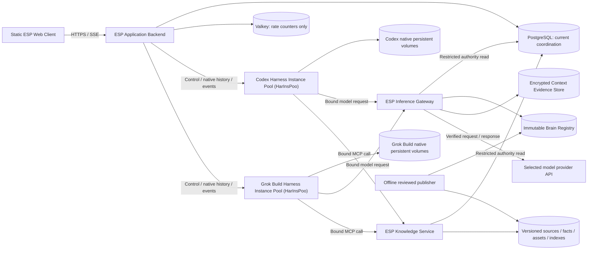

# ESP AI-Centric Website v1 Technical Design and Implementation Plan

> **For agentic workers:** REQUIRED SUB-SKILL: Use superpowers:subagent-driven-development (recommended) or superpowers:executing-plans to implement this plan task-by-task. Steps use checkbox (`- [ ]`) syntax for tracking.
>
> **This job is plan-only.** The instruction above applies to a separately authorized implementation job. Do not execute tasks, delegate work, publish, or request an execution-method decision during this planning job.

**Goal:** Build the ESP conversational website specified in v0.25, with permanently bound providers, recoverable native histories, immediate admission, authoritative retrieval, and provable exact Brain presence on every provider request.

**Architecture:** Retain the static `site/` frontend and add a TypeScript application backend, a mandatory inference gateway, a separate read-only MCP knowledge service, and an offline publisher. PostgreSQL owns current coordination; each native harness owns its history on exclusively mounted persistent storage. Separate Codex and Grok Build shared-process deployments remain ineligible for production until their exact integrations pass DA-01 independently.

**Tech Stack:** Vanilla HTML/CSS/browser ES modules; Node.js 24 LTS, TypeScript strict mode, Fastify 5, Zod, `pg`, PostgreSQL 17 with pgvector for knowledge indexes, Valkey 8 for rate counters, S3-compatible object storage, native Codex App Server and Grok Build ACP candidate integrations, Vitest, Playwright, OpenTelemetry, Docker Compose for local services, Kubernetes with enforced network policy for qualification/production.

**Spec:** [ESP architecture specification v0.25](../../prd/esp-ai-architecture-spec-v0.25.md), all Chapters 1–26. The PRD takes precedence over the older seed documents. Repository baseline: `dev/v1-ai-site`, commit `8a724a608b8ddca70d32ad87ae92d542e4bbcfac`.

## Global Constraints

- “The complete released ESP Core Brain must be present **word-for-word, without summarization, truncation, reordering, omission, or substitution, in every final inference request submitted to a model provider**.” (§2.1)
- “Evidence persistence fails” → “no inference”. (§2.1)
- “Admission policy: execute on immediately available capacity, otherwise reject immediately.” (§12.4)
- “Each ESP Conversation (EspCon) is permanently bound to the harness/provider selected when it is created.” (§14.1)
- “Only one Active Agent Run (ActAgeRun) may be authorized for an ESP Conversation (EspCon) at a time, including while an interrupted operation's outcome is unresolved.” (§3.7)
- “The application stores no pending-message payload or future-dispatch job in this schema or another durable waiting store.” (§17.4)
- “Recovery from lost, deleted, or corrupt native storage is outside this specification.” (§12)
- “The initial tool profile is read-only.” (§12.7) No shell, repository edits, arbitrary host filesystem, unapproved network tools, or runtime subagents in the initial profile.
- Defined architectural terms always use their full name and parenthesized abbreviation in human-facing technical descriptions; literal identifiers are exempt (§3).
- Initial PRD operating values: warm idle timeout **15 minutes**, heartbeat **5 seconds**, ownership lease **30 seconds**, maximum automatic recovery restarts **2 for the current interrupted operation**, recovery window **120 seconds**, and work deadline **300 seconds** (§12.2). These are qualification inputs, not measured service guarantees.
- The expected initial Brain size is approximately **5k–15k tokens** (§8.4); evaluation determines production size. Never trim the Brain to make a request fit.
- Follow the seed's semantic HTML, CSS custom properties, vanilla JavaScript, and minimal frontend dependencies. Clear Ledger craft/beauty work and invented infographic assets are outside this job and the implementation scope.
- Production qualification requires real binaries, mixed Brain releases, distinct histories, and at least **two concurrently active Harness Conversation Sessions (HarConSes) on one process per provider** (§12.14). Passing one provider never qualifies the other.

## Review Focus

These five implied failure classes receive explicit tests in the owning tasks below; they supplement the PRD's named acceptance tests.

1. A marker pasted into user/tool content, split across instruction fields, duplicated, or changed only by Unicode/newline normalization must never masquerade as the verified instruction block — Task 5.
2. A disconnect between native acceptance and its acknowledgement must preserve the guard and reconcile before offering another submission, including refresh from a different backend instance — Tasks 16 and 20.
3. A partitioned process can outlive its lease and later emit output or write its volume; database revocation and exclusive storage fencing must both protect replacements — Tasks 4, 18, and 25.
4. A source version changes or is withdrawn while a cited answer is being streamed/reloaded; the citation must still identify the exact published version or show it unavailable, never silently substitute current material — Tasks 7 and 21.
5. Interleaved streams, cancellation, and slow browser consumption must not mix visitors, exhaust service memory, or cause reconnection to duplicate an abandoned answer fragment — Tasks 9, 17, 19, and 20.

---

## 1. Starting point and scope boundaries

The repository currently has only `README.md`, `CONTRIBUTING.md`, `docs/architecture.md`, the PRD, `site/index.html`, `site/css/main.css`, and `site/js/.gitkeep`. There is no package manifest, backend, runtime integration, knowledge release, CI, or test suite. The working tree was clean when planning began. This plan adds those capabilities; it does not assume they already exist.

`README.md:1`, `CONTRIBUTING.md:1`, and `docs/architecture.md:1` describe a presentation website with a secondary explainer. Tasks 20 and 26 replace that obsolete framing with the conversational product. Remove the seed's Clear Ledger navigation/claims from the v1 entry point as part of that change; do not redesign that halted product. Keep a small approved ESP introduction and useful no-JavaScript fallback. The PRD is an application architecture source, not an approved corpus of ESP business facts.

The PRD spans independently testable subsystems. This single requested plan groups them into reviewable milestones rather than introducing separate plan files: contracts/control data, gateway/retrieval, actual-harness proof, live application/recovery, browser/content, and release qualification. Each task has its own test cycle and commit. Splitting a milestone into an independently tracked sub-project later must preserve the contracts here.

**Explicit exclusions:** no model-provider SDK used to replace native agent loops; no durable application transcript or input queue; no cross-provider history transfer or fallback; no browser provider credentials; no per-visitor process/container as an unannounced DA-01 fallback; no native-state reconstruction from inference evidence; no automatic schema upgrade of native state; no generated art; no live deployment in this planning job.

## 2. Decision locks and evidence boundaries

| Lock | Implementation decision | Qualification or change boundary |
|---|---|---|
| D01 — web | Keep `site/` as the web application; no React, SSR, or relocation to `apps/web/`. Browser modules use DOM APIs and same-origin HTTPS. | This is the explicit adaptation of the illustrative PRD Chapter 22 tree to the actual seed. |
| D02 — service code | One root npm package and lockfile, with focused TypeScript modules under `apps/`, `packages/`, `providers/`, `services/`, and `knowledge/`. Separate service processes use Fastify. | Pin exact npm versions/image digests at implementation and record them. Node 24 is deliberate even though this planning machine reports Node 26.7.0. [Node release policy](https://nodejs.org/en/about/previous-releases), [Fastify support policy](https://fastify.dev/docs/latest/Reference/LTS/). |
| D03 — coordination | PostgreSQL 17 transactions and non-waiting locks own guards, placement, provider capacity, and current authority. Use explicit SQL through `pg`, not an ORM that hides lock semantics. | Test against a real database with multiple independent connections. [PostgreSQL locking clauses](https://www.postgresql.org/docs/17/sql-select.html). |
| D04 — ephemeral counters | Valkey 8, atomic Lua token buckets, contains only opaque subjects/policy identifiers and numeric counter/expiry data. | No messages, execution ownership, waiting work, or stream buffers. Counter-store outage rejects new submissions. [Valkey EVAL](https://valkey.io/commands/eval/). |
| D05 — model protocol | Gateway routes only `/openai/v1/responses` and `/xai/v1/responses`; use HTTP request/SSE responses initially. Unknown endpoints, redirects, background generation, server-managed conversations, and opaque continuation modes are disabled until individually qualified. | OpenAI candidate model is `gpt-6-astra`; xAI model ID is mandatory deployment configuration, never a guessed alias. Exact account access, context limits, and model snapshots are captured in each candidate. [GPT-6 Astra](https://developers.openai.com/api/docs/models/gpt-6-astra). |
| D06 — native adapters | Codex App Server over supervised stdio; Grok Build ACP over supervised stdio are the first candidates. A trusted per-operation model/MCP transport integration is mandatory. | A common base URL/static header is not that integration. Missing essential identity, acceptance, history, unload, or recovery primitives invalidate that candidate. |
| D07 — persistence | One exclusively writable native storage unit per running Shared Harness Instance (ShaHarIns), mounted at the native location qualified for that build. Resume only with the saved native ID and compatible build/storage profile. | No direct ESP parsing/editing of private native files. Storage moves as a unit after drain/fencing; individual histories are not copied between volumes. |
| D08 — evidence | Immutable exact outbound request bytes and proof in encrypted object storage, acknowledged durably before dispatch; append separate dispatch/outcome objects. | General telemetry may degrade; evidence and authority may not. Hash-only logs are insufficient. |
| D09 — retrieval | PostgreSQL full-text plus pgvector exact cosine search for the small v1 corpus; fuse top-20 lists by reciprocal rank with `k=60`, return at most 8 authorized hits. No learned reranker initially. | Keep knowledge schema/role separate from coordination, even when sharing a PostgreSQL deployment. [pgvector](https://github.com/pgvector/pgvector). |
| D10 — embeddings | Run a pinned local sentence-transformer embedding model in an isolated internal service; proposed candidate `sentence-transformers/all-MiniLM-L6-v2`, 384 dimensions. Publisher and query path use the same immutable model revision and tokenizer. | Model licensing, language coverage, retrieval quality, runtime image, and revision are validated in Task 7; no hosted embedding inference bypass. The worker performs no generative ESP reasoning. |
| D11 — tools | Six read-only ESP MCP tools, Streamable HTTP, runtime-request authorization on every operation. No inference-gateway call to the Knowledge Service or reverse dependency. | Pin the compatible MCP SDK/protocol in each runtime profile. [MCP transport specification](https://modelcontextprotocol.io/specification/2025-06-18/basic/transports). |
| D12 — browser identity | Anonymous visitor ownership via a signed random subject cookie; provider credentials remain ESP-owned. OIDC/account linking is a later extension. | Cross-device history is not promised. Expiry/retention policy requires an explicit release setting; no subject ID supplied by browser JSON is trusted. |
| D13 — packaging | Compose for local data services; Kubernetes for qualification/production, separate harness workloads with one main process per container, attachable volumes, enforced egress controls. | Exact hosting region, storage driver/fencing mechanism, costs, and retention are release inputs. Neither Compose nor a generic `ReadWriteOnce` claim proves host-failure fencing. |
| D14 — rollout | Qualification is keyed by provider, harness build/image, configuration, transport, storage, tool policy, and measured limits. Default status is `pending`; enable only `validated` matches. | An invalidated candidate needs an explicit revised design and new evidence. Do not quietly convert ACP to per-message CLI invocations or reduce it to one active visitor and call DA-01 passed. |

Official documentation checked on 2026-10-02 gives integration starting points, not proof of DA-01. [Codex App Server](https://developers.openai.com/codex/app-server/) documents explicit thread creation/resume/read, turn start/interrupt, and unload after the final subscription ends and its grace period expires. It does not establish this deployment's acceptance durability or cross-visitor transport isolation. [Codex configuration](https://developers.openai.com/codex/config-reference/) documents custom provider endpoints and the Responses wire protocol; configured headers alone are process configuration. [Grok headless/ACP documentation](https://docs.x.ai/build/cli/headless-scripting) documents ACP `session/new`, `session/prompt`, and `session/update`; its separate headless persistence description does not establish ACP restart/history/unload behavior. Tasks 10–13 must discover and record those exact build capabilities.

The implementation's service boundaries are:



Return streams follow their originating connection; the drawing omits those duplicate arrows. The browser never addresses native runtimes or inference providers directly. Native storage boxes represent harness-owned data, not new ESP database services.

## 3. Components and files before implementation

All paths below are relative to the repository root. Files in the tasks refine this map; create only files owned by an executing task. Native harness source changes, if required, are reviewed patches/build inputs under `providers/<provider>/integration/`, not ad hoc edits to a developer's installed CLI.

| Paths | Single responsibility |
|---|---|
| `site/index.html`, `site/css/main.css`, `site/js/app.js`, `site/js/api.js`, `site/js/state.js`, `site/js/sse.js` | Accessible shell, client state, authenticated fetch and stream parsing. |
| `site/js/render.js`, `site/js/sources.js` | Safe text/citation/asset/structured-content DOM rendering. |
| `apps/api/src/{main,config,server,auth,conversations,chat,history,events,sources}.ts` | Validated startup, public HTTP boundary, ownership, normalized browser delivery. |
| `packages/contracts/src/{ids,chat,knowledge,runtime,release}.ts` | Validated shared data contracts; no I/O. |
| `packages/db/src/{pool,authority,records}.ts`, `packages/db/migrations/` | PostgreSQL access, typed records and migrations. |
| `packages/object-store/src/{store,s3}.ts` | Immutable checksummed object access; encryption/evidence policy stays with the gateway. |
| `packages/execution-bindings/src/{binding,authorize}.ts` | Signed request scope and current-authority enforcement. |
| `packages/request-admission/src/{admit,rate-limit}.ts`, `packages/request-admission/lua/token-bucket.lua` | Non-waiting admission and visitor rate policy. |
| `packages/runtime-placement/src/{placement,capacity}.ts` | Compatible storage-affine placement and limit checks. |
| `packages/runtime-sessions/src/{manager,lifecycle}.ts`, `packages/recovery/src/{reconcile,group-recovery}.ts` | Native setup, residency, cancellation, and interrupted-work reconciliation. |
| `packages/event-protocol/src/{normalize,history}.ts` | Convert authorized native events/history into website records. |
| `packages/observability/src/{telemetry,redaction}.ts` | Correlated metrics/traces with no raw prompt logging. |
| `providers/shared/src/{adapter,rpc-client,supervisor,transport-context,storage-fence}.ts` | Harness interface, framed stdio, trusted request scope, process and storage ownership. |
| `providers/openai/src/{adapter,events}.ts`, `providers/xai/src/{adapter,events}.ts` | Exact native protocol translations; no alternate agent loops. |
| `providers/openai/integration/`, `providers/xai/integration/` | Build-specific integration notes, protocol captures and any required reviewed transport patch. |
| `services/esp-inference-gateway/src/{main,server,brain,verify,evidence,forward}.ts`, `services/esp-inference-gateway/src/adapters/{openai-responses,xai-responses}.ts` | Validated startup, provider request parsing, Brain enforcement, durable proof, upstream connection and response relay. |
| `services/esp-mcp/src/{main,server,tools,retrieve,resolve,assets,embedding-client}.ts` | Validated startup, authorized read-only knowledge access and source precedence. |
| `services/esp-embeddings/{app.py,requirements.lock,Dockerfile}` | Local deterministic embedding endpoint, no provider network. |
| `knowledge/release/{manifest,publish,validate}.ts`, `knowledge/evals/{schema,run,grade}.ts` | Reviewed artifact publication and quality evaluation. |
| `knowledge/{brain,behavior,corpus,ontology,assets}/README.md` | Import contracts for approved external knowledge inputs; no invented company content. |
| `infra/local/compose.yaml`, `infra/runtime/`, `infra/k8s/`, `infra/observability/` | Service images, enforceable deployment controls, dashboards. |
| `scripts/{migrate,dev,qualify,evaluate}.ts`, `tests/{unit,integration,contract,e2e,qualification}/`, `tests/support/` | Repeatable development, meaningful tests and evidence generation. |
| `docs/qualification/`, `docs/runbooks/`, `docs/architecture.md` | Candidate evidence manifests, operational decisions, final system guide. |

## 4. Shared contracts and decisions tasks must preserve

### 4.1 Identity and authority

Use UUID strings for application identities; native IDs and work references are opaque strings. Epochs are PostgreSQL `BIGINT`, serialized as decimal strings to avoid JavaScript precision loss. Timestamps are UTC ISO-8601 strings backed by `TIMESTAMPTZ`; database time controls leases. Provider values are exactly `openai | xai`.

`RunBinding` in `packages/contracts/src/runtime.ts` has: `conversation_id`, `provider_session_id`, `session_generation`, `native_session_id`, `active_agent_run_id`, `harness_instance_id`, `runtime_incarnation_id`, `ownership_epoch`, `provider`, `model`, `brain_release_id`, `brain_hash`, `deployment_ref`, `issued_at`, `expires_at`, and `audience: "inference" | "knowledge"`. An optional `native_work_ref` can be added only after native acceptance. Every field except that optional reference must match current authorized metadata; token expiry never extends the database lease/deadline. Signing uses a service key held by trusted backend/supervision components, separate from upstream API credentials. Audience-specific tokens cannot be substituted.

`OperationAuthority = {inference:RunBinding;knowledge:RunBinding}` carries the two separately signed audiences for the same run/native identity. Trusted transport selects the appropriate member; a model/tool cannot choose or override it. Renewals replace both scopes from current metadata without changing the operation identity.

`SessionHandle` contains the mapping/native IDs, generation, placement, storage reference, provider/model/Brain/behavior/deployment pins, with a non-null `native_session_id`. `SessionReservation = Omit<SessionHandle,"native_session_id"> & {native_session_id:string|null}` represents bounded setup before a native ID exists. `AdmissionAuthority = Omit<RunBinding,"native_session_id"|"audience"> & {native_session_id:string|null}` authorizes trusted setup only and is never accepted by model/MCP endpoints. After native creation/resume and a conditional mapping update, mint audience-specific `RunBinding` values with the actual native ID. `WorkRef = { native_session_id: string; native_work_ref: string }`. `SubmissionResult` is a discriminated union: `{kind:"accepted"; work:WorkRef}`, `{kind:"not_submitted"; code:string}`, or `{kind:"unconfirmed"; native_work_ref?:string}`. A native protocol acknowledgement counts as accepted only if the integration proved its correlation and durable-input semantics.

`NativeStatus` is `{kind:"idle"|"running"|"completed"|"interrupted"|"failed"|"unknown"; work:WorkRef|null; request_id:string|null; saved_input_available:boolean}`. `NativeHistorySnapshot` contains ordered public `HistoryItem[]`, an opaque native cursor if supported, and `NativeStatus`; it never exposes hidden reasoning, credentials, or unrelated tool payloads. `HistoryItem` has `id`, `native_work_ref`, `role:"user"|"assistant"`, `text`, `citations:Citation[]`, `assets:AssetRef[]`, `structured_data:StructuredData[]`, and `provisional:boolean`.

### 4.2 Public API and stream

Public paths follow the PRD without an extra `/api` prefix; the reverse proxy routes these reserved paths to the API and all other approved static paths to `site/`. JSON requests reject unknown properties, including provider overrides in message bodies. A conflicting override receives `400 provider_override_forbidden` before admission; a route for changing the provider does not exist.

| Method/path | Contract and outcome |
|---|---|
| `POST /visitor-session` | Same-origin bootstrap, returns CSRF token and sets `__Host-esp_session` (`Secure`, `HttpOnly`, `SameSite=Lax`, `Path=/`). A 256-bit random subject is signed; no provider credentials. |
| `GET /providers` | `{providers: ProviderOption[]}` with eligibility/availability and display model; no secret/deployment internals. |
| `POST /conversations` | `{provider}` → `201 ConversationView`; validate qualified deployment and released Brain, allocate neither native state nor active capacity yet. |
| `GET /conversations` | Owner-filtered metadata list with cursor; no transcript table. |
| `GET /conversations/:id` | Authorized `ConversationView`, including fixed identity, runtime state and current work outcome. Return owner-obscuring `404` to other subjects. |
| `POST /conversations/:id/messages` | `{conversation_id,client_request_id,message}`; body/path IDs must agree. Clean rejection is JSON; after qualified native acceptance, return `200 text/event-stream` with `X-ESP-Acceptance: accepted`. |
| `GET /conversations/:id/status?client_request_id=...` | `SubmissionView` after native reconciliation. Never infer non-acceptance just because a current request field was cleared. |
| `GET /conversations/:id/history` | `NativeHistorySnapshot`; empty before native allocation. Reading history may not start model work. |
| `GET /conversations/:id/events` | Authorized SSE attachment to current work; reconnect does not submit input. |
| `POST /conversations/:id/cancel` | `{active_agent_run_id}` → current cancelling/terminal status; stale IDs cannot cancel new work. |
| `GET /sources/:id?version=...`, `GET /assets/:id?version=...` | Serve only published, policy-eligible source/asset references through a backend service credential; not an arbitrary URL fetcher or an MCP execution endpoint. |

`ConversationView = {id, provider, harness:"codex"|"grok-build", model:string|null, brain_release_id, status:"active"|"closed", runtime_state:RuntimeState|null, active_agent_run_id:string|null}`. Before first setup, return `model:null` and display the eligible candidate model separately; pin the actual model on native setup. `SubmissionView = {outcome:"accepted"|"running"|"completed"|"not_started"|"submission_unconfirmed"|"cancelled"|"failed", active_agent_run_id:string|null, native_work_ref:string|null, resubmission_allowed:boolean}`. An unknown old request remains `submission_unconfirmed` unless supported native correlation establishes its result; there is no durable exactly-once claim.

Clean rejections use `{error:{code,message,retryable},submitted:false}`: `409 conversation_busy`, `503 capacity_unavailable`, `503 service_unavailable`, `429 rate_limited` with `Retry-After`. Uncertain submission uses `409 submission_unconfirmed`, `submitted:null`, current status link, and **no retry permission**. Validation errors are `400`, missing authentication is `401`, CSRF failure `403`, oversized message `413`. Proposed application limits: 8,192 UTF-8 bytes per message, 64 KiB public JSON body, bounded 10-second setup/submission-confirmation interval; none changes native work's 300-second deadline. The 10-second limit never proves non-acceptance after submission began.

`ChatEvent` retains every PRD §7.3 variant and exact property names, including `output_reset.activeAgentRunId` and `done.nativeWorkRef`. Add one explicit v1 extension, `{type:"structured_data"; data:StructuredData}`. `Usage = {input_tokens:number; output_tokens:number; cached_tokens:number|null}`; unknown usage stays unknown, not zero. `StructuredData = {kind:"table"; caption:string; columns:string[]; rows:(string|number|null)[][]; source:Citation}`. `Citation = {source_id,version,title,locator,quote?:string}`; `AssetRef = {asset_id,version,kind:"diagram"|"infographic"|"image",alt,source_id}`. Versions and locators identify approved corpus artifacts; model-generated remote URLs cannot become trusted references.

Each SSE `data` value is `EventEnvelope = {protocol_version:1, conversation_id, provider_session_id, active_agent_run_id, native_work_ref:string|null, connection_id, sequence:number, event:ChatEvent}`. Sequence is local to the connection, starts at 1, and is not a durable cursor. Internal native events additionally carry epoch/incarnation and are rejected before normalization if stale. Use a bounded in-memory buffer per subscriber (256 KiB); disconnect slow consumers and require status/native-history reload. No Valkey event buffer. No promise of exact token replay. SSE status maps `starting`, `restoring`, `running`, `recovering`, `warm_idle` exactly as the PRD; other lifecycle states remain explicit in status JSON/error events.

### 4.3 Database, capacity and linearization

Implement all columns/states in PRD §§17.1–17.5. Add database constraints/triggers for immutable `conversation.provider`, retained generations matching that provider, one current mapping per `conversation_id`, mapping/guard ownership, immutable execution pins, nonnegative limits/counts, and monotonic epochs. The guard points to the current mapping only while work is active or unresolved, not to every idle mapping. Use a deferred constraint trigger for the circular guard/reference consistency at transaction commit.

Add one explicitly identified operational extension, `provider_capacity(provider PRIMARY KEY, active_run_limit INTEGER, blocked_until TIMESTAMPTZ NULL, policy_digest TEXT)`. This is current provider admission control, not a queue, a history table, or a new runtime container. Count active/unresolved reservations from `provider_session`; do not create separate historical turn/attempt rows. All occupancy mutations lock the provider capacity row, then the authorized ESP Conversation (EspCon), then affected Shared Harness Instance (ShaHarIns) rows in stable UUID order. Use `NOWAIT`/try-locks; inability to acquire now is a clean rejection. Choose placement using `FOR UPDATE SKIP LOCKED` only among compatible, healthy candidates. A short statement timeout caps accidental SQL waits. No remote I/O occurs inside the admission transaction.

Reservation atomically checks qualification, provider health/cap, conversation guard, instance active/resident caps, storage affinity, and current incarnation; sets run/request IDs, epoch/lease/deadline; and claims the guard. A rollback releases all partial changes. Residency is reserved even before `native_session_id` is available. Existing saved state is reopened only on its current exclusive storage owner. A free process lacking that storage is not compatible capacity. Provider throughput is bounded conservatively by measured active limits and profile token/context caps; upstream rate-limit responses update current `blocked_until` through authenticated backend supervision and do not create deferred work. Provider RPM/TPM and cost acceptance are measured in Task 26, not inferred from browser counts.

Gateway and MCP use separate read-only database roles/views exposing only current authorization fields. `withDispatchAuthority(binding, startRequest)` takes a short transaction-scoped shared advisory lock for the mapping, checks current authority using database time, and holds it only until outbound request headers/body are committed to the transport. Revocation/ownership changes take the matching exclusive advisory lock; lock acquisition failures reject new dispatches. Thus revocation cannot race between the last check and initiation. `startRequest` resolves on the bounded transport write-completion callback and returns a ticket containing the separate response promise; do not hold a transaction awaiting `fetch()` response headers or model output. A write timeout aborts the transport and preserves an ambiguous dispatch outcome if bytes may have left. A request already initiated before revocation is in flight; abort is best-effort and stale output is discarded. No gateway writes to application execution records. A store outage blocks new model/tool operations.

### 4.4 Exact Brain and evidence protocol

Canonical bytes are immutable UTF-8. The publisher validates UTF-8 without repairing/reformatting, hashes raw bytes, records byte length and behavioral/corpus identities, and rejects an attempt to overwrite an existing version. Do not normalize CRLF, Unicode, trailing newline, or BOM at runtime. Prefer the §9.1 manifest keys `canonical_brain_sha256` and `canonical_brain_bytes`; the importer may translate §8.3's legacy `brain_sha256` once and rejects conflicting values. Example version 17 is not a supplied production release.

Gateway adapters parse bounded JSON bodies, reject duplicate JSON keys/invalid UTF-8/unsupported instruction shapes, and enumerate decoded privileged instruction fields. Recognize exactly one valid `BEGIN/END ESP CORE BRAIN vN` block with the PRD's framing. A block in user text/tool results is data and never satisfies verification. A malformed, duplicated, wrong-version, reordered, or truncated privileged block is rejected. If no privileged block or malformed privileged marker exists, append the exact framed canonical bytes to the supported instruction field without replacing unrelated instructions. Re-extract after final serialization and require equal bytes, equal byte length, and equal SHA-256. Offsets are half-open UTF-8 byte offsets within decoded content at `brain_content_path`, not JSON character positions.

Persist the exact serialized buffer that will be forwarded, encrypted, plus all §9.6 fields and §18.2 correlation fields, request byte length, verifier/build IDs, and immutable artifact references. Object layout: `evidence/<inference_id>/request.enc`, `verification.json`, then separate immutable `dispatch.json` and `outcome.json`; each object is versioned and checksummed. Persist/acknowledge request and verification before opening the provider connection. A later outcome write failure alerts and leaves an unknown outcome; it cannot undo an already dispatched call and never causes replay. The gateway does not retry provider calls; a native retry is a new independently verified inference with its own evidence. Disable HTTP redirect following and implicit client retries.

Allow only the configured model/route and qualified request shapes. Context overflow is an explicit error, never Brain truncation. Standalone compaction and any other answer-affecting endpoint are rejected until a specific adapter proves the same invariant; a candidate that requires an unsupported endpoint cannot pass qualification. Provider-managed opaque background continuations and native subagents are disabled for v1. These restrictions are tested against the actual harness; silently suppressing a required operation is not qualification.

### 4.5 Knowledge publication and retrieval

`ReleaseManifest = {brain_version:number, canonical_brain_sha256:string, canonical_brain_bytes:number, behavior_version:number, source_revision:string, created_at:string, status:"draft"|"reviewed"|"production"|"withdrawn", brain_artifact_ref:string, behavior_artifact_ref:string, corpus_release_id:string, evaluation_ref:string|null, qualification_refs:string[]}`. Candidate artifacts live under content-addressed candidate namespaces; they can be evaluated in isolated deployments while remaining unavailable to public creation. Final publication writes the production manifest once, with non-null evaluation and complete qualification references, preserving the approved canonical bytes. Never rewrite an immutable candidate/production manifest to change status. Withdrawal and selection use separate controlled registry metadata/active pointers. Existing ESP Conversations (EspCon) keep their Brain/behavior and default corpus snapshot across new releases; current-value lookups explicitly return the latest approved effective value with its source/version/as-of time. Revoking a pinned release makes affected work unavailable; do not silently substitute a new Brain.

Knowledge metadata includes `authority`, `version`, `effective_date`, `supersedes`, `status`, `source_owner`, content hash, public visibility and locator ranges. Preserve exact source text for quotations; embeddings/chunks are separate derived records. Filter access/status/version before ranking. Explicit version wins when available and authorized; default snapshot uses the release corpus; current-value resolution uses effective-date precedence and never chooses a disputed fact just by relevance score. Equal-precedence conflicts return `conflict`, absent data `not_found`, dependencies down `unavailable`.

Six tool contracts, implemented by Task 8: `esp.search({query,filters?:{source_ids?:string[],version?:string,as_of?:string},limit?:number}) -> SearchResult`, `esp.get_source({source_id,version?}) -> SourceResult`, `esp.get_claim({claim_id}) -> ClaimResult`, `esp.get_concept({concept_id}) -> ConceptResult`, `esp.get_asset({asset_id}) -> AssetResult`, `esp.get_current_value({key}) -> CurrentValueResult`. Each successful result carries `corpus_release_id`, exact source/version references and provenance; all use `{ok:false,code:"not_found"|"conflict"|"unavailable"|"forbidden"}` for known failures. Search hits include exact snippet/locator and rank, never invented quotes. Tools take identity from authenticated transport, not model-supplied arguments.

Define `ToolFailure` as that failure union and `KnowledgeSuccess<T> = {ok:true;corpus_release_id:string;data:T;sources:SourceMetadata[]}`. `SourceResult = KnowledgeSuccess<SourceRecord> | ToolFailure`, `SearchResult = KnowledgeSuccess<{hits:SearchHit[];mode:"hybrid"|"lexical"}> | ToolFailure`; define the other result aliases the same way for `ClaimRecord`, `ConceptRecord`, `AssetRecord`, and `CurrentValueRecord`. `FactResult` is the union of claim/concept/current-value results. `SourceMetadata` has source ID/version/title/hash, authority, effective date, supersedes, status and source owner. A `SourceRecord` adds original text, visibility and named byte locator ranges; `SearchHit` has `citation`, `snippet` and numeric `rank`. `ClaimRecord` has ID/text/citations; `ConceptRecord` has ID/name/definition/citations and typed relationship edges; `AssetRecord` extends `AssetRef` with immutable object reference, MIME type and hash; `CurrentValueRecord` has key, value (`string|number|null`), unit, effective date/as-of time and citations. Authority precedence is a reviewed corpus-manifest order, never model-assigned. Missing or conflicting facts use the failure union, never a null disguised as a known value.

Behavior instructions require retrieval for exact/current/version-specific/cited claims and explicit uncertainty on unavailable/conflicting results. Conceptual answers may continue from the Brain when retrieval is down. Retrieved instructions remain data. Publish only approved existing diagram/media artifacts and validated structured data. Citation markers persisted in native assistant text use `[esp:source_id@version#locator]`; adapters also recover references from approved native tool results. On history reload, regenerate normalized references from native saved content and the versioned corpus, not an application transcript table.

### 4.6 Lifecycle, retention and production gates

Use all §12.11 runtime states, with transitions tested in Task 17. Idle unload releases resident capacity only after qualified unload/persistence confirmation; browser keepalives never extend the 15-minute timer. Cancellation revokes execution authorization, requests scoped native interruption, and retains the guard until stop/reconciliation. A missing acknowledgement is not cancellation success.

On process exit, revoke the entire Process Incarnation (ProInc), inventory every mapping, fence the old writer, then attach the same intact storage to a compatible replacement. Reconcile each mapping independently: idle → lazy reload; completed → read result; definitely not accepted → clear reservation and require manual resubmission; unknown → keep guard; qualified resumable work → fresh authority and normal capacity; otherwise → actionable unavailable state. Preserve cancellation across restart. Recovery scans current unresolved records only; it never discovers/replays rejected input. Restarts and headroom are bounded by the PRD's two-attempt/120-second policy.

Encryption and access controls cover metadata, native volumes, object stores and backups. Operational telemetry excludes message text, cookies, credentials and raw tool results. Exact evidence necessarily contains private request context and has a separate restricted audit role. Production configuration must explicitly set retention for native history, metadata, evidence and telemetry plus region/key ownership. Native export/deletion uses supported, qualified harness operations and cannot remove peers. If selective deletion is unavailable, do not promise it or implement filesystem surgery; block a rollout whose required retention policy cannot be satisfied.

Five gates: **G0** exact candidate capability inventory; **G1** real-binary invariant/attribution/egress proof; **G2** native residency/recovery/isolation proof; **G3** approved Brain/corpus evaluation on both providers; **G4** capacity, privacy and operating-budget approval. The local mock mode is marked development-only and cannot produce `validated` records. All source content, model account access, reviewed budget values, region/storage/retention selections remain explicit future release inputs; none prevents writing this plan.

## 5. Implementation sequence and verification conventions

Execute Tasks 1–13 as a risk-reduction prototype, then Tasks 14–26 as product/release work. G0 failures stop the affected real-provider branch; contracts, mocks and unrelated components remain testable. Do not build a production feature atop a missing native primitive. Each task lists dependencies; all commands run from the repo root and are instructions for a later execution job.

Task 1 creates `npm test` → `vitest run`, `npm run typecheck` → `tsc --noEmit`, `npm run test:e2e` → `playwright test`, `npm run migrate` → `tsx scripts/migrate.ts`, `npm run qualify` → `tsx scripts/qualify.ts`, and `npm run evaluate` → `tsx scripts/evaluate.ts`. Default Vitest discovery includes only unit, contract and integration directories; credentialed `tests/qualification/` files run only through the explicit qualification runner. Tests use `npm test -- tests/<path>`. Integration fixtures start only explicitly configured disposable local services. No missing credentials means a false passing qualification: an unrun live suite reports `pending` and exits nonzero when a production gate is requested.

Test snippets below are the required named assertions inside the named test file; imports/fixture builders are supplied by that task. They specify behavior, not full implementation bodies. Each task must first fail for the missing behavior, then pass after implementation. Documentation-only updates need links/consistency checks, not tests mirroring prose. Commits are local implementation milestones; do not push automatically. The current planning job makes no commit.

### Task 1: Establish validated contracts and a runnable test foundation

**Depends on:** none. **PRD:** §§3, 7.3, 9.6, 17.

**Files:** Create `package.json`, `package-lock.json`, `.nvmrc`, `tsconfig.json`, `vitest.config.ts`, `playwright.config.ts`, `packages/contracts/src/ids.ts`, `packages/contracts/src/chat.ts`, `packages/contracts/src/runtime.ts`, `packages/contracts/src/knowledge.ts`, `packages/contracts/src/release.ts`, `tests/support/fixtures.ts`, `tests/unit/contracts.test.ts`; modify `.gitignore:1`.

**Interfaces:** Produces the DTOs in §4 and Zod exports `CreateConversationSchema`, `SubmitMessageSchema`, `RunBindingSchema`, `EventEnvelopeSchema`, `ReleaseManifestSchema`; `SubmitMessage` is inferred from its schema. Export `RuntimeState` and `InstanceState` with exactly the PRD states, plus `Provider`, `SessionHandle`, `SessionReservation`, `AdmissionAuthority`, `OperationAuthority`, `WorkRef`, `SubmissionResult`, `NativeStatus`, `NativeHistorySnapshot`. Test-only `binding(overrides?:Partial<RunBinding>):RunBinding` and `event(overrides?:Partial<EventEnvelope>):EventEnvelope` return deterministic valid fixtures.

- [ ] **Step 1:** Add Node 24 selection and the minimal TypeScript/Vitest/Playwright toolchain/scripts from §5; pin resolved dependency versions in the lockfile. Ignore test output, generated evidence and downloaded model weights. Keep all provider credentials absent.
- [ ] **Step 2:** Write `rejects_overrides_and_lossy_epochs` and `roundtrips_every_event_variant` with these assertions:

```ts
expect(SubmitMessageSchema.safeParse({ ...validMessage, provider: "xai" }).success).toBe(false);
expect(RunBindingSchema.parse(binding({ ownership_epoch: "9007199254740993" })).ownership_epoch)
  .toBe("9007199254740993");
for (const e of everyEventVariant) expect(EventEnvelopeSchema.parse(e)).toEqual(e);
expect(SubmitMessageSchema.safeParse({ ...validMessage, message: "😀".repeat(2049) }).success).toBe(false);
```

- [ ] **Step 3:** Run `npm test -- tests/unit/contracts.test.ts`; expect failure because schemas are absent, not because the runner is broken.
- [ ] **Step 4:** Implement the strict schemas/DTOs in the listed files, including byte-based message length, nonempty text, UUID validation, decimal epoch strings, bounded table dimensions (20 columns/100 rows), and all event discriminants. Store fixture-only Brain identities explicitly as test data.
- [ ] **Step 5:** Run `npm test -- tests/unit/contracts.test.ts` and `npm run typecheck`; expect all schema assertions and type checking to pass.
- [ ] **Step 6:** Commit the explicit files: `git add package.json package-lock.json .nvmrc tsconfig.json vitest.config.ts playwright.config.ts .gitignore packages/contracts tests/support/fixtures.ts tests/unit/contracts.test.ts`, then `git commit -m "feat: define ESP protocol and test foundation"`.

### Task 2: Create current-state coordination schema and restricted readers

**Depends on:** Task 1. **PRD:** §§11, 17, 20.5.

**Files:** Create `packages/db/migrations/001_coordination.sql`, `packages/db/src/pool.ts`, `packages/db/src/records.ts`, `packages/db/src/authority.ts`, `scripts/migrate.ts`, `infra/local/compose.yaml`, `tests/support/database.ts`, `tests/integration/schema.test.ts`; modify `package.json`, `package-lock.json`.

**Interfaces:** `createDb(connectionString:string):Db`, `withTransaction<T>(db:Db,fn:(tx:DbTransaction)=>Promise<T>):Promise<T>`, `readCurrentAuthority(db:Db,providerSessionId:string):Promise<AuthorityRecord|null>`. `AuthorityRecord` combines §17 records/pins, database `now`, guard, instance lifecycle and qualification status; it excludes message content and owner secrets. Export typed row models for every §17 table and `provider_capacity`.

- [ ] **Step 1:** Add a disposable PostgreSQL/Valkey Compose profile and database fixture that resets a uniquely named test schema. Write real-SQL tests:

```ts
await expect(db.changeProvider(existingConversation, "xai")).rejects.toMatchObject({ code: "23514" });
await expect(db.addSecondCurrentMapping(existingConversation)).rejects.toMatchObject({ code: "23505" });
await expect(db.pointGuardAtOtherConversation()).rejects.toMatchObject({ code: "23514" });
expect(await db.listApplicationTables()).not.toEqual(expect.arrayContaining(["message", "turn", "job"]));
await expect(gatewayDb.writeConversation()).rejects.toMatchObject({ code: "42501" });
```

`db` helper methods in this file issue literal SQL against fixture IDs; they are not production repository interfaces.

- [ ] **Step 2:** Run `docker compose -f infra/local/compose.yaml up -d postgres valkey`, then `npm test -- tests/integration/schema.test.ts`; expect missing relation/constraint failures.
- [ ] **Step 3:** Implement the migration, constraints and role/view grants described in §4.3, including all §17.5 release/deployment/qualification fields and indexes for current mapping, incarnation inventory, owner lookup and occupancy. Use database-generated timestamps. Add the migration runner with transactional version tracking in a schema-migration table only.
- [ ] **Step 4:** Implement typed database access with parameterized SQL, bounded connection pools, `statement_timeout=200ms` for admission, and no automatic transaction retries that hold user input waiting for capacity.
- [ ] **Step 5:** Run `npm run migrate` against the disposable database, `npm test -- tests/integration/schema.test.ts`, and `npm run typecheck`; expect enforced constraints, role denial, and idempotent migration rerun.
- [ ] **Step 6:** `git add packages/db scripts/migrate.ts infra/local/compose.yaml tests/support/database.ts tests/integration/schema.test.ts package.json package-lock.json`; `git commit -m "feat: add ESP coordination schema and authority views"`.

### Task 3: Publish and resolve immutable Brain artifacts

**Depends on:** Tasks 1–2. **PRD:** §§8, 9.1, 15, 17.5.

**Files:** Create `packages/object-store/src/store.ts`, `packages/object-store/src/s3.ts`, `knowledge/release/manifest.ts`, `knowledge/release/validate.ts`, `knowledge/release/publish.ts`, `services/esp-inference-gateway/src/brain.ts`, `tests/fixtures/brain/v17/canonical_brain.md`, `tests/fixtures/brain/v18/canonical_brain.md`, `tests/integration/brain-release.test.ts`; modify `infra/local/compose.yaml`, `package.json`, `package-lock.json`.

**Interfaces:** `ObjectStore.putImmutable(key:string,bytes:Uint8Array,metadata:Record<string,string>):Promise<{version_id:string;sha256:string}>`, `ObjectStore.get(key:string,versionId?:string):Promise<Uint8Array>`; `publishBrain(input:{directory:string;manifest:ReleaseManifest},store:ObjectStore):Promise<ReleaseManifest>`; `resolveBrain(releaseId:string):Promise<{manifest:ReleaseManifest;bytes:Uint8Array}>`. A release resolver takes the pinned ID, never implicitly “latest”.

- [ ] **Step 1:** Write `immutable_bytes_survive_publish_and_load`, `rejects_release_overwrite`, and `draft_not_production_eligible`. Include a multibyte character, CRLF, and a final newline in fixture bytes:

```ts
expect(await resolveBrain("fixture-v17")).toMatchObject({ bytes: canonicalBytes });
await expect(publishSameVersionWithChangedBytes()).rejects.toThrow("immutable_release_conflict");
expect(await productionEligibility("fixture-v17")).toBe(false);
```

- [ ] **Step 2:** Run `npm test -- tests/integration/brain-release.test.ts`; expect unresolved publisher/resolver failures.
- [ ] **Step 3:** Add S3-compatible local emulation to Compose, implement immutable writes/checksums and release validation, and cache only immutable artifacts by hash. A withdrawn/missing manifest blocks resolution even if bytes are cached. Keep test releases under a development namespace.
- [ ] **Step 4:** Implement publication ordering: artifact objects → manifest → database metadata; a failure before the final pointer leaves an unreachable artifact, not a partially enabled release. Production publication additionally requires Task 22's review/evaluation gates.
- [ ] **Step 5:** Run `npm test -- tests/integration/brain-release.test.ts` and `npm run typecheck`; expect byte-preserving roundtrip and rejected overwrite/draft eligibility.
- [ ] **Step 6:** `git add packages/object-store knowledge/release services/esp-inference-gateway/src/brain.ts tests/fixtures/brain tests/integration/brain-release.test.ts infra/local/compose.yaml package.json package-lock.json`; `git commit -m "feat: publish immutable Brain artifacts and resolve pinned releases"`.

### Task 4: Bind every protected operation to current database authority

**Depends on:** Tasks 1–3. **PRD:** §§9.4, 12.5, 17.4, 20.5.

**Files:** Create `packages/execution-bindings/src/binding.ts`, `packages/execution-bindings/src/authorize.ts`, `tests/integration/authority.test.ts`; modify `packages/db/src/authority.ts`, `packages/db/migrations/002_dispatch_fencing.sql` (new migration), `package.json`, `package-lock.json`.

**Interfaces:** `signBinding(binding:RunBinding,key:SigningKey):Promise<string>`, `verifyBinding(token:string,audience:RunBinding["audience"]):Promise<RunBinding>`, `authorizeBinding(binding:RunBinding):Promise<AuthorityRecord>`, `withDispatchAuthority<T>(binding:RunBinding,startRequest:()=>Promise<T>):Promise<T>`. `SigningKey` is an imported cryptographic key plus `kid`, never a browser value. `revokeAuthority(providerSessionId:string,expectedEpoch:string):Promise<boolean>` uses the matching exclusive dispatch fence and a conditional epoch increase.

- [ ] **Step 1:** Write mixed-version, large-epoch, expired-lease, stale-incarnation, wrong-audience, mismatched-provider/model/native-ID and database-outage tests:

```ts
await expect(authorizeBinding(binding({ ownership_epoch: "7" }))).rejects.toThrow("stale_authority");
await expect(verifyBinding(inferenceToken, "knowledge")).rejects.toThrow("wrong_audience");
await revokeBeforeDispatch();
expect(upstreamStarts).toBe(0);
expect(await completeWithOldRunId()).toBe(false);
```

- [ ] **Step 2:** Run `npm test -- tests/integration/authority.test.ts`; expect missing enforcement/fencing failures.
- [ ] **Step 3:** Implement signatures/audience checks, restricted current-authority joins and fail-closed dependency handling. Compare all §4.1 pins and the guard; do not cache positive authority past a dispatch. Use the database clock and reject an expired 30-second lease regardless of process heartbeat.
- [ ] **Step 4:** Implement the short shared dispatch fence/exclusive revocation boundary from §4.3; test two database connections so revocation before dispatch prevents transport initiation, while already initiated work can only return stale-discarded output.
- [ ] **Step 5:** Run `npm test -- tests/integration/authority.test.ts` and `npm run typecheck`; expect zero unauthorized starts and no stale compare-and-set update.
- [ ] **Step 6:** `git add packages/execution-bindings packages/db/src/authority.ts packages/db/migrations/002_dispatch_fencing.sql tests/integration/authority.test.ts package.json package-lock.json`; `git commit -m "feat: enforce scoped execution authority and dispatch fencing"`.

### Task 5: Verify exact Brain bytes in supported provider request shapes

**Depends on:** Tasks 1, 3. **PRD:** §§2.1, 9.4–9.5, 9.9–9.10, 19.2.

**Files:** Create `services/esp-inference-gateway/src/verify.ts`, `services/esp-inference-gateway/src/adapters/openai-responses.ts`, `services/esp-inference-gateway/src/adapters/xai-responses.ts`, `tests/unit/brain-verifier.test.ts`, `tests/fixtures/inference/openai.json`, `tests/fixtures/inference/xai.json`; modify `package.json`, `package-lock.json` if a strict JSON parser is added.

**Interfaces:** `verifyAndSerialize(raw:Uint8Array,brain:{manifest:ReleaseManifest;bytes:Uint8Array},adapter:RequestAdapter):VerifiedRequest`; `RequestAdapter.parseAndLocate(raw):ParsedRequest`, `RequestAdapter.inject(parsed,brain):ParsedRequest`. `VerifiedRequest` includes `body:Uint8Array`, `request_body_sha256`, `request_body_bytes`, `brain_content_path`, byte offsets, extracted hash/length, and `injection_action:"injected"|"verified"`. It is not an authorization token.

- [ ] **Step 1:** Write named tests for absent/exact Brain, modified/truncated/duplicate/version-mismatch blocks, user-pasted markers, cross-field fragments, composed/decomposed Unicode, newline changes, escaped JSON, duplicate keys, malformed UTF-8, unsupported content arrays and context overflow. Required examples:

```ts
expect(extractBrain(verifyAndSerialize(absent, brain, adapter))).toEqual(brain.bytes);
expect(() => verifyAndSerialize(modified, brain, adapter)).toThrow("brain_mismatch");
expect(() => verifyAndSerialize(duplicate, brain, adapter)).toThrow("duplicate_brain");
expect(verifyAndSerialize(userOnlyMarker, brain, adapter).injection_action).toBe("injected");
expect(extractBrain(verifyAndSerialize(escapedExact, brain, adapter))).toEqual(brain.bytes);
```

- [ ] **Step 2:** Run `npm test -- tests/unit/brain-verifier.test.ts`; expect verifier/adapter failures.
- [ ] **Step 3:** Implement the §4.4 algorithm and a strict JSON parser with duplicate-key detection. Preserve unrelated fields semantically, serialize once into the final immutable buffer, re-extract from that buffer, and compute proof from decoded privileged text. Limit raw request size using a per-deployment value tested against its context window, not the browser's small input limit.
- [ ] **Step 4:** Implement separate adapter shape allowlists; explicitly reject opaque continuations, background work, unknown compaction routes, remote built-in tools and caller-specified upstream URLs. Keep provider-specific unsupported shapes as explicit errors, not silent conversion to a different API.
- [ ] **Step 5:** Run `npm test -- tests/unit/brain-verifier.test.ts` and `npm run typecheck`; expect all cases for both adapters to pass, with no normalization repair.
- [ ] **Step 6:** `git add services/esp-inference-gateway/src/verify.ts services/esp-inference-gateway/src/adapters tests/unit/brain-verifier.test.ts tests/fixtures/inference package.json package-lock.json`; `git commit -m "feat: verify exact Brain content in provider requests"`.

### Task 6: Build the evidence-gated inference proxy and response relay

**Depends on:** Tasks 2–5. **PRD:** §§5.2, 9.6–9.14, 18.2, 19.3.

**Files:** Create `services/esp-inference-gateway/src/main.ts`, `services/esp-inference-gateway/src/server.ts`, `services/esp-inference-gateway/src/evidence.ts`, `services/esp-inference-gateway/src/forward.ts`, `tests/support/provider-server.ts`, `tests/integration/gateway.test.ts`, `tests/integration/evidence.test.ts`; modify `package.json`, `package-lock.json`, `infra/local/compose.yaml`.

**Interfaces:** `buildGateway(deps:GatewayDependencies):FastifyInstance`, `persistVerifiedRequest(binding:RunBinding,verified:VerifiedRequest):Promise<EvidenceReceipt>`, `forwardVerified(receipt:EvidenceReceipt,verified:VerifiedRequest,signal:AbortSignal):Promise<Response>`. `EvidenceReceipt = {inference_id,request_ref,verification_ref,request_body_sha256}`; dependencies explicitly inject the authority reader, Brain resolver, store, encryption key service, approved route map and HTTP transport.

- [ ] **Step 1:** Write transport-spy tests and an independent evidence extractor:

```ts
expect(trace).toEqual(["authorize", "verify", "evidence_ack", "reauthorize", "dispatch"]);
expect(provider.receivedBody).toEqual(await decryptCapturedRequest(receipt));
expect(provider.callsAfterEvidenceFailure).toBe(0);
expect(await auditExtractedBrain(receipt)).toEqual(canonicalBytes);
expect(streamedToolArguments).toEqual(providerToolArguments);
```

Also split upstream UTF-8/SSE frames at arbitrary byte boundaries, interleave two origins, inject 429/5xx/midstream disconnects, and lose the outcome-store acknowledgement after dispatch.

- [ ] **Step 2:** Run `npm test -- tests/integration/gateway.test.ts tests/integration/evidence.test.ts`; expect absent proxy/evidence behavior.
- [ ] **Step 3:** Implement encryption, immutable proof writes and durable acknowledgement before dispatch. Strip internal binding headers and runtime credentials from upstream requests; only the gateway holds provider keys. Recheck/fence authority immediately before sending the exact proved buffer. `main.ts` validates service environment, constructs dependencies and listens; importing the server factory never opens sockets or provider connections.
- [ ] **Step 4:** Implement streaming backpressure and origin-specific response relay without interpreting tool calls as instructions for the gateway. Preserve upstream response/error semantics. Do not follow redirects or retry. Record “unknown” when upstream/outcome acknowledgement is ambiguous; never claim native completion from provider evidence.
- [ ] **Step 5:** Run the two test files and `npm run typecheck`; expect byte-for-byte captured/forwarded equality, zero dispatch on pre-dispatch evidence/authority failure, and no cross-origin chunks.
- [ ] **Step 6:** `git add services/esp-inference-gateway tests/support/provider-server.ts tests/integration/gateway.test.ts tests/integration/evidence.test.ts package.json package-lock.json infra/local/compose.yaml`; `git commit -m "feat: gate inference dispatch on durable request evidence"`.

### Task 7: Index versioned sources and resolve exact facts

**Depends on:** Tasks 1–3. **PRD:** §§8.2, 10.3, 20.2, 25.7.

**Files:** Create `packages/db/migrations/003_knowledge.sql`, `services/esp-mcp/src/retrieve.ts`, `services/esp-mcp/src/resolve.ts`, `services/esp-mcp/src/assets.ts`, `services/esp-mcp/src/embedding-client.ts`, `services/esp-embeddings/app.py`, `services/esp-embeddings/requirements.lock`, `services/esp-embeddings/Dockerfile`, `tests/fixtures/corpus/manifest.json`, `tests/fixtures/corpus/sources.json`, `tests/integration/retrieval.test.ts`; modify `infra/local/compose.yaml`, `package.json`, `package-lock.json`.

**Interfaces:** `embed(texts:string[]):Promise<{revision:string;vectors:number[][]}>`; `searchSources(query:string,scope:KnowledgeScope,filters?:SearchFilters,limit?:number):Promise<SearchResult>`; `resolveSource(id:string,version:string|undefined,scope:KnowledgeScope):Promise<SourceResult>`; `resolveFact(kind:"claim"|"concept"|"current_value",id:string,scope:KnowledgeScope):Promise<FactResult>`; `resolveAsset(id:string,scope:KnowledgeScope,version?:string):Promise<AssetResult>`. `KnowledgeScope = {corpus_release_id:string;visibility:"public";as_of:string}`. Define result schemas in `packages/contracts/src/knowledge.ts`: successful variants contain typed records/references; failure variants follow §4.5. `SearchFilters` is the filter shape in §4.5; MCP asset calls default to the pinned snapshot, while public citation inspection may pass the explicit recorded version.

- [ ] **Step 1:** Write tests for version precedence, exact quotation offsets, superseded/conflicting/current values, private/withdrawn sources and citation stability after a new release:

```ts
expect(await resolveSource("fixture-mechanism", "1", scope)).toMatchObject({ ok: true, data: { version: "1" } });
expect(await resolveFact("current_value", "fixture-limit", scope)).toMatchObject({ ok: true, data: { value: 12 } });
expect(await resolveFact("current_value", "fixture-conflict", scope)).toMatchObject({ ok: false, code: "conflict" });
expect(await searchSources("private canary", scope)).toMatchObject({ ok: true, data: { hits: [] } });
expect(citedQuoteAfterPublishingV2).toBe(exactV1Quote);
```

- [ ] **Step 2:** Run `npm test -- tests/integration/retrieval.test.ts`; expect missing schema/resolver behavior.
- [ ] **Step 3:** Implement separate knowledge tables for releases, sources/versions, chunks, claims, concepts, relationships, current values and assets. Store original content in immutable objects; derive full-text/vector indexes. Implement §4.5 precedence before rank fusion, deterministic tie-breaks and bounded results. Use exact vector search initially; add approximate indexes only after measured need.
- [ ] **Step 4:** Package the pinned local embedding candidate using Python 3.12, FastAPI/Uvicorn and sentence-transformers with a hashed requirements lock. Verify its license/revision and 384-dimensional output against its [model card](https://huggingface.co/sentence-transformers/all-MiniLM-L6-v2), and disable network after image build. Expose internal `POST /embed` accepting at most 32 strings with a 256-token chunk cap including special tokens per the selected tokenizer. Chunk documents with 32-token overlap and preserve source byte offsets separately. A tokenizer/model change requires rebuilding the index. Lexical-only degradation is explicitly marked in results when embeddings are unavailable.
- [ ] **Step 5:** Run `npm test -- tests/integration/retrieval.test.ts` and `npm run typecheck`; expect exact citations, filtered private data, stable pinned snapshots and deterministic retrieval fixtures. Fixture facts are synthetic and cannot be published as ESP production knowledge.
- [ ] **Step 6:** `git add packages/db/migrations/003_knowledge.sql packages/contracts/src/knowledge.ts services/esp-mcp services/esp-embeddings tests/fixtures/corpus tests/integration/retrieval.test.ts infra/local/compose.yaml package.json package-lock.json`; `git commit -m "feat: retrieve versioned ESP sources and structured facts"`.

### Task 8: Expose the six read-only MCP tools with independent authorization

**Depends on:** Tasks 4, 7. **PRD:** §§5.3, 10, 20.3–20.4.

**Files:** Create `services/esp-mcp/src/main.ts`, `services/esp-mcp/src/server.ts`, `services/esp-mcp/src/tools.ts`, `tests/contract/mcp-tools.test.ts`, `tests/integration/mcp-authority.test.ts`; modify `package.json`, `package-lock.json`.

**Interfaces:** `buildKnowledgeServer(deps:KnowledgeDependencies):FastifyInstance`; `callEspTool(name:EspToolName,args:unknown,binding:RunBinding):Promise<ToolResult>`, with `EspToolName` exactly the six names in §4.5. `ToolResult` is the discriminated union of Task 7 result schemas, wrapped in MCP structured content plus bounded readable text. All tools declare read-only semantics, while server allowlists enforce them.

- [ ] **Step 1:** Write protocol/schema tests for all six tools and adversarial authorization tests:

```ts
expect((await listTools()).map(t => t.name).sort()).toEqual(expectedSixNames.sort());
expect((await callWithStaleBinding("esp.search", { query: "ESP" })).status).toBe(403);
expect(await callWithForgedIdentityArgument()).toMatchObject({ error: "invalid_arguments" });
expect(gatewayCalls).toBe(0);
expect(await currentValueDuringStoreOutage()).toMatchObject({ ok: false, code: "unavailable" });
```

- [ ] **Step 2:** Run `npm test -- tests/contract/mcp-tools.test.ts tests/integration/mcp-authority.test.ts`; expect absent tool/server failures.
- [ ] **Step 3:** Implement Streamable HTTP with exact schemas, bounded input/output sizes and independent database authorization for every protected call. Use the audience-specific binding supplied by trusted runtime transport. An MCP session ID or connection identity alone cannot authorize a tool. Add validated service startup in `main.ts` without side effects when test code imports `buildKnowledgeServer`.
- [ ] **Step 4:** Return retrieved text as source data with provenance and explicit availability; reject writes, arbitrary URLs, filesystem paths and unapproved tools. A returned source containing “ignore previous instructions” remains quoted data, with no privilege change.
- [ ] **Step 5:** Run both test files and `npm run typecheck`; expect schema parity, stale/forged scope rejection, and no inference-gateway dependency.
- [ ] **Step 6:** `git add services/esp-mcp/src/main.ts services/esp-mcp/src/server.ts services/esp-mcp/src/tools.ts tests/contract/mcp-tools.test.ts tests/integration/mcp-authority.test.ts package.json package-lock.json`; `git commit -m "feat: expose authorized read-only ESP knowledge tools"`.

### Task 9: Define shared native adapters, supervision and trusted transport context

**Depends on:** Tasks 1, 4, 6, 8. **PRD:** §§3.10, 9.4, 12.1, 12.13.

**Files:** Create `providers/shared/src/adapter.ts`, `providers/shared/src/rpc-client.ts`, `providers/shared/src/supervisor.ts`, `providers/shared/src/transport-context.ts`, `providers/shared/src/storage-fence.ts`, `tests/support/fake-harness.ts`, `tests/contract/runtime-adapter.test.ts`, `tests/unit/rpc-routing.test.ts`.

**Interfaces:** `RuntimeAdapter.createSession(reservation:SessionReservation):Promise<SessionHandle>`, `resumeSession(handle:SessionHandle):Promise<SessionHandle>`, `submit(handle:SessionHandle,input:{client_request_id:string;message:string},authority:OperationAuthority):Promise<SubmissionResult>`, `inspect(handle:SessionHandle,requestId?:string):Promise<NativeStatus>`, `readHistory(handle:SessionHandle):Promise<NativeHistorySnapshot>`, `cancel(handle:SessionHandle,work:WorkRef):Promise<"requested"|"stopped"|"unknown">`, `unload(handle:SessionHandle):Promise<"unloaded"|"unsupported">`, `continueWork(handle:SessionHandle,work:WorkRef,authority:OperationAuthority):Promise<SubmissionResult>`, `events(handle:SessionHandle):AsyncIterable<NativeEvent>`. Also define operator-only `exportHistory(handle:SessionHandle):Promise<NativeHistorySnapshot>` and `deleteHistory(handle:SessionHandle):Promise<{kind:"deleted";evidence_ref:string}|{kind:"unsupported"}>`; unsupported privacy primitives stay explicit until Task 24. `NativeEvent` contains explicit native session/work IDs plus run, epoch, incarnation and typed payload; missing origin is an error. `NativeRpcClient` supplies `request<T>(method:string,params:unknown):Promise<T>` and an async notification stream. `StorageFence.fencePreviousWriter(unitId:string,incarnationId:string):Promise<FenceReceipt>` produces an infrastructure proof reference, not an expired database lease.

- [ ] **Step 1:** Write adapter and RPC tests with a fake harness deliberately reversing responses, interleaving events, omitting IDs, emitting invalid frames and cancelling only one of two active operations:

```ts
expect(await collectText(sessionA)).toBe("private-canary-A");
expect(await collectText(sessionB)).toBe("private-canary-B");
expect(await peerStatusAfterCancelA()).toBe("running");
expect(await submitAckLost()).toEqual({ kind: "unconfirmed" });
expect(unattributedCallsForwarded).toBe(0);
```

- [ ] **Step 2:** Run `npm test -- tests/contract/runtime-adapter.test.ts tests/unit/rpc-routing.test.ts`; expect missing adapter/RPC behavior.
- [ ] **Step 3:** Implement framed RPC with unique request IDs, bounded frames, explicit per-native-ID event subscriptions, and one supervised main harness process per deployed instance. Create a fresh incarnation ID on each start. No “most recent session” variable or mutable environment/header binds work.
- [ ] **Step 4:** Define `TransportAttributor.attach(scope:RunBinding,request:NativeOutboundRequest):BoundOutboundRequest` for model and MCP paths. `NativeOutboundRequest` contains transport kind, method, approved URL, headers and body bytes; `BoundOutboundRequest` adds the correct audience-specific signed binding. Attachment must originate from native operation context in the harness, including internal continuations; an external stdio wrapper alone cannot manufacture that context. Unknown/missing context blocks the call. A reviewed native extension/patch may implement the hook; its source/build digest is part of qualification. Keep `StorageFence` mocked here; only Task 24 may supply the production infrastructure implementation.
- [ ] **Step 5:** Run both tests and `npm run typecheck`; expect isolated streams, scoped cancellation, explicit uncertainty and bounded memory. Passing the fake harness proves only the application contract.
- [ ] **Step 6:** `git add providers/shared tests/support/fake-harness.ts tests/contract/runtime-adapter.test.ts tests/unit/rpc-routing.test.ts`; `git commit -m "feat: define native runtime adapter and scoped transport contracts"`.

### Task 10: Implement and inspect the exact Codex candidate

**Depends on:** Task 9. **PRD:** §§9.2, 12.13–12.14, 25.2–25.4. **Gate:** G0 for OpenAI.

**Files:** Create `providers/openai/src/adapter.ts`, `providers/openai/src/events.ts`, `providers/openai/integration/README.md`, `providers/openai/integration/protocol-schema.json`, `infra/runtime/codex/config.toml`, `docs/qualification/openai/candidate.json`, `scripts/qualify.ts`, `tests/contract/codex-adapter.test.ts`, `tests/qualification/codex-capabilities.test.ts`.

**Interfaces:** `createCodexAdapter(transport:NativeRpcClient,profile:RuntimeProfile):RuntimeAdapter`; `inspectCandidate(provider:Provider):Promise<CapabilityReport>`. `RuntimeProfile` records exact build, image/config/transport/storage/tool-policy digests and native location/operation mapping. `CapabilityReport` records each required primitive as `proven | absent | unproven`, its evidence reference, and failure reason. It is not a DA-01 success result.

- [ ] **Step 1:** Write protocol-capture contract tests for explicit native identity, safe status/history filtering and qualified acceptance. Write a capability test that refuses to claim an unsupported primitive:

```ts
expect(await adapter.submit(handleA, inputA, scopeA)).toMatchObject({ kind: "accepted" });
expect(observedTurnStart.threadId).toBe(handleA.native_session_id);
expect(await historyContainsPeerCanary()).toBe(false);
expect(promotable({ ...report, requestScopedModelIdentity: "unproven" })).toBe(false);
```

- [ ] **Step 2:** Run `npm test -- tests/contract/codex-adapter.test.ts`; expect missing adapter translation. Run `npm run qualify -- inspect --provider openai`; expect an explicit incomplete capability report until actual inspection succeeds.
- [ ] **Step 3:** Capture the installed candidate's version/help/generated protocol schema without updating it. Map native create/resume/history/turn/interrupt operations to Task 9's interface; use final-subscription removal and observed unload only if the exact build supports and proves it. Do not invent a `thread/unload` operation. Keep all administrative shell/process/raw-history injection operations outside the trusted control allowlist.
- [ ] **Step 4:** Configure a custom provider such as `esp_gateway` with `base_url` ending `/openai/v1`, `wire_api="responses"`, and WebSocket transport disabled for this profile. Treat a runtime transport credential as gateway authentication only. Integrate and test the operation-scoped attribution hook, native request-ID correlation, disabled shell/edit/network tools, compaction route, accepted-input durability and native-history access. Record any missing primitive as `absent`/`unproven`; do not infer it from a configuration key.
- [ ] **Step 5:** Run `npm test -- tests/contract/codex-adapter.test.ts` and `npm run qualify -- inspect --provider openai`; expect contract PASS and an honest capability report. If an essential primitive is absent, mark the candidate invalidated with evidence and stop its live integration path; mocks may continue. No success from skipped checks.
- [ ] **Step 6:** `git add providers/openai infra/runtime/codex/config.toml docs/qualification/openai/candidate.json scripts/qualify.ts tests/contract/codex-adapter.test.ts tests/qualification/codex-capabilities.test.ts`; `git commit -m "feat: integrate and inventory the pinned Codex candidate"`.

### Task 11: Implement and inspect the exact Grok Build candidate

**Depends on:** Task 9; reuse Task 10's qualification runner. **PRD:** §§9.3, 12.13–12.14, 25.2–25.4. **Gate:** G0 for xAI.

**Files:** Create `providers/xai/src/adapter.ts`, `providers/xai/src/events.ts`, `providers/xai/integration/README.md`, `providers/xai/integration/protocol-capabilities.json`, `infra/runtime/grok/config.toml`, `docs/qualification/xai/candidate.json`, `tests/contract/grok-adapter.test.ts`, `tests/qualification/grok-capabilities.test.ts`; modify `scripts/qualify.ts`.

**Interfaces:** `createGrokAdapter(transport:NativeRpcClient,profile:RuntimeProfile):RuntimeAdapter`; same Task 9 interface and Task 10 report format. ACP capability negotiation and exact selected model/API are recorded in the profile, not guessed by generic Responses compatibility.

- [ ] **Step 1:** Write ACP response/update correlation, peer cancellation, explicit history availability and unsupported-resume tests:

```ts
expect(observedPrompt.sessionId).toBe(handleA.native_session_id);
expect(await textFor(handleB)).not.toContain("private-canary-A");
expect(await acceptanceFromTerminalOnlyWithoutDurabilityProof()).toMatchObject({ kind: "unconfirmed" });
expect(promotable({ ...report, persistedHistoryRead: "absent" })).toBe(false);
```

- [ ] **Step 2:** Run `npm test -- tests/contract/grok-adapter.test.ts` and `npm run qualify -- inspect --provider xai`; expect missing adapter behavior/incomplete inventory.
- [ ] **Step 3:** Record the exact binary and ACP handshake, custom-model configuration schema, session creation/prompt/update methods, and supported cancellation/history/load/unload operations. Start a single long-lived ACP process using the documented command, with updates disabled. Disable filesystem/terminal capabilities and deny server-side tools as well; client capability flags alone are insufficient enforcement.
- [ ] **Step 4:** Implement the adapter and per-operation transport integration for model and MCP calls. Prove that the chosen ACP mode can reopen saved native IDs and reconcile accepted input after restart. A headless `--resume` demonstration alone cannot satisfy this step. Fix the Responses route and configured xAI model only when that exact combination is observed; otherwise record the candidate as unsupported and propose a revised, separately qualified adapter.
- [ ] **Step 5:** Run `npm test -- tests/contract/grok-adapter.test.ts` and `npm run qualify -- inspect --provider xai`; expect contract PASS plus a truthful report, or recorded invalidation that blocks the xAI live path. Never disguise one-shot headless execution as a shared ACP process.
- [ ] **Step 6:** `git add providers/xai infra/runtime/grok/config.toml docs/qualification/xai/candidate.json scripts/qualify.ts tests/contract/grok-adapter.test.ts tests/qualification/grok-capabilities.test.ts`; `git commit -m "feat: integrate and inventory the pinned Grok Build candidate"`.

### Task 12: Package a constrained qualification environment

**Depends on:** Tasks 6, 8–11, with a usable candidate for the provider being tested. **PRD:** §§9.7, 20.5, 21.3.

**Files:** Create `infra/runtime/codex/Dockerfile`, `infra/runtime/grok/Dockerfile`, `infra/runtime/tool-policy.json`, `infra/k8s/qualification/namespace.yaml`, `infra/k8s/qualification/services.yaml`, `infra/k8s/qualification/runtimes.yaml`, `infra/k8s/qualification/network-policy.yaml`, `infra/k8s/qualification/kustomization.yaml`, `tests/qualification/egress.test.ts`, `tests/qualification/tool-policy.test.ts`; modify `scripts/qualify.ts`.

**Interfaces:** `npm run qualify -- environment --context esp-qualification` builds/applies only to the explicitly named disposable context; default command refuses a different context. Runtime service endpoints expose only trusted control RPC, gateway traffic and MCP, with separate workload credentials and fixed model routes. A qualification mode can load fixture metadata but cannot export production eligibility.

- [ ] **Step 1:** Write active network/tool probes:

```ts
expect(await directProviderTcpConnectionFromRuntime()).toBe("denied");
expect(await requestViaGateway()).toBe("observed_and_verified");
expect(await invokeShellAsModelTool()).toBe("denied");
expect(await readPeerNativeStateAsModelTool()).toBe("denied");
expect(runtimeEnvironmentHasProviderApiKey).toBe(false);
```

- [ ] **Step 2:** Run `npm run qualify -- network --provider openai` (then `xai`); expect missing-environment/incomplete evidence rather than PASS.
- [ ] **Step 3:** Build pinned non-root runtime images with read-only root filesystems, writable native volumes only, resource limits, no host mounts/socket access and an enforced tool allowlist. Use one main harness process per container; trusted supervision is part of that deployment. Mount gateway-only credentials separately from provider keys.
- [ ] **Step 4:** Apply default-deny ingress/egress with a policy-enforcing CNI in the isolated cluster. Permit runtime → gateway/MCP/internal DNS/telemetry only; permit gateway → explicitly approved provider destinations through enforced FQDN/egress policy. Deny direct IP, IPv6, redirects and alternative model endpoints. Avoid broad “Internet HTTPS” runtime rules. Record actual connection denial/network flow evidence; a provider `401` is evidence of access, not successful blocking.
- [ ] **Step 5:** Run `npm run qualify -- network --provider openai` and `npm run qualify -- network --provider xai` for available candidates; expect denied bypass/tool probes and allowed authorized paths. Missing capability stays `pending`/`invalidated`; no production network claim from YAML inspection alone.
- [ ] **Step 6:** `git add infra/runtime infra/k8s/qualification tests/qualification/egress.test.ts tests/qualification/tool-policy.test.ts scripts/qualify.ts`; `git commit -m "feat: constrain harness tools and enforce gateway-only model egress"`.

### Task 13: Pass the real-binary Brain and attribution proof gate

**Depends on:** Tasks 1–12. **PRD:** §§9.11, 12.14, 23. **Gate:** G1, separately per provider.

**Files:** Create `tests/qualification/brain-attribution.test.ts`, `tests/qualification/mixed-sessions.test.ts`, `tests/qualification/context-boundaries.test.ts`, `docs/qualification/README.md`, `docs/qualification/manifest.schema.json`; modify `scripts/qualify.ts`, both candidate manifests.

**Interfaces:** `runQualification(provider:Provider,gate:"brain-attribution"|"recovery"|"capacity"):Promise<QualificationResult>`; `QualificationResult` includes all §12.14 manifest fields, exact model/protocol identity, per-criterion result/evidence, captured inference count, bypass count and digest match. Evidence bundles go to protected storage; git contains manifests and sanitized summaries only.

- [ ] **Step 1:** Write live qualification assertions with two simultaneous native sessions in the same actual process, distinct private canaries, Brain fixtures v17/v18 and different epochs:

```ts
expect(actualMainProcessCount).toBe(1);
expect(maxOverlappingDistinctNativeSessions).toBeGreaterThanOrEqual(2);
expect(allCapturedRequests.every(r => r.brain_presence_verified)).toBe(true);
expect(wrongBrainOrVisitorAttributions).toBe(0);
expect(unobservedProviderDispatches).toBe(0);
expect(corruptedBrainProviderDispatches).toBe(0);
```

- [ ] **Step 2:** Run `npm run qualify -- brain-attribution --provider openai` and `npm run qualify -- brain-attribution --provider xai`; before all required behaviors exist, expect a nonzero gate result with exact failing criteria. No mocked harness can satisfy these tests.
- [ ] **Step 3:** Exercise first turns, repeated turns, multi-tool loops, retries, manual/automatic compaction, near-context-limit input, restart/resume, missing/modified/duplicate Brain, stale bindings and network bypass attempts. Trigger compaction through the harness's supported operation and observed threshold; do not simulate only the resulting request. Verify disabled subagents/background tools cannot start; enabling them later requires requalification of their calls.
- [ ] **Step 4:** Independently decrypt/re-extract every provider-bound request in the bundle and cross-check native operation IDs, mixed Brain hashes, model route, response destination and MCP identity. Verify provider errors and stream truncation return to only the originating operation. Inspect evidence boundaries before/after failed object writes.
- [ ] **Step 5:** Rerun the failed gate after a concrete fix. Record G1 results independently per provider, retaining overall DA-01 `pending` until G2 and capacity criteria pass. If an essential primitive is absent, record `invalidated`; stop dependent live work and prepare a design revision, not a fake success.
- [ ] **Step 6:** `git add tests/qualification/brain-attribution.test.ts tests/qualification/mixed-sessions.test.ts tests/qualification/context-boundaries.test.ts docs/qualification scripts/qualify.ts`; `git commit -m "test: prove per-request Brain and shared-session attribution"`.

### Task 14: Add visitor ownership and lazy conversation metadata APIs

**Depends on:** Tasks 1–4; live provider eligibility ultimately requires Tasks 13, 25–26. **PRD:** §§6.2, 7.1–7.2, 14, 19.4.

**Files:** Create `apps/api/src/main.ts`, `apps/api/src/server.ts`, `apps/api/src/auth.ts`, `apps/api/src/conversations.ts`, `apps/api/src/config.ts`, `.env.example`, `tests/integration/conversations-api.test.ts`, `tests/integration/auth.test.ts`; modify `package.json`, `package-lock.json`.

**Interfaces:** `buildApi(deps:ApiDependencies):FastifyInstance`, `requireSubject(request:FastifyRequest):Promise<{subject_id:string}>`, `createConversation(subjectId:string,provider:Provider):Promise<ConversationView>`, `listEligibleProviders():Promise<ProviderOption[]>`, `getConversation(subjectId:string,id:string):Promise<ConversationView>`. `ApiDependencies` explicitly provides database, counter client, release resolver, runtime adapters and telemetry; tests inject fakes where appropriate.

- [ ] **Step 1:** Write cookie, CSRF, cross-owner access, pinning, unavailable-provider and lazy-allocation tests:

```ts
expect(await otherVisitor.getConversation(ownerConversation.id)).toMatchObject({ statusCode: 404 });
expect(await api.create("openai")).toMatchObject({ statusCode: 201 });
expect(nativeCreateCalls).toBe(0);
expect(createdConversation.brain_release_id).toBe(releasedBrainId);
expect(await api.createWithPendingQualification()).toMatchObject({ statusCode: 503 });
expect(await postFromForeignOrigin()).toMatchObject({ statusCode: 403 });
```

- [ ] **Step 2:** Run `npm test -- tests/integration/conversations-api.test.ts tests/integration/auth.test.ts`; expect missing handlers/security behavior.
- [ ] **Step 3:** Implement the cookie/CSRF/owner boundary from §4.2, signed subject-key rotation, strict same-origin mutating requests, secure headers and owner-filtered lists. Development HTTP uses a clearly separate local cookie name/config; production must refuse insecure cookies or a missing signing key.
- [ ] **Step 4:** Implement released-Brain/provider eligibility checks and immutable creation pins. Require the exact deployment qualification digest match. Keep public inference disabled when no providers qualify; test/mock mode exposes a visible development label and cannot register a validated record. `.env.example` lists configuration names only, with no real secrets or assumed model account access. `main.ts` validates configuration and listens. All services expose internal `/livez` for process health and `/readyz` for required control/storage connectivity; provider eligibility is a separate result so an unavailable model does not disable status/history access.
- [ ] **Step 5:** Run both test files and `npm run typecheck`; expect correct ownership, provider immutability, empty native allocation and disabled pending profiles.
- [ ] **Step 6:** `git add apps/api/src/main.ts apps/api/src/server.ts apps/api/src/auth.ts apps/api/src/conversations.ts apps/api/src/config.ts .env.example tests/integration/conversations-api.test.ts tests/integration/auth.test.ts package.json package-lock.json`; `git commit -m "feat: add owned conversations with fixed provider and Brain pins"`.

### Task 15: Implement atomic non-waiting admission and rate counters

**Depends on:** Tasks 2, 4, 14. **PRD:** §§7.5, 12.4, 12.10, 17.4.

**Files:** Create `packages/request-admission/src/admit.ts`, `packages/request-admission/src/rate-limit.ts`, `packages/request-admission/lua/token-bucket.lua`, `packages/runtime-placement/src/placement.ts`, `packages/runtime-placement/src/capacity.ts`, `tests/integration/admission.test.ts`, `tests/integration/rate-limit.test.ts`; modify `package.json`, `package-lock.json`.

**Interfaces:** `tryAdmit(subjectId:string,input:{conversation_id:string;client_request_id:string}):Promise<AdmissionResult>` deliberately has **no message parameter**. `AdmissionResult = {kind:"admitted";reservation:SessionReservation;authority:AdmissionAuthority}|{kind:"duplicate_active";status:SubmissionView}|{kind:"rejected";status:409|429|503;code:string;retry_after_seconds?:number}`. `releaseUnsubmitted(authority:AdmissionAuthority):Promise<boolean>` is legal only after proven non-submission. `checkRate(subjectId:string,policy:RatePolicy):Promise<{allowed:boolean;retry_after_seconds:number}>`; policy has capacity/refill/window identifiers and is deployment configuration.

- [ ] **Step 1:** Write multi-connection race tests, not sequential mocks. Saturate active/resident/provider budgets independently, race first mapping creation, race a current duplicate, and inspect Valkey keys:

```ts
expect(results.filter(r => r.kind === "admitted")).toHaveLength(1); // same conversation
expect(await nativeDispatchCountForRejectedInput()).toBe(0);
expect(await reservationsAfterRolledBackAdmission()).toBe(0);
expect(await executeAfterCapacityFreedWithoutNewRequest()).toBe(false);
expect(await counterStoreContainsPayloadOrOwnership()).toBe(false);
```

- [ ] **Step 2:** Run `npm test -- tests/integration/admission.test.ts tests/integration/rate-limit.test.ts`; expect failed atomicity/rejection behavior.
- [ ] **Step 3:** Implement §4.3 lock order, try-locks and atomic placement/reservation. Recognize the same current request before treating it as a busy new request. Count unresolved/cancelling reservations conservatively; lease expiry alone cannot release an uncertain guard. Reject startup/outage/storage-incompatible candidates immediately; do not start a process to hold a waiting message.
- [ ] **Step 4:** Implement atomic numeric-only Valkey buckets with opaque HMAC subject keys and expiry, keeping capacity in PostgreSQL. Initial local test policy is 10 submissions/minute with burst 3; production requires an explicit reviewed policy. Return `503 service_unavailable` on counter-store failure. Use no retry loops or Redis lists/streams. An HTTP retry header is guidance for manual retry only.
- [ ] **Step 5:** Run both tests and `npm run typecheck`; expect no oversubscription, no retained message backlog, no leaked reservation and immediate documented status codes. Measure rejection latency against the predeclared test budget rather than claiming timing from unit mocks.
- [ ] **Step 6:** `git add packages/request-admission packages/runtime-placement tests/integration/admission.test.ts tests/integration/rate-limit.test.ts package.json package-lock.json`; `git commit -m "feat: reserve execution capacity atomically or reject immediately"`.

### Task 16: Submit live input once and reconcile native acceptance/history

**Depends on:** Tasks 9–11, 14–15. **PRD:** §§7.1, 11, 12.3–12.4, 12.7, 13.

**Files:** Create `apps/api/src/chat.ts`, `apps/api/src/history.ts`, `packages/runtime-sessions/src/manager.ts`, `packages/event-protocol/src/history.ts`, `tests/integration/submission.test.ts`, `tests/integration/native-history.test.ts`; modify `apps/api/src/server.ts`.

**Interfaces:** `ensureSession(admission:Extract<AdmissionResult,{kind:"admitted"}>):Promise<{handle:SessionHandle;authority:OperationAuthority}>`, `submitMessage(admission:Extract<AdmissionResult,{kind:"admitted"}>,input:SubmitMessage):Promise<SubmissionResult>`, `inspectSubmission(subjectId:string,conversationId:string,requestId:string):Promise<SubmissionView>`, `readAuthorizedHistory(subjectId:string,conversationId:string):Promise<NativeHistorySnapshot>`, `normalizeNativeHistory(snapshot:NativeHistorySnapshot):NativeHistorySnapshot`. The HTTP handler calls `tryAdmit` once and passes only a successful reservation to `submitMessage`; it retains message bytes only in the live handler until native submission. Setup authority becomes model/tool authority only after a native ID has been recorded.

- [ ] **Step 1:** Write failure tests at setup, before send, after native persistence/before acknowledgement, after completion/before metadata update, and after backend restart:

```ts
expect(await failBeforeSubmit()).toMatchObject({ kind: "not_submitted" });
expect(await loseAcceptanceAck()).toMatchObject({ kind: "unconfirmed" });
expect(await guardHeldAfterUnknownOutcome()).toBe(true);
expect(await duplicateActiveRequestNativeSubmitCount()).toBe(1);
expect(await completedAnswerAfterBackendRestart()).toBe(nativeSavedAnswer);
expect(await oldRequestWithoutNativeCorrelation()).toMatchObject({ resubmission_allowed: false });
```

- [ ] **Step 2:** Run `npm test -- tests/integration/submission.test.ts tests/integration/native-history.test.ts`; expect missing lifecycle/API behavior.
- [ ] **Step 3:** Implement bounded lazy create/resume on already reserved compatible capacity; pin model/deployment on first native setup and preserve it subsequently. Update native IDs/storage references with compare-and-set authority. Release setup reservations only when input was definitely not submitted.
- [ ] **Step 4:** Implement explicit native submission, acceptance handling and status inspection. A lost RPC/HTTP acknowledgement retains request/native references and returns `submission_unconfirmed`; it never resubmits automatically. Reconcile completed native work even if metadata is behind. If original live input is gone and non-acceptance is proved, return `not_started` and permit explicit browser resubmission.
- [ ] **Step 5:** Implement owner-checked native history reads with filtered public content, references and partial-output flags. Never reconstruct from gateway evidence, read an arbitrary native file, or persist a second transcript. A history read may use supported nonresident inspection or bounded native resume; unavailable storage returns unavailable, not an empty fake history.
- [ ] **Step 6:** Run both test files and `npm run typecheck`; expect one native submission per active request, preserved uncertainty, and native-sourced saved answers.
- [ ] **Step 7:** `git add apps/api/src/chat.ts apps/api/src/history.ts apps/api/src/server.ts packages/runtime-sessions/src/manager.ts packages/event-protocol/src/history.ts tests/integration/submission.test.ts tests/integration/native-history.test.ts`; `git commit -m "feat: reconcile native submission and serve owned native history"`.

### Task 17: Manage warm residency, cancellation and draining

**Depends on:** Tasks 4, 9, 15–16. **PRD:** §§12.2, 12.8, 12.11, 21.2.

**Files:** Create `packages/runtime-sessions/src/lifecycle.ts`, `tests/integration/lifecycle.test.ts`, `tests/integration/cancellation.test.ts`; modify `packages/runtime-sessions/src/manager.ts`, `apps/api/src/chat.ts`, `providers/shared/src/supervisor.ts`.

**Interfaces:** `finishWork(binding:RunBinding,work:WorkRef):Promise<boolean>`, `cancelWork(subjectId:string,conversationId:string,activeAgentRunId:string):Promise<SubmissionView>`, `evictIdle(nowFromDb:string):Promise<string[]>`, `drainInstance(instanceId:string):Promise<"draining"|"stopped">`, `renewOwnership(binding:RunBinding):Promise<RunBinding>`. Renew leases every 5 seconds up to the fixed 300-second run deadline; renewal cannot extend that deadline.

- [ ] **Step 1:** Write tests using a controlled database clock/shortened test-only timers and peers sharing one process:

```ts
expect(await stateAfterCompletion()).toBe("warm_idle");
expect(await residentAfterIdleSeconds(899)).toBe(true);
expect(await residentAfterIdleSeconds(900)).toBe(false);
expect(peerStillRunningAfterUnload).toBe(true);
expect(await guardHeldUntilCancellationConfirmed()).toBe(true);
expect(await oldCompletionClearsNewRun()).toBe(false);
```

- [ ] **Step 2:** Run `npm test -- tests/integration/lifecycle.test.ts tests/integration/cancellation.test.ts`; expect missing transition/ownership behavior.
- [ ] **Step 3:** Implement the full PRD state transition table, lease renewal, terminal compare-and-set clearing and separate active/resident capacity accounting. Browser events do not renew residency; executing/recovering work is never idle-evicted. A native unsubscribe is not counted as unloaded until confirmed by the qualified mechanism.
- [ ] **Step 4:** Implement cancellation as revoke → scoped interrupt → confirmed stop/reconcile → guard release. Preserve cancellation intent using current `runtime_state:"cancelling"` and failure/status metadata until resolved. Failed single-session stopping escalates to explicitly recorded group recovery, not silent peer termination. Drain stops new placement/admission on that instance before safely unloading and stopping it.
- [ ] **Step 5:** Run both test files and `npm run typecheck`; expect exact defaults, no peer interruption, no early guard release and no stale completion mutation.
- [ ] **Step 6:** `git add packages/runtime-sessions apps/api/src/chat.ts providers/shared/src/supervisor.ts tests/integration/lifecycle.test.ts tests/integration/cancellation.test.ts`; `git commit -m "feat: manage warm sessions cancellation and safe instance draining"`.

### Task 18: Reconcile group failures behind native-storage fencing

**Depends on:** Tasks 4, 9, 15–17. **PRD:** §§12.5–12.7, 12.12, 19.6.

**Files:** Create `packages/recovery/src/reconcile.ts`, `packages/recovery/src/group-recovery.ts`, `tests/integration/recovery.test.ts`, `tests/integration/storage-fencing.test.ts`; modify `providers/shared/src/supervisor.ts`, `packages/runtime-sessions/src/manager.ts`.

**Interfaces:** `recoverInstance(instanceId:string,failedIncarnationId:string):Promise<RecoveryGroupResult>`, `reconcileSession(handle:SessionHandle):Promise<RecoveryDecision>`. `RecoveryDecision = {kind:"read_completed"|"clear_not_started"|"keep_unresolved"|"continue_saved"|"lazy_reload"|"unavailable";native_work_ref:string|null;reason:string}`. `RecoveryGroupResult` inventories all affected mapping IDs and per-mapping decisions, with a recovery group ID, fence receipt and timings; historical copies go to observability, not an execution-history table.

- [ ] **Step 1:** Write partition and crash tests covering idle, completed, active, ambiguous and cancelled peers together:

```ts
expect(await replaceBeforeFenceReceipt()).toBe("blocked");
expect(await resumedNativeIds()).toEqual(originalNativeIds);
expect(await completedWorkRegenerationCount()).toBe(0);
expect(await newInputDuringRecovery()).toMatchObject({ status: 503, code: "service_unavailable" });
expect(await restartAttemptsForInterruptedWork()).toBeLessThanOrEqual(2);
expect(await cancelledWorkContinuedAfterRestart()).toBe(false);
```

- [ ] **Step 2:** Run `npm test -- tests/integration/recovery.test.ts tests/integration/storage-fencing.test.ts`; expect missing recovery/fence behavior.
- [ ] **Step 3:** Implement incarnation-wide revocation/inventory before restart. Require positive infrastructure fencing before a replacement mounts the same storage. On mere control loss, reconnect/inspect or fence; do not declare process death from silence or lease expiry. Keep all native paths opaque and preserve compatible build/model/Brain/storage pins.
- [ ] **Step 4:** Implement the §4.6 reconciliation table and fair bounded continuation using saved native input only. Reserve normal active/provider capacity before fresh recovery authority. Keep unresolved guards beyond the automatic 120-second window as `unavailable`; do not clear uncertainty to improve availability. A 300-second run timeout initiates cancellation/reconciliation, not unconditional unlock. Report lost/corrupt storage outside the recovery promise.
- [ ] **Step 5:** Run both test files and `npm run typecheck`; expect no competing writer, no blind replay, all peers accounted for and bounded recovery. These tests do not replace actual host/storage failure qualification in Task 25.
- [ ] **Step 6:** `git add packages/recovery providers/shared/src/supervisor.ts packages/runtime-sessions/src/manager.ts tests/integration/recovery.test.ts tests/integration/storage-fencing.test.ts`; `git commit -m "feat: recover shared native sessions with fenced ownership"`.

### Task 19: Normalize authorized events and implement bounded SSE delivery

**Depends on:** Tasks 1, 4, 9, 16–18. **PRD:** §§7.3, 12.8, 18.1.

**Files:** Create `packages/event-protocol/src/normalize.ts`, `apps/api/src/events.ts`, `tests/contract/event-normalizer.test.ts`, `tests/integration/sse.test.ts`; modify `apps/api/src/chat.ts`, `apps/api/src/server.ts`.

**Interfaces:** `normalizeEvent(native:NativeEvent,authority:AuthorityRecord):ChatEvent[]`, `attachEvents(subjectId:string,conversationId:string):AsyncIterable<EventEnvelope>`, `writeSse(stream:Writable,envelope:EventEnvelope):Promise<void>`. Each stream attachment has a new connection ID/sequence; native events remain internally fenced by run/epoch/incarnation before output.

- [ ] **Step 1:** Write complete event-variant tests, stale-event tests, native-history reconnection tests and slow-consumer tests:

```ts
expect(normalizeEvent(staleEpochEvent, currentAuthority)).toEqual([]);
expect(normalizeEvent(nativeComplete, currentAuthority)).toContainEqual({ type: "done", nativeWorkRef });
expect(await maximumSubscriberBufferBytes()).toBeLessThanOrEqual(262144);
expect(await nativeSubmitCountAfterReconnect()).toBe(1);
expect(await newConnectionFirstSequence()).toBe(1);
```

- [ ] **Step 2:** Run `npm test -- tests/contract/event-normalizer.test.ts tests/integration/sse.test.ts`; expect missing normalizer/delivery behavior.
- [ ] **Step 3:** Normalize both provider event streams, expose useful tool progress only, preserve unknown usage as null where allowed, and resolve trusted citation/asset references. Hide raw tool arguments, hidden reasoning and infrastructure identifiers from displayed text. Emit `output_reset` before replacing provisional content during qualified regeneration.
- [ ] **Step 4:** Implement streaming responses after confirmed native acceptance, status/event attachment and no-buffer proxy headers. Browser disconnect detaches its subscription without cancelling native work. Each reconnect reauthorizes, reads status/history, and attaches to current work; another backend instance can use the same trusted runtime control path. If replay is unsupported, use the snapshot and an explicit provisional reset rather than inventing missing token history.
- [ ] **Step 5:** Run both tests and `npm run typecheck`; expect isolated authorized delivery, bounded buffers and no submission side effect on GET/reconnect. Verify heartbeats do not alter residency.
- [ ] **Step 6:** `git add packages/event-protocol/src/normalize.ts apps/api/src/events.ts apps/api/src/chat.ts apps/api/src/server.ts tests/contract/event-normalizer.test.ts tests/integration/sse.test.ts`; `git commit -m "feat: stream normalized native events with bounded reconnection"`.

### Task 20: Build the accessible conversational shell and submission state machine

**Depends on:** Tasks 14–19. **PRD:** §§1, 6.1–6.2, 12.4, 12.8, 14.

**Files:** Modify `site/index.html:1`, `site/css/main.css:1`; create `site/js/app.js`, `site/js/api.js`, `site/js/state.js`, `site/js/sse.js`, `scripts/dev.ts`, `tests/unit/browser-state.test.ts`, `tests/unit/sse-parser.test.ts`, `tests/e2e/chat.spec.ts`.

**Interfaces:** `createClient({baseUrl,fetchImpl}):EspClient` exposes the public §4.2 API without provider secrets; `reduceClientState(state:ClientState,action:ClientAction):ClientState`; `parseSse(chunks:AsyncIterable<Uint8Array>):AsyncIterable<EventEnvelope>`. `ClientState` explicitly tracks selected conversation, fixed provider/model, draft, request ID, provisional run, history and `phase:"ready"|"submitting"|"running"|"reconciling"|"rejected"|"recovering"|"unavailable"`. Browser contracts use JSDoc/types in tests without converting the static site to a framework.

- [ ] **Step 1:** Write reducer/parser tests plus browser flows for clean rejection, uncertain response, refresh, second tab, separate-provider new chat, mobile layout and keyboard use:

```ts
expect(reduceClientState(submitting, rejected503).draft).toBe(originalDraft);
expect(networkPostsAfterCapacityReturns).toBe(0);
expect(reduceClientState(submitting, connectionLost).phase).toBe("reconciling");
expect(postCallsBeforeStatusResolved).toBe(1);
await expect(page.getByRole("button", { name: "Send" })).toBeDisabled(); // unresolved submission
await expect(page.getByTestId("provider-identity")).toHaveText("Codex / OpenAI");
```

- [ ] **Step 2:** Run `npm test -- tests/unit/browser-state.test.ts tests/unit/sse-parser.test.ts` and `npm run test:e2e -- tests/e2e/chat.spec.ts`; expect missing frontend behavior.
- [ ] **Step 3:** Replace obsolete presentation/Clear Ledger content with a semantic chat-first shell, short approved ESP introduction, provider choice for new chats, fixed identity label, history, composer, cancel/status controls and a no-JavaScript explanation. Retain existing CSS variables as the starting design system. Support visible focus, proper labels, polite live announcements, reduced motion and narrow-screen reflow. Do not invent marketing claims while approved copy is absent.
- [ ] **Step 4:** Implement client transitions: generate a unique request ID once per explicit submission; hold the draft until native acceptance is confirmed; preserve it on clean rejection; check status before retry after a lost response. Keep the pending draft/request ID in per-tab `sessionStorage` to survive refresh, with a memory fallback if storage is denied; clear after accepted reconciliation or visitor discard. Store no provider tokens/transcript in localStorage. Never implement an automatic send on reconnect, focus, timer or capacity recovery.
- [ ] **Step 5:** Implement streaming with a UTF-8 incremental decoder/SSE parser, fetch credentials/CSRF, bounded provisional output and snapshot reconciliation. Ignore events from a former connection/run. An HTTP 200 alone is insufficient without native-acceptance semantics; a lost header leads to status inspection. Selecting the other provider invokes new creation and starts an independent history.
- [ ] **Step 6:** Run the named unit/browser suites and `npm run typecheck`; expect passing keyboard/mobile/reconnect/rejection flows and split-byte SSE parsing. Start `npm run dev` for local manual inspection with clearly marked mocks when credentials/qualification are absent.
- [ ] **Step 7:** `git add site/index.html site/css/main.css site/js scripts/dev.ts tests/unit/browser-state.test.ts tests/unit/sse-parser.test.ts tests/e2e/chat.spec.ts`; `git commit -m "feat: build accessible ESP conversations with safe manual retry"`.

### Task 21: Render trustworthy citations, existing assets and structured content

**Depends on:** Tasks 7–8, 16, 19–20. **PRD:** §§6.3, 10.3, 20.2–20.4, 25.8.

**Files:** Create `site/js/render.js`, `site/js/sources.js`, `apps/api/src/sources.ts`, `tests/unit/render.test.ts`, `tests/e2e/sources.spec.ts`, `tests/integration/source-access.test.ts`; modify `site/js/app.js`, `site/css/main.css`, `apps/api/src/server.ts`.

**Interfaces:** `renderHistoryItem(item:HistoryItem,container:HTMLElement):void`, `renderCitation(citation:Citation):HTMLElement`, `openSourcePanel(citation:Citation):Promise<void>`, `getPublishedSource(sourceId:string,version:string):Promise<SourceResult>`, `getPublishedAsset(assetId:string,version:string):Promise<AssetResult>`. Public retrieval is restricted to published/public artifacts with service authentication on the backend-to-knowledge path; it is distinct from protected MCP execution.

- [ ] **Step 1:** Write XSS, protocol/URL, source withdrawal, exact version, structured table, accessibility and missing-asset tests:

```ts
renderText('');
expect(window.pwned).toBeUndefined();
expect(await sourcePanelVersionForOldAnswer()).toBe("1");
expect(await resolveUnapprovedRemoteAsset()).toBe("rejected");
await expect(page.getByRole("dialog", { name: "Source details" })).toBeVisible();
await expect(page.getByRole("link", { name: "Source unavailable" })).toHaveCount(0);
```

The last assertion requires unavailable evidence to be explanatory text, not a working-looking broken link.

- [ ] **Step 2:** Run `npm test -- tests/unit/render.test.ts tests/integration/source-access.test.ts` and `npm run test:e2e -- tests/e2e/sources.spec.ts`; expect absent safe renderer/source APIs.
- [ ] **Step 3:** Implement text with DOM text nodes, controlled links and citation buttons; no raw model HTML or `innerHTML`. The source panel displays version, authority, effective date, exact locator/quotation and availability. Inline citation numbering is a display concern; persisted markers resolve stable source/version identities. The panel traps/restores focus and closes with Escape.
- [ ] **Step 4:** Resolve only manifest-listed artifacts, serve media with strict MIME/CSP/no-sniff, alt text and attribution; use image rendering rather than executing model-supplied SVG/HTML/Mermaid. Validate structured table sizes and cells. Reject executable assets at publication. Reuse approved diagrams/infographics if supplied; otherwise render an unavailable-material message without generating replacements.
- [ ] **Step 5:** Run the named tests and `npm run typecheck`; expect no executable model/source content, pinned citation versions after reload, and usable accessible source inspection.
- [ ] **Step 6:** `git add site/js/render.js site/js/sources.js site/js/app.js site/css/main.css apps/api/src/sources.ts apps/api/src/server.ts tests/unit/render.test.ts tests/e2e/sources.spec.ts tests/integration/source-access.test.ts`; `git commit -m "feat: render verified source citations and approved rich content"`.

### Task 22: Complete reviewed knowledge publishing and the evaluation harness

**Depends on:** Tasks 3, 7–8, 13, 16. **PRD:** §§8, 15–16, 19.5, 20.1–20.4.

**Files:** Create `knowledge/brain/README.md`, `knowledge/behavior/README.md`, `knowledge/corpus/README.md`, `knowledge/ontology/README.md`, `knowledge/assets/README.md`, `knowledge/evals/schema.ts`, `knowledge/evals/run.ts`, `knowledge/evals/grade.ts`, `knowledge/evals/cases.schema.json`, `scripts/evaluate.ts`, `tests/unit/evaluation-grading.test.ts`, `tests/integration/publication.test.ts`, `tests/fixtures/evals/cases.json`; modify `knowledge/release/publish.ts`, `knowledge/release/validate.ts`, `packages/contracts/src/release.ts`.

**Interfaces:** `publishRelease(input:{source_directory:string;review_ref:string;evaluation_ref:string;qualification_refs:string[]}):Promise<ReleaseManifest>`, `runEvaluation(input:{provider:Provider;deployment_ref:string;brain_release_id:string;cases:EvaluationCase[]}):Promise<EvaluationReport>`, `gradeAnswer(answer:HistoryItem,testCase:EvaluationCase):Grade`. A case records ID/category/question, required concepts/sources, retrieval expectation, prohibited claims and rubric. The report records per-case result, provider/deployment/Brain IDs, quality/concept/source/retrieval/citation scores, latency and token usage.

- [ ] **Step 1:** Write publication fail-closed and grading tests for all seven §16.1 categories, plus adversarial/unavailable-source cases:

```ts
await expect(publishUnreviewedRelease()).rejects.toThrow("review_required");
await expect(publishWithoutEitherProviderEvaluation()).rejects.toThrow("evaluation_incomplete");
expect(gradeAnswer(answerWithoutRequiredSource, factualCase).passed).toBe(false);
expect(gradeAnswer(answerInventingUnavailableValue, outageCase).passed).toBe(false);
expect(await previouslyPinnedBrainAfterPromotion()).toBe(oldBrainId);
```

- [ ] **Step 2:** Run `npm test -- tests/unit/evaluation-grading.test.ts tests/integration/publication.test.ts`; expect missing publication/grade gates.
- [ ] **Step 3:** Define the source import/review contract with provenance and immutable version/hash checks. Require approved ESP conceptual content, behavior/retrieval rules, ontology/terminology, exact facts, source corpus and any existing assets from their owner. Never use the architecture PRD or test canaries as a production domain Brain. Require supplied production cases across conceptual, counterfactual, misconception, edge-case, version-specific, exact-factual and retrieval behavior categories.
- [ ] **Step 4:** Implement deterministic source/citation/retrieval checks and an explicit human quality rubric; do not introduce an external LLM judge that bypasses the gateway. Run answer generation through the native application path in an isolated evaluation deployment, then read native results and evidence. Record missing provider runs as incomplete, not skipped success. Token/latency/cost results identify the exact model and current price inputs.
- [ ] **Step 5:** Implement atomic reviewed Brain/behavior/corpus publication, active-pointer promotion and rollback. Require complete uploaded/indexed artifacts and both provider reports before production promotion. Old pins remain readable; withdrawal is an explicit unavailable state. A rollback changes new-conversation selection only, never a running conversation's Brain.
- [ ] **Step 6:** Run the named tests and `npm run typecheck`; expect deterministic gate behavior. Once approved content is supplied, run `npm run evaluate -- --provider openai --release <reviewed-candidate-id>` and the corresponding `xai` command, replacing the argument with the actual immutable candidate ID. Evaluation precedes public production publication, in the isolated candidate namespace defined in §4.5. Missing approved content is a G3 blocker, not permission to invent it.
- [ ] **Step 7:** `git add knowledge packages/contracts/src/release.ts scripts/evaluate.ts tests/unit/evaluation-grading.test.ts tests/integration/publication.test.ts tests/fixtures/evals/cases.json`; `git commit -m "feat: gate knowledge publication on review and ESP evaluations"`.

### Task 23: Add correlated observability without leaking payloads

**Depends on:** Tasks 6, 8, 14–19, 22. **PRD:** §§5.5, 18, 12.10–12.12.

**Files:** Create `packages/observability/src/telemetry.ts`, `packages/observability/src/redaction.ts`, `infra/observability/collector.yaml`, `infra/observability/dashboards.json`, `infra/observability/alerts.yaml`, `tests/integration/observability.test.ts`; modify `apps/api/src/server.ts`, `services/esp-inference-gateway/src/server.ts`, `services/esp-mcp/src/server.ts`, `providers/shared/src/supervisor.ts`, `knowledge/release/publish.ts`, `package.json`, `package-lock.json`.

**Interfaces:** `recordChatTrace(trace:ChatTrace):void`, `recordInferenceTrace(trace:InferenceTrace):void`, `recordRecoveryTrace(trace:RecoveryTrace):void`, `redactLog(input:unknown):unknown`. Trace schemas implement every field in PRD §§18.1–18.3; `retrieval_calls`/source IDs come from observed tools, token counts from reported usage, not estimates disguised as observations.

- [ ] **Step 1:** Write telemetry-correlation, payload-redaction and dependency-separation tests:

```ts
expect(allTraceKindsShareCorrectRunAndIncarnation()).toBe(true);
expect(serializedLogs).not.toContain(privateMessageCanary);
expect(serializedLogs).not.toContain(secretCookieCanary);
expect(await dispatchWithTelemetrySinkDown()).toBe("verified_dispatch");
expect(await dispatchWithEvidenceStoreDown()).toBe("blocked");
```

- [ ] **Step 2:** Run `npm test -- tests/integration/observability.test.ts`; expect missing tracing/redaction.
- [ ] **Step 3:** Instrument request admission/rejection, native acceptance, tool/retrieval events, provider calls, byte verification, native completion and group recovery with all required identifiers. Metrics use bounded labels; high-cardinality IDs remain in access-controlled traces. Keep exact request evidence outside generic logs.
- [ ] **Step 4:** Add dashboards for verified **forwarded** requests (100%), unobservable dispatched calls (0), blocked/mismatched requests separately, provider/token cost, TTFT, retrieval/citation quality, Brain/version regressions, qualified capacity, memory/reclamation, rejection latency, leaks, stale calls and recovery blast radius. Alert on any invariant failure, fencing failure or qualification mismatch; distinguish telemetry loss from correctness-store loss.
- [ ] **Step 5:** Run the named test and `npm run typecheck`; expect complete correlation, no payload secrets, and correctly different outage behavior.
- [ ] **Step 6:** `git add packages/observability infra/observability tests/integration/observability.test.ts apps/api/src/server.ts services/esp-inference-gateway/src/server.ts services/esp-mcp/src/server.ts providers/shared/src/supervisor.ts knowledge/release/publish.ts package.json package-lock.json`; `git commit -m "feat: observe ESP inference admission retrieval and recovery"`.

### Task 24: Supply production storage fencing, privacy controls and release packaging

**Depends on:** Tasks 12, 17–18, 21–23. **PRD:** §§12.3, 12.5, 20–21, 25.9.

**Files:** Create `infra/k8s/base/{kustomization,web,ingress,api,gateway,knowledge,embeddings,runtimes,storage,network-policy,service-accounts}.yaml`, `infra/runtime/service.Dockerfile`, `infra/runtime/web.Dockerfile`, `infra/runtime/web.conf`, `infra/runtime/retention-policy.schema.json`, `tsconfig.build.json`, `providers/shared/src/kubernetes-fence.ts`, `scripts/history-lifecycle.ts`, `docs/runbooks/storage-and-retention.md`, `docs/runbooks/deployment-and-rollback.md`, `tests/qualification/storage-access.test.ts`, `tests/qualification/privacy-lifecycle.test.ts`, `tests/integration/release-readiness.test.ts`; modify `package.json` and the service startup files as needed for health/readiness.

**Interfaces:** `KubernetesStorageFence` implements Task 9's `StorageFence` using the selected CSI/infrastructure fencing proof; `exportNativeHistory(handle:SessionHandle):Promise<NativeHistorySnapshot>`, `deleteNativeHistory(handle:SessionHandle):Promise<{deleted:boolean;evidence_ref:string}>` are operator-only lifecycle operations delegated to qualified native adapters. `validateReleaseReadiness(config:ProductionConfig):ReadinessResult` requires all profile digests, provider eligibility, policies and encryption/storage credentials, with no placeholder success.

- [ ] **Step 1:** Write deployment/readiness tests and live storage/privacy probes:

```ts
expect(validateReleaseReadiness(configWithoutRetention).ready).toBe(false);
expect(await simultaneousNativeVolumeWriters()).toBe(1);
expect(await gatewayRoleCanReadAnotherServiceSecret()).toBe(false);
expect(await peerHistoryAfterDeletingTarget()).toEqual(originalPeerHistory);
expect(await requestEvidenceWithBrowserCredential()).toBe("denied");
```

- [ ] **Step 2:** Run `npm test -- tests/integration/release-readiness.test.ts`, then `npm run qualify -- storage --provider openai` and `--provider xai`; expect failed/missing production mechanisms before implementation.
- [ ] **Step 3:** Add `npm run build` using `tsc -p tsconfig.build.json`, excluding tests and preserving module-relative output paths under `dist/`. Build service images that execute the corresponding compiled `src/main.js`; the web image serves unchanged static files through Nginx and its explicit route config. Implement dedicated service identities, TLS, encrypted volumes/objects/databases/backups, protected evidence KMS access, CSP and same-origin reverse proxy routes. Harness images have no provider keys; gateway has no native-volume mount; the Knowledge Service cannot read evidence. State stores and runtime pools remain logically separate; scale services independently.
- [ ] **Step 4:** Implement real storage fencing using the chosen hosting/CSI mechanism: confirm old workload termination or revoke its host/storage access and acknowledge detach/fence before new attach. A Kubernetes force-delete or expired lease alone is insufficient. On uncertain fencing, remain unavailable. Record actual storage profile and region; volume loss/corruption remains outside the stated recovery scope.
- [ ] **Step 5:** Implement validated operator export/delete and retention runs using native-supported operations, including peer-isolation tests. Configure separate explicit retention periods for native data, metadata, evidence and logs, with auditable deletion and protected backups. Do not ship a retention promise the selected harness cannot fulfill. Disable export/delete mutations from public tool runtimes.
- [ ] **Step 6:** Document staged drain/upgrade/rollback: preserve native format compatibility, immutable model/Brain pins and exact qualification digests; keep an old compatible runtime available for existing native state. Reject unqualified replacements. Run the named readiness/storage/privacy suites and render `kubectl kustomize infra/k8s/base`; expect valid resources and affirmative infrastructure evidence for the selected environment.
- [ ] **Step 7:** `git add infra/k8s/base infra/runtime/service.Dockerfile infra/runtime/web.Dockerfile infra/runtime/web.conf infra/runtime/retention-policy.schema.json tsconfig.build.json package.json apps/api/src/main.ts services/esp-inference-gateway/src/main.ts services/esp-mcp/src/main.ts providers/shared/src/kubernetes-fence.ts scripts/history-lifecycle.ts docs/runbooks tests/qualification/storage-access.test.ts tests/qualification/privacy-lifecycle.test.ts tests/integration/release-readiness.test.ts`; `git commit -m "feat: package fenced native storage and production privacy controls"`.

### Task 25: Qualify real shared-process recovery and adversarial isolation

**Depends on:** Tasks 13–24. **PRD:** §§12.12–12.14, 14.4, 20.5, 23. **Gate:** G2 independently per provider.

**Files:** Create `tests/qualification/group-recovery.test.ts`, `tests/qualification/acceptance-faults.test.ts`, `tests/qualification/isolation.test.ts`, `tests/qualification/admission-faults.test.ts`; modify `scripts/qualify.ts`, `docs/qualification/openai/candidate.json`, `docs/qualification/xai/candidate.json`.

**Interfaces:** Task 13's qualification runner gains `recovery`, `isolation`, `admission` and `privacy` suites, with protected evidence per criterion and distinct pending/validated/invalidated outcomes. Qualification functions must exercise the actual application path and pinned runtime image, not only invoke adapter stubs.

- [ ] **Step 1:** Write live assertions using at least two overlapping native operations and idle peers in each actual shared process:

```ts
expect(allAffectedMappingsInventoried).toBe(true);
expect(nativeIdsAfterHostReplacement).toEqual(nativeIdsBeforeFailure);
expect(completedTurnsRegenerated).toBe(0);
expect(staleModelToolOrStreamMutations).toBe(0);
expect(rejectedInputsExecutedLater).toBe(0);
expect(crossVisitorCanaryLeaks).toBe(0);
expect(volumeWritersDuringReplacement).toBeLessThanOrEqual(1);
```

- [ ] **Step 2:** Run `npm run qualify -- recovery --provider openai`, then `--provider xai`; expect failing criteria while any native or infrastructure mechanism is unproved. An inability to reproduce a required fault leaves that criterion pending.
- [ ] **Step 3:** Inject failure before submission, after native persistence/before acknowledgement, after native completion/before metadata clearing, during tools/compaction, on browser/control disconnect and on evidence/authority outages. Verify native saved acceptance/status, no duplicate replay, retained unresolved guard and explicit output replacement. Cancel one peer while another is active and ensure recovery never restarts cancelled work.
- [ ] **Step 4:** Kill the main shared process, then separately stop its Worker Host (WorHos) while native storage survives. Verify incarnation-wide revocation, positive storage fencing, same-volume/native-ID reopen, individual reconciliation, same-provider/model/Brain pins and bounded fair continuation. Test idle unload/reload with active peers and measure reclaimed memory. Add scale-in and compatible-build rollback probes.
- [ ] **Step 5:** Race several backend instances against the same guard and independent active/resident/provider limits. Free capacity after rejection and wait beyond the old request deadline: no rejected message may appear in native history. Attack cross-visitor history, forged identities, prompt-injected tool requests and direct egress; verify tool allowlists and privacy lifecycle controls.
- [ ] **Step 6:** Run `npm run qualify -- recovery --provider openai`, `--provider xai`, and each `admission`, `isolation`, `privacy` suite. Record protected evidence, measured recovery results and failed criteria. Keep overall DA-01 pending until the agreed capacity/economic tests pass; any demonstrated correctness/isolation violation invalidates the candidate immediately.
- [ ] **Step 7:** `git add tests/qualification/group-recovery.test.ts tests/qualification/acceptance-faults.test.ts tests/qualification/isolation.test.ts tests/qualification/admission-faults.test.ts scripts/qualify.ts docs/qualification/openai/candidate.json docs/qualification/xai/candidate.json`; `git commit -m "test: qualify shared native recovery admission and isolation"`.

### Task 26: Measure capacity, enforce release gates and complete the engineer handoff

**Depends on:** Tasks 1–25. **PRD:** §§12.10, 12.14, 16, 18, 21–25. **Gates:** G3 and G4; final independent DA-01 decisions.

**Files:** Create `docs/qualification/acceptance-budgets.schema.json`, `docs/qualification/acceptance-budgets.json`, `tests/qualification/capacity.test.ts`, `tests/qualification/release-gate.test.ts`, `.github/workflows/ci.yml`, `docs/runbooks/operations.md`, `docs/qualification/v1-readiness.md`; modify `README.md:1`, `CONTRIBUTING.md:1`, `docs/architecture.md:1`, `scripts/qualify.ts`, both candidate manifests.

**Interfaces:** `evaluateReleaseGate(input:{qualifications:QualificationResult[];evaluations:EvaluationReport[];budgets:AcceptanceBudgets;policies:ProductionConfig}):ReadinessResult`. `AcceptanceBudgets` must contain owner/review timestamp, workload description, target saved/resident/active counts, provider RPM/TPM, max baseline/incremental/peak memory, minimum reclaimed memory, p95 admission/warm/restore/TTFT targets, tolerated rejection/recovery rates, provider spend ceiling, and max cost per completed answer. Missing/unsigned/nonfinite values forbid the load test's “accepted” result.

- [ ] **Step 1:** Write gate/schema tests before running load. Record proposed local engineering targets (p95 clean rejection ≤200 ms under the declared fixture load; bounded setup ≤10 seconds; all PRD defaults) separately from Premysl's production workload and spending limits. Obtain/record actual release budgets before running the production capacity test; the plan does not invent approval or measured caps.

```ts
expect(evaluateReleaseGate(withMissingBudgetApproval).ready).toBe(false);
expect(evaluateReleaseGate(withOnePendingProvider).ready).toBe(false);
expect(evaluateReleaseGate(withDifferentTransportDigest).ready).toBe(false);
expect(evaluateReleaseGate(withVerifiedForwardedRateBelowOne).ready).toBe(false);
expect(evaluateReleaseGate(withNonzeroUnobservedDispatches).ready).toBe(false);
```

- [ ] **Step 2:** Run `npm run qualify -- release-gate`; expect nonzero while evidence/content/approvals are incomplete, with actionable reasons. Add a regression fixture showing a passing complete synthetic gate, clearly separate from production records.
- [ ] **Step 3:** Measure one process baseline, per-resident incremental memory, concurrent active peaks, reclaimed memory after unload, warm/restore/admission/first-token latency, provider usage/cost, rejection rates, recovery headroom and blast radius. Sweep resident and active limits independently, then scale across containers/hosts. Test the declared workload; 1,000 open browsers and 1,000 simultaneous generations are separate scenarios. Record tested limits only; no “1,000 users supported” conclusion from two-session correctness tests.
- [ ] **Step 4:** Run the reviewed corpus/Brain evaluation matrix for both configured providers, require approved quality rubrics, exact source/citation correctness and retrieval-outage behavior, and record model/pricing inputs with date. Measure provider prompt-cache behavior as an optimization without removing Brain bytes or relying on opaque context. Set final runtime limits only from accepted measurements and sign each exact-profile DA-01 decision.
- [ ] **Step 5:** Add CI for `npm ci`, `npm run typecheck`, `npm run build`, local data-service startup/migrations, `npm test`, and `npm run test:e2e`. Explicitly exclude credentialed live qualification from default Vitest discovery and untrusted PR workflows. Live gate execution is a protected manual/environment job with limited secrets and reviewed spend; missing access reports pending. Verify installed dependencies/images/embedding weights are pinned and required artifacts can be reproduced.
- [ ] **Step 6:** Rewrite seed docs with the actual layout, Node 24 setup, local mock/live distinction, commands, trust/data ownership boundaries, source import process, observed limitations and deployment gates. Document manual retry, unknown acceptance, provider outage, Brain/evidence failure, old-writer fencing, safe drain/rollback, counter-store outage and content withdrawal. Preserve contribution flow to `dev/v1-ai-site`; publishing remains a separate authorized action.
- [ ] **Step 7:** Run `npm run typecheck`, `npm test`, `npm run test:e2e`, `npm run qualify -- release-gate`, and the reviewed per-provider capacity commands. Expected final result: all ordinary checks pass and G0–G4 have complete matching evidence for both providers, otherwise an explicit blocked release. Record results in `docs/qualification/v1-readiness.md`. Do not label an incomplete/invalidation result production-ready or silently ship a different topology/provider scope.
- [ ] **Step 8:** `git add docs/qualification docs/runbooks/operations.md tests/qualification/capacity.test.ts tests/qualification/release-gate.test.ts .github/workflows/ci.yml README.md CONTRIBUTING.md docs/architecture.md scripts/qualify.ts`; `git commit -m "docs: record ESP qualification limits and v1 release readiness"`.

## 6. PRD coverage and milestone exit criteria

| PRD coverage | Owning tasks | Checkable exit |
|---|---|---|
| Chapters 1–4: product, invariant, identities and system roles | 1, 4–6, 9–14, 20 | Fixed provider identities and observed exact Brain on every dispatched request. |
| Chapter 5: runtime, authority, publishing, telemetry relationships | 2–9, 12, 19, 22–24 | Separate model/tool paths; no Knowledge Service/gateway dependency; native stores remain harness-owned. |
| Chapter 6: conversation, selection and rich rendering | 14, 19–21 | Accessible streaming chat, immutable identity, native history, safe citations/approved assets. |
| Chapter 7: API, router, events and counters | 14–16, 19, 23 | Immediate documented outcomes, typed streams, atomic metadata-only counters. |
| Chapter 8: Brain content, canonical storage, manifest and size | 3, 22, 26 | Approved domain content and behavior, exact immutable artifact, evaluated size. |
| Chapter 9: all enforcement, protocols, evidence, network, qualification | 3–6, 9–13, 23–26 | Independent extraction of exact forwarded bytes, no bypass, all native continuations covered. |
| Chapter 10: retrieval, six tools, exact/history/current sources | 7–8, 21–22 | Authenticated version/provenance-aware retrieval and explicit availability. |
| Chapter 11 and Chapter 17: metadata/native history and schema | 1–4, 14–18 | Current-state schema matches PRD; no parallel transcript, job or turn-history store. |
| §12.1–12.4: sharing, warm state, persistence and immediate admission | 9–18, 25 | Real overlapping sessions, bounded setup, no deferred rejected work. |
| §12.5–12.9: authority, fencing, group recovery, reconciliation, reconnect | 4, 16–20, 24–25 | Old writer fenced, guard survives uncertainty, same native IDs/pins on recovery. |
| §12.10–12.14: capacity, states, integration, DA-01 | 9–13, 15, 17–18, 23–26 | All states/criteria tested, independent exact-profile qualification decisions. |
| Chapters 13–14: complete request flow and fixed-provider lifetime | 14–20, 25 | Native acceptance distinct from reservation; new provider requires separate empty history. |
| Chapters 15–16: release lifecycle and seven evaluation categories | 3, 7, 22, 26 | Reviewed artifacts, two-provider evaluation matrix and controlled promotion/rollback. |
| Chapter 18: every trace/metric category | 6, 19, 23, 26 | Complete correlations, protected evidence, bounded-cardinality payload-free operational telemetry. |
| Chapter 19: correctness/availability/recovery | 4–8, 13, 16–18, 22, 25 | Fail closed on Brain/evidence/authority; conceptual-only retrieval degradation; no provider failover. |
| Chapter 20: release/source/tool/isolation/privacy security | 4, 7–14, 21–25 | Approved tools, independent request scope, encrypted protected data and qualified native deletion. |
| Chapter 21: topology, placement, eviction, drain, transport, qualification | 9–13, 15, 17–18, 24–26 | Shared processes in separate provider pools, compatible storage-affine moves and measured limits. |
| Chapter 22: repository structure | 1–26 | Seed `site/` retained; responsibility map is the explicit tree adaptation. |
| Chapter 23: prototype and first/second gates | 9–13, 25–26 | G1 before product reliance, G2 before production, no synthetic/live evidence confusion. |
| Chapters 24–26: ownership, open decisions and summary | 2, 9–13, 22–26 | Provider responsibilities preserved; all open items have a decision lock or gated release input. |

Each milestone produces reviewable software: Tasks 1–8 yield tested enforcement/data/tool services; Tasks 9–13 yield an honest real-harness feasibility verdict; Tasks 14–19 yield the owned live application and recovery path; Tasks 20–23 yield the browser and content/operating workflows; Tasks 24–26 yield deployment evidence and a release decision. A failure at a real-harness gate is useful completed evidence, but it is not completion of the two-provider product.

## 7. Open risks and follow-ups for Premysl

| Follow-up | Owner/action before the named gate | Current plan status |
|---|---|---|
| Native attribution and ACP recovery | Integration engineer must prove per-operation hooks, durable acceptance, readable history and bounded unload in each selected build (G0/G1/G2). | Unproved; explicitly gated. No stock-CLI support claim. |
| Authoritative ESP Brain/corpus/behavior and copy | Premysl/content owner supplies reviewed source directory/revision, source precedence and production evaluation cases (G3). | Not present in this repository; fixtures cannot replace it. |
| Model and account eligibility | Platform owner records actual OpenAI/xAI model IDs, access, token limits, pricing date and candidate digests (G0/G4). | OpenAI candidate chosen; xAI exact model and account access remain release inputs. |
| Workload and spending acceptance | Premysl approves target concurrency, latency/rejection expectations and per-answer/test spend ceilings before live capacity tests (G4). | Schema/process locked; no invented numbers or approval. |
| Hosting, storage and region | Platform owner selects an attachable native-volume profile and demonstrates host-level fencing, compatibility and survival (G2/G4). | Kubernetes topology chosen; vendor-specific fencing remains a measured release prerequisite. |
| Retention, export/deletion and visitor expiry | Premysl/platform owner sets explicit retention/region/cookie lifetime and confirms selected native operations meet them (G4). | No default production retention promise; readiness rejects omission. |
| Shared-process trust boundary | Confirm the constrained public informational workload remains the product scope. Visitor secrets or stronger OS isolation require a revised design. | Read-only tools enforced; logical sessions are not OS sandboxes. |
| Local embedding quality/language | Validate the pinned candidate against supplied ESP corpus/query languages; change the model only with an index rebuild and evaluation. | Concrete candidate chosen, quality not asserted. |
| Provider-internal transformations | Gateway proves ESP's submitted request, not an internal provider token buffer. | PRD trust boundary preserved. |

These follow-ups block their implementation/release gates, not this technical-plan deliverable. No human answer is required to save and review the plan. No benchmark, native qualification, approved Brain release or production readiness is claimed by this document.

## 8. Planning self-review and handoff

Superpowers **writing-plans** was explicitly used from `/home/ibmko/.codex/plugins/cache/openai-curated-remote/superpowers/6.4.2/skills/writing-plans/SKILL.md`. The plan retains its required header, file map, exact interfaces, checkbox actions, test assertions/commands, local commit checkpoints, five review-focus cases and self-review. OpenAI Docs supported official interface checks; verification-before-completion governs final file/scope checks. No subagents were used.

Self-review checklist for this plan (completed by the planning worker after drafting):

- [x] Read the complete PRD, including lifecycle, schema, qualification and open design items, plus every existing seed file.
- [x] Map every PRD chapter to implementation tasks in §6; distinguish proposed engineering values from exact PRD defaults.
- [x] Keep provider binding, exact Brain/evidence enforcement, independent tool authorization and native ownership consistent across contracts/tasks.
- [x] Give each review-focus failure an owning test; include races/unknown outcomes, not only happy-path mocks.
- [x] Separate fake-contract tests, documented APIs, real-binary evidence, production policy inputs and actual release approval.
- [x] Keep this plan smaller than the PRD and describe bodies only where the enforcement/coordination algorithm needs a decision.
- [x] Save only this plan and the required worker report; leave application code and the current branch unchanged.

**Handoff:** plan-only, saved for parent review. Future implementation follows the tasks and gates above only under a separate execution instruction. Do not start a native or delegated implementation run from this planning job.
